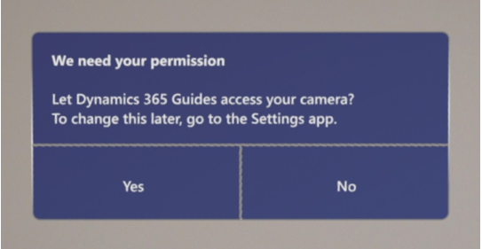
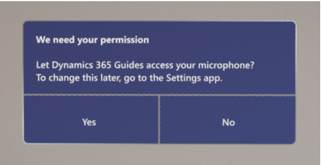
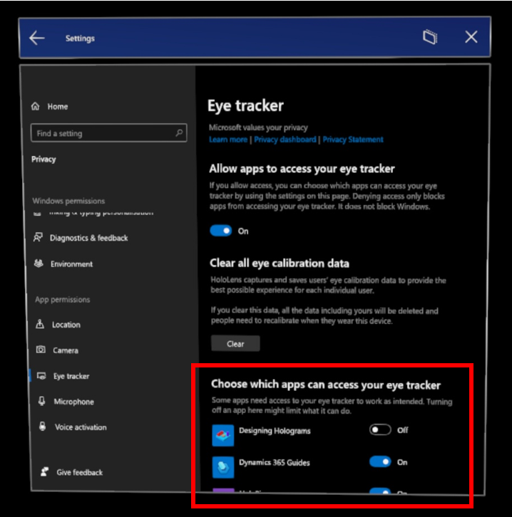
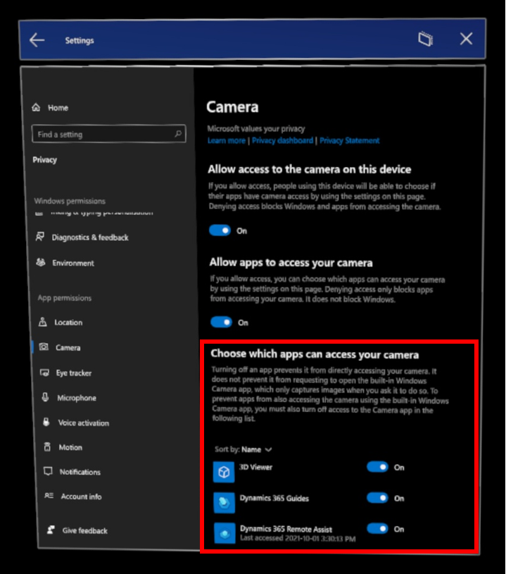
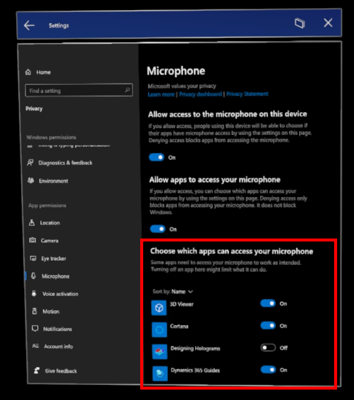

# HoloLens permissions required to use version 7.0 of Dynamics 365 Guides

Version 7.0 of Dynamics 365 Guides [introduced a new main menu and the ability to make calls from Microsoft HoloLens](new.md). To use these new features in the HoloLens app, you must provide permission to use HoloLens eye tracking, and the HoloLens camera and microphone. 

|Permission|Why required|
|----------------------|----------------------------------------------------------|
|Eye tracking|Required to use the main menu and to create a great experience. Eye tracking lets HoloLens know what you’re looking at and helps validate your intentions.  Eye tracking has been designed with user privacy in mind. Microsoft doesn’t store any biometric or other identifiable information.| 
|Camera|Required to make video calls, to understand the space around you, and more.| 
|Microphone|Required to make voice calls and use voice commands.|  

When you open the HoloLens app for the first time in Dynamics 365 Guides version 7.0, you're prompted to provide these permissions through three separate dialog boxes. 

If you don't provide permissions through any one of these three dialog boxes, you'll see the following dialog box that prompts you to provide the permissions again.

SCREEN SHOT OF GUIDES DIALOG BOX GOES HERE

You can't use the Dynamics 365 Guides version 7.0 HoloLens app until you provide all three permissions. 

You can also turn on each permission by following the steps described in this article.

### Give permission to use eye tracking

1. Go to **Settings** > **Privacy**. 

2. On the left side of the screen under **App permissions**, select **Eye tracker**, and then on the right side of the screen, under **Allow apps to access your eye tracker**, move the slider to **On**.  

    

3. On the right side of the screen, under **Choose which apps can access your eye tracker**, turn the individual settings for Dynamics 365 Guides to **On**. 

    

[Learn more about Windows 10 eye tracking and privacy](https://support.microsoft.com/en-us/windows/windows-10-eye-tracking-and-privacy-62623324-36cf-04a3-6992-8f329081f20b)

### Give permission to use the camera 

1. Go to **Settings** > **Privacy**.

2. On the left side of the screen under **App permissions**, select **Camera**, and then on the right side of the screen, under **Allow apps to access your camera**, move the slider to **On**.  

3. On the right side of the screen, under **Choose which apps can access your camera**, turn the individual settings for Dynamics 365 Guides to **On**. 

    

[Learn more about Windows camera, microphone, and privacy](https://support.microsoft.com/en-us/windows/windows-camera-microphone-and-privacy-a83257bc-e990-d54a-d212-b5e41beba857#ID0EBD=Windows_10)

### Give permission to use the microphone

1. Go to **Settings** > **Privacy**.

2. On the left side of the screen under **App permissions**, select **Microphone**, and then on the right side of the screen, under **Allow apps to access your microphone**, move the slider to **On**. 

3. On the right side of the screen, under **Choose which apps can access your microphone**, turn the individual settings for Dynamics 365 Guides to **On**. 

    

[Learn more about Windows camera, microphone, and privacy](https://support.microsoft.com/en-us/windows/windows-camera-microphone-and-privacy-a83257bc-e990-d54a-d212-b5e41beba857#ID0EBD=Windows_10)

## See also

[Frequently asked questions about Dynamics 365 Guides](faq.md)
