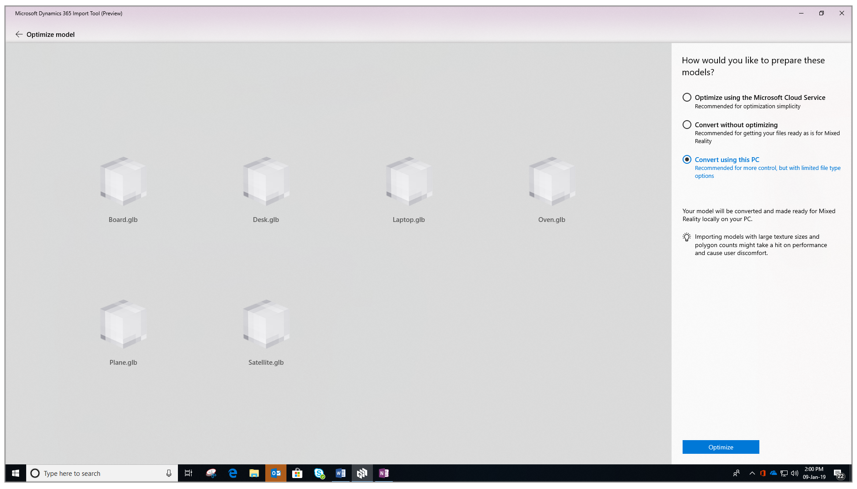
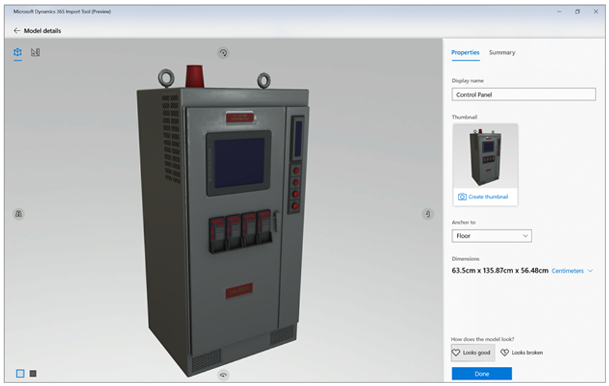
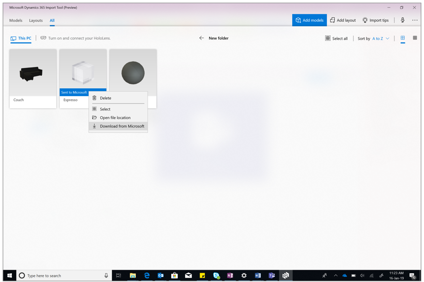

# Use the Dynamics 365 Import Tool (Preview) with Dynamics 365 Guides (Preview)

Guides supports GLTF, GLB, and FBX file formats. For additional file support (including some CAD formats) and automated 
3D model optimization, you can use the [Dynamics 365 Import Tool (Preview)](guides-import-tool-flow.md) available through Dynamics 365 Layout. The Import Tool enables you to convert, edit, decimate, and set the conversion scale for 3D models.

## What you’ll need to use the Import Tool

-   [A subscription to Dynamics 365 Layout.](../licensing/buy-and-deploy.md) The [!include[pn-layout](../includes/pn-layout.md)] subscription includes the
    [!include[cc-microsoft](../includes/cc-microsoft.md)] [!include[pn-dyn-365-import-tool](../includes/pn-dyn-365-import-tool.md)] for PC.

-   A [HoloLens](https://www.microsoft.com/hololens) running the [Windows 10 April 2018 Update](https://support.microsoft.com/en-us/help/12643). 

-   A [Windows Mixed Reality-ready
    PC](https://www.microsoft.com/en-us/windows/windows-mixed-reality-devices#wmrpcs)
    running the [Windows 10 April 2018
    Update](https://support.microsoft.com/en-us/help/4028685).

-   An internet connection.

## Install the Import Tool

How you install [!include[pn-import-tool](../includes/pn-import-tool.md)] depends on how your administrator
chooses to distribute the app. Your admin may have you install the app from the
[!include[cc-microsoft](../includes/cc-microsoft.md)] Store for Consumers, from your organization’s private store, through
an email link, or another method. 

The following table describes the Import Tool, and how to install it from the Microsoft Store for Consumers:

| **App**     | **Device**            | **Use to**                            | **To install from [!include[cc-microsoft](../includes/cc-microsoft.md)] store** |
|-------------|-----------------------|---------------------------------------------|-------------------------------------|
| [!include[pn-import-tool](../includes/pn-import-tool.md)] | PC                    | <ul><li>Process 3D models for use on [!include[pn-hololens](../includes/pn-hololens.md)] </ul>| On your PC go to **Start**  \> **[!include[cc-microsoft](../includes/cc-microsoft.md)] Store** , search for “[!include[pn-dyn-365-import-tool](../includes/pn-dyn-365-import-tool.md)]," and then [install the app](https://www.microsoft.com/store/apps/9NBF1CGB7KHX).      |

## Convert 3D models for use on HoloLens

To use 3D models on [!include[pn-hololens](../includes/pn-hololens.md)], you’ll need to convert
them to the correct file format using the [!include[pn-import-tool](../includes/pn-import-tool.md)], and then import them 
into [!include[pn-dyn-365-guides](../includes/pn-dyn-365-guides.md)].

The Import Tool provides three options for preparing your 3D models. Use the following table to determine which option is 
best for your needs.

|**Option**|**Description**|**Supported file formats**|
|--------|-------------------------------------------------------------------------|----------------------------|
|Optimize using the Microsoft Cloud Service|This is the simplest way to optimize your 3D models. The Microsoft Cloud Service automatically transcodes and simplifies the models you select. You can specify the type of device (HoloLens or Windows Mixed Reality headset) to optimize for, and also the number of models that you intend to view simultaneously. If you're not happy with the initial results after optimizing, you can use a sliding scale to re-optimize the model, focusing on performance or quality.|FBX, OBJ, SKP, JT, STP, STEP, GLTF, GLB|
|Convert without optimizing|Use this option if you've already optimized a model using an external tool and want to retain the model properties when you convert it for use on HoloLens. The Microsoft Cloud Service automatically transcodes the models you select without doing any optimization.|FBX, OBJ, SKP, JT, STP, STEP, GLTF, GLB|
|Convert using your PC|Use this option if you want to bring in self-authored assets without any optimization.|GLB only|

Specific instructions for each option are provided below.

### Optimize using the Microsoft Cloud Service

1.  On your PC, open the [!include[pn-import-tool](../includes/pn-import-tool.md)].

2.  Select **Models** \> **This PC**, and then select **Add models**.

3.  Go to the folder where your models are saved, and then select the
    models you want to import (up to 25 at a time).

4. Select **Open**.

5. Select **Optimize using the Microsoft Cloud Service.**
   
    

6. Under **Optimization settings**, choose the HoloLens device and the number of models that you'll use in a single scene. These settings will apply to all models you selected in step 3.

    

7. Select **Optimize** to start the optimization process. This process might take a while, depending on how many models you're importing.

8. When the optimization process is complete, open each model to view the results. If you aren't happy with the results of any model, do the following:

   1. On the **Properties** tab for the model, select **Optimize again** in the lower right corner of the screen. 
   
   2. Under **Optimize this model again** in the center of the screen, pull the slider to the left to optimize for performance or to the right to optimize for quality. Optimizing for performance will result in a model that performs better on HoloLens or Mixed Reality headsets, but may compromise on visual quality. Optimizing for quality will result in a model that has better visual quality but may adversely affect device performance, resulting in user discomfort.
   
       
   
   3. Once you've moved the slider to the desired level, select **Optimize**.
         
   4. Repeat steps a, b, and c until you're satisfied with the results.
   
      > [!NOTE]
      > The re-optimization option is available for 24 hours after the first optimization done using the cloud service.

To use 3D models on [!include[pn-hololens](../includes/pn-hololens.md)], you’ll need to convert
them to the correct file format using the [!include[pn-import-tool](../includes/pn-import-tool.md)], and then import them into [!include[pn-dyn-365-guides](../includes/pn-dyn-365-guides.md)]. 

### Convert without optimizing

1.  On your PC, open the [!include[pn-import-tool](../includes/pn-import-tool.md)].

2.  Select **Models** \> **This PC**, and then select **Add models**.

3.  Go to the folder where your models are saved, and then select the
    models you want to import (up to 25 at a time).

4. Select **Open**.

5. Select **Convert without optimizing**.

    

6. Select **Optimize** to start the optimization process. This process might take a while, depending on how many models you're importing.

If you're using a [!include[pn-ms-windows-short](../includes/pn-ms-windows-short.md)] Mixed Reality immersive headset, your imported models will show up automatically in [!include[pn-layout](../includes/pn-layout.md)].
	
To use your models on [!include[pn-hololens](../includes/pn-hololens.md)], you’ll need to [copy them to the HoloLens device](#copy-models-to-a-HoloLens-device).

### Convert using your PC

1.  On your PC, open the [!include[pn-import-tool](../includes/pn-import-tool.md)].

2.  Select **Models** \> **This PC**, and then select **Add models**.

3.  Go to the folder where your models are saved, and then select the
    models you want to import (up to 25 at a time).

4. Select **Open**.

5. Select **Convert using this PC**. 

   
      
   > [!NOTE] 
   > The **Convert using this PC** option will not be available if any of your source models are not in GLB file format. For more information on file type limitations, see [File types and guidelines](#file-types-and-guidelines) below.  
   
6. Select **Optimize** to start the optimization process. The optimization process might take a while, depending on how many models you're importing.

To use 3D models on [!include[pn-hololens](../includes/pn-hololens.md)], you’ll need to convert
them to the correct file format using the [!include[pn-import-tool](../includes/pn-import-tool.md)], and then import them into [!include[pn-dyn-365-guides](../includes/pn-dyn-365-guides.md)].

### Provide feedback and submit assets for manual processing if the quality is unsatisfactory

You can provide feedback on the quality of prepared 3D models and get assistance from Microsoft if you're not satisfied with the quality.

1. Select the **Models** or **All** tab, and then select the model you want to provide feedback on.
2. At the bottom of the **Properties** tab, under **How does the model look?**, select **Looks good** or **Looks broken** to record your feedback.

   

   > [!NOTE]
   > You can't update feedback after you submit it. 
	
If you rate the quality at 3 or below (out of 5), you'll be prompted to optionally submit the model to Microsoft for manual optimization. To submit a model for manual optimization: 

1. Review the terms and conditions, and then if you consent, select the check box.
2. Select **Next**.
3. Enter the location of the source file, why you're dissatisfied with the results, and your email address.
4. Select **Next** to upload the file to Microsoft safely and securely.
   You'll receive an acknowledgement confirming receipt of the model (and will also receive an email confirmation). 

Microsoft will update you on the progress of the manual optimization through email and will let you know when the model is ready to download.

To download a model after manual optimization when ready: 

1. Open the Import Tool.

2. Right-click the model that was submitted for manual processing, and then select **Download from Microsoft**. 

   
   
   The manually optimized model will replace the previous model in the Import Tool.

### File types and guidelines

There are different limits on the types of files you can import, depending on
whether you use the cloud or your PC to convert the files. Using the cloud
service simplifies the conversion process. If you use the PC option, you’ll need
to adhere to a number of prerequisites.

#### For the cloud service

|  Item           |     Description                          |
|-----------------|------------------------------|
| **File format** | <ul><li>FBX (version 7.5 or earlier) </li><li>OBJ </li><li>SKP (version 18 or earlier) </li><li>JT (versions 8 and 9) </li><li>STP, STEP (versions AP203 and AP214) </li><li>GLTF, GLB </li><ul><li>Version 2.0 </li><li>Supported extensions:<ul><li>Input:<ul><li>MSFT_texture_dds</li><li>KHR_materials_pbrSpecularGlossiness</li></ul><li>Output<ul><li> MSFT_packing_occlusionRoughnessMetallic </li><li>MSFT_packing_normalRoughnessMetallic</li><li>MSFT_texture_dds (supported but not used)</ul></ul></ul><li>ZIP</li> |
| **External files**     | If your model references external files, such as the following, you'll need to create a ZIP file containing the model and the files it references to import the model:  <ul><li>Textures (PNG, TGA, etc.) </li><li>Materials (MTL) </li><li>Other parts </li></ul> The ZIP file should only contain the above file formats and their dependent external files.   |   
| **Textures**   | Textures are unembedded. Zip your file with the unembedded textures. You can only zip one model at a time with its textures.           |   
| **Model orientation**  | <ul><li>The model’s +Y axis should point up and the +Z axis should point forward. </li></ul> |   

See the next section in this topic to learn how the cloud service works.

#### For the PC

|  Item           |     Description                          |
|-----------------|------------------------------|
| **File format** | GLB file formats only, with the following recommendations: <ul><li>No more than 1 set of UVs per mesh</li><li>Less than 5,000 polygons</li><li>Texture size of 512 x 512 </li></ul> |
| **Textures**     | Textures are embedded. Export your model from your CAD program as a single self-contained file.   **Note:** Emissive, occlusion, specular, and gloss textures will be ignored.    | 
| **Model orientation** | <ul><li>The model’s +Y axis should point up and the +Z axis should point forward.</ul> |  

## Best practices for importing 3D models 

-   When you’re creating a 3D model using 3D creation tools, make sure that the
    model is not too far off from the center (the origin of the grid).

-   When exporting from 3D creation tools, if available, choose the “embed
    texture option” in FBX export. If not available, include the FBX file and
    any image files in a ZIP archive and use the resulting ZIP as your import
    file.

The [!include[pn-import-tool](../includes/pn-import-tool.md)] is designed to import 3D models from CAD and various formats for conversion and optimization. Also note that:

-   Models with interiors will not be preserved.

-   Existing offsets in models, any transforms off the 3D origin (0,0,0), or
    relative offsets from other models will be preserved on export and
    subsequent import.

-   Any usage of layers for grouping or defining model colors will not be
    preserved.

-   Any use of “hatching” in AutoCAD will not be preserved.

-   Imported models that are comprised of multiple individual sub-objects will
    result in a single combined mesh to enable more efficient interaction with
    the complete model.

## How does the Microsoft cloud service work?

When you convert a 3D model, the [!include[pn-import-tool](../includes/pn-import-tool.md)] uploads the raw model to
the [!include[cc-microsoft](../includes/cc-microsoft.md)] cloud service, which is hosted on a [!include[cc-microsoft](../includes/cc-microsoft.md)] [!include[pn-azure](../includes/pn-azure.md)] web service.
The cloud service transcodes and simplifies the model and then returns the
simplified models to the [!include[pn-import-tool](../includes/pn-import-tool.md)], restricting access via the use of
obfuscated URLs.

-   Both the raw model and the simplified model are transferred by using the
    HTTPS protocol.

-   Both the raw model and the simplified model are hosted on [!include[pn-azure](../includes/pn-azure.md)] Blob
    storage.

-   Both the raw model and the simplified model are purged from [!include[pn-azure](../includes/pn-azure.md)] Blob
    storage after 24 hours.

-   The simplified model is fetched via an obfuscated URL by using the HTTPS
    protocol.

    
