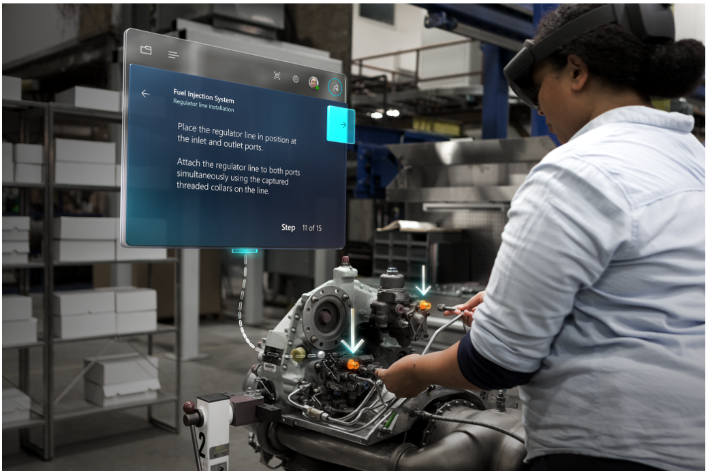

# Overview of Dynamics 365 Guides

 [Watch this video to get a quick overview of Dynamics 365 Guides on HoloLens 2](https://www.youtube.com/watch?v=V8c3pDKdHEc)

[!include[cc-microsoft](../includes/cc-microsoft.md)] [!include[pn-dyn-365-guides](../includes/pn-dyn-365-guides.md)] is a mixed-reality application for [!include[cc-microsoft](../includes/cc-microsoft.md)] [!include[pn-hololens](../includes/pn-hololens.md)] that helps operators learn during the flow of work by providing holographic instructions when and where they're needed. These instruction cards are visually tethered to the place where the work is done, and can include images, videos, and 3D holographic models. Operators see exactly what needs to be done, and where, so they can get the job done faster, with fewer errors and greater skill retention. [Read more about Dynamics 365 Guides capabilities](https://dynamics.microsoft.com/mixed-reality/guides/?ef_id=34bba79ef37214ad99adc7aaf4d29e4f:G:s&OCID=AID2100366_SEM_34bba79ef37214ad99adc7aaf4d29e4f:G:s&msclkid=34bba79ef37214ad99adc7aaf4d29e4f).

 

## No coding skills required to create mixed-reality guides

With [!include[pn-dyn-365-guides](../includes/pn-dyn-365-guides.md)], you don't need specialized 3D or programming skills. Start with the PC authoring app to create a guide made up of step-by-step instructions, images, videos, and 3D holograms. After you create the guide on a PC, use the HoloLens app to connect the instruction cards and holograms to the physical workspace by picking them up and moving them to the correct location. You can use the default library of 3D holograms to get started. You can also import your own custom 3D models.

## Improve productivity – Learn by doing

[!include[pn-dyn-365-guides](../includes/pn-dyn-365-guides.md)] provides heads-up, hands-free, step-by-step instructions during the flow of work, whether employees are doing complex procedures on the job or training away from the production line. Operators control the interface with their gaze, using a glance to move to the next step, which leaves their hands free to do the work. Instruction cards follow the operator as they move around equipment. Holograms point to the tools and parts that they need, and show them exactly how and where to use them. The experience is comfortable and simple to use, and it helps reduce mental processing time, errors, and the need to rely on a buddy system.

## Continually analyze and improve processes

Managers can use [!include[pn-power-bi](../includes/pn-power-bi.md)] dashboards to view rich data about how processes are working for their employees. Using this data, they can continually analyze and improve processes without having to do expensive studies.

[!include[pn-dyn-365-guides](../includes/pn-dyn-365-guides.md)] also provides access and integration opportunities for customers and partners, because it's part of the [!include[pn-dyn-365](../includes/pn-dyn-365.md)] product family and is powered by Microsoft Dataverse.

## What's next?

Check out these overview topics and videos:

 [Get started](get-started.md) 
 [Quick overview of Dynamics 365 Guides](https://aka.ms/guidesoverview) 
 [Author a guide in the PC app](https://aka.ms/pcauthor) 
 [Author a guide in the HoloLens app (for HoloLens 1)](https://aka.ms/hololensauthor) 
 [Overview of authoring a guide](authoring-overview.md) 
 [Operate a guide](https://aka.ms/guidesoperate) 
 [Overview of operating a guide](operator-overview.md) 
 [Overview of analyzing your guides](analytics-guide.md) 
 [FAQ](faq.md)

[!INCLUDE[footer-include](../includes/footer-banner.md)]
