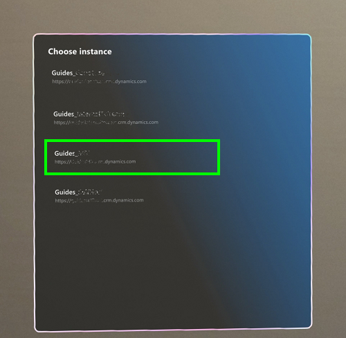

# Install and sign in to the Dynamics 365 Guides HoloLens app

If you haven't already installed the [!include[cc-microsoft](../includes/cc-microsoft.md)] [!include[pn-hololens](../includes/pn-hololens.md)] app on your [!include[pn-hololens](../includes/pn-hololens.md)] device (or if it hasn't already been installed for you), you can install it from the [!include[cc-microsoft](../includes/cc-microsoft.md)] Store for Consumers.

> [!NOTE]
> You must have a license to install the [!include[pn-dyn-365-guides](../includes/pn-dyn-365-guides.md)] [!include[pn-hololens](../includes/pn-hololens.md)] app. You can also sign up for a free trial. For more information, see [Setup overview](setup.md).

## Install the app

1. Make sure that you have [!include[cc-microsoft](../includes/cc-microsoft.md)] [!include[pn-hololens](../includes/pn-hololens.md)] build 10.0.14393.0 or later installed on your [!include[pn-hololens](../includes/pn-hololens.md)] device. We recommend that you update to newer versions when they are available. For information about how to use [!include[pn-ms-windows-short](../includes/pn-ms-windows-short.md)] Update for Business, see [Manage updates to HoloLens](/HoloLens/hololens-updates).

2. On your [!include[pn-hololens](../includes/pn-hololens.md)], use the [bloom gesture](authoring-gestures.md) to open the **Home** menu. Then open [!include[cc-microsoft](../includes/cc-microsoft.md)] Store, and search for "[!include[pn-dyn-365-guides](../includes/pn-dyn-365-guides.md)]".

3. Select **Install** to download and install the [!include[pn-dyn-365-guides](../includes/pn-dyn-365-guides.md)] app.

## Sign in

If you sign in to a brand-new [!include[pn-hololens](../includes/pn-hololens.md)] device, you'll be prompted to complete the **Setup** wizard. In the **Setup** wizard, you can either sign in by using an existing account or create a new account, depending on the version of [!include[pn-ms-windows-short](../includes/pn-ms-windows-short.md)] that you're running. The **Setup** wizard will also guide you through steps to calibrate and prepare your [!include[pn-hololens](../includes/pn-hololens.md)] for use.

## Open and sign in for the first time

After you've made sure that your [HoloLens is correctly calibrated](hololens-app-calibrate.md), you can open the [!include[pn-hololens](../includes/pn-hololens.md)] app.

If you're a [!include[pn-dyn-365-guides](../includes/pn-dyn-365-guides.md)] admin, you can assign **Author** and **Operator** roles to limit the features that are available to users. For more information, see [Assign an Author or Operator role to a user](assign-role.md).

> [!NOTE]
> If you're using Dynamics 365 Guides version 7.0, you'll need to provide permissions to use the HoloLens eye tracker, camera, and microphone before you can sign in. [Learn more about permissions required to use the HoloLens app](hololens-permissions.md). 

1. Select **All Apps**.

    

2. Select the down arrow button.

    

3. Open the [!include[pn-dyn-365-guides](../includes/pn-dyn-365-guides.md)] app.

    

4. On the **Welcome** page, select **Sign in**.

5. On the **Email and accounts** page, select **Work or school account**, and then select **Continue**.

6. On the **Work or school account** page, enter the credentials that you created during sign-up for the trial, or the credentials that the admin who installed the app provided to you.

    

7. If you have access to more than one instance, select an instance to use.
    

8. Look at the palm of your hand to open the Main menu.  Choose the **Work activity** to open a guide by using direct touch.

> [!NOTE]
> You must look at the palm of your hand to open the Main menu. If you turn your palm toward you but don't look at it, the Main menu won't open. This is to keep holographic screens from appearing when you don't want them to appear. 

    
## Sign out of the HoloLens app in Dynamics 365 Guides version 7.0

If you're using Dynamics 365 Guides version 7.0, you can sign out by using touch.

1. Look at your palm to open the Main menu, and then select the **Profile** button.

    
    
2. Select **Sign out**. 

## What's next?

[Main menu](main-menu.md) 
[Find a guide](find-guide.md) 
[Anchor your guide](hololens-app-anchor.md) 
[Place holograms, add styles, and more](hololens-app-orientation.md)

[!INCLUDE[footer-include](../includes/footer-banner.md)]
