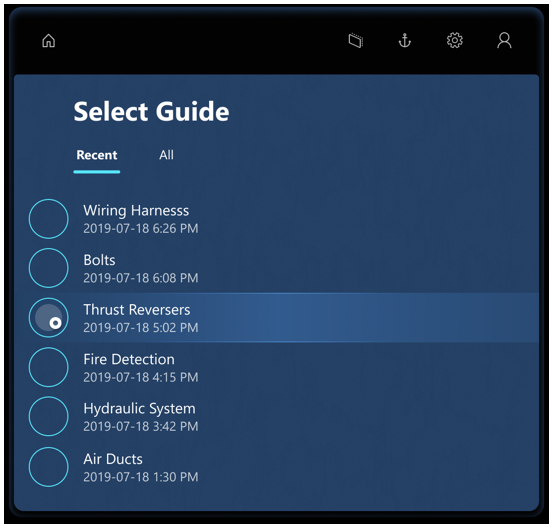
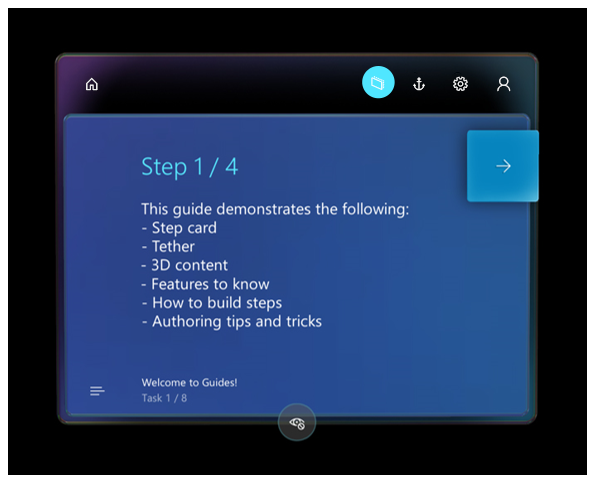

# Install and sign in to the Dynamics 365 Guides HoloLens app

If you haven’t already installed the [!include[pn-hololens](../includes/pn-hololens.md)] app on your [!include[pn-hololens](../includes/pn-hololens.md)] device (or it hasn't already been installed for you), install it from the [!include[cc-microsoft](../includes/cc-microsoft.md)] Store for Consumers.

To install the HoloLens app:

1.	Make sure you have [!include[cc-microsoft](../includes/cc-microsoft.md)] [!include[pn-hololens](../includes/pn-hololens.md)] build 10.0.14393.0 or later installed on your [!include[pn-hololens](../includes/pn-hololens.md)] device. We recommend updating to newer versions when available. See [Manage updates to HoloLens](https://docs.microsoft.com/HoloLens/hololens-updates) for instructions on using [!include[pn-ms-windows-short](../includes/pn-ms-windows-short.md)] Update for Business.

2.	On your [!include[pn-hololens](../includes/pn-hololens.md)], use the [bloom gesture](authoring-gestures.md) to open the **Home** menu, and then open [!include[cc-microsoft](../includes/cc-microsoft.md)] Store and search for “[!include[pn-dyn-365-guides](../includes/pn-dyn-365-guides.md)]”.

3.	Select **Install** to download and install the [!include[pn-dyn-365-guides](../includes/pn-dyn-365-guides.md)] application.

## Sign in to the HoloLens app
If you sign in with a brand new [!include[pn-hololens](../includes/pn-hololens.md)] device, you’ll be prompted to walk through the Setup wizard. In the Setup wizard, you can sign in with an existing account or create a new one, depending on the version of [!include[pn-ms-windows-short](../includes/pn-ms-windows-short.md)] that you’re running. The Setup wizard will also walk you through steps to calibrate and prepare your [!include[pn-hololens](../includes/pn-hololens.md)] for use.

## Calibrate your HoloLens

To have the holograms appear in the correct locations, the interpupillary distance (IPD) must be set. This is true for any [!include[pn-hololens](../includes/pn-hololens.md)] user, whether you’re an author or an operator. In an industrial setting where a hologram is used to direct the operator to do operational tasks, it’s crucial that holograms be aligned properly. Otherwise it can cause operator confusion and can result in costly damage.

If you don’t configure the IPD for each user: 

- Holograms will be out of alignment by 1–2 cm. 

- Holograms will appear as if they’re sunk into or floating above surfaces they’re sitting on.

- Holograms will not be stable. As you walk around, you’ll notice that they move.

> [!IMPORTANT] 
> It’s particularly crucial for authors to ensure that their IPD is set correctly. Otherwise, all operators using the guide will see misaligned holograms. 

To set your IPD, use the Calibration app included with [!include[pn-hololens](../includes/pn-hololens.md)] using the following steps: 

1.	Do the bloom gesture to launch the **Start** menu.

2.	Air tap on **Calibration** to begin calibrating your [!include[pn-hololens](../includes/pn-hololens.md)].

    
 
3.	Follow the instructions on your [!include[pn-hololens](../includes/pn-hololens.md)].

Each user will need to do this calibration after logging into the device. If [!include[pn-hololens](../includes/pn-hololens.md)] is running [!include[pn-ms-windows-short](../includes/pn-ms-windows-short.md)] Holographic for Business edition, the IPD setting will be saved on the device. When the user logs into the same [!include[pn-hololens](../includes/pn-hololens.md)], their IPD setting will be applied automatically even after switching users—they won’t need to recalibrate. If [!include[pn-hololens](../includes/pn-hololens.md)] is running [!include[pn-ms-windows-short](../includes/pn-ms-windows-short.md)] Holographic edition, however, user settings aren’t saved, because this version of the operating system is designed for a single user. Each time you switch users, you’ll need to recalibrate the device. 

To determine which version of the operating system you’re using on [!include[pn-hololens](../includes/pn-hololens.md)]: 

1.	Do the bloom gesture to launch the **Start** menu.

2.	Air tap on **Settings > System**.
 
3.	Air tap **About**.
 
## Open and sign in to HoloLens for the first time

After ensuring that your [!include[pn-hololens](../includes/pn-hololens.md)] is correctly calibrated, you can open the [!include[pn-hololens](../includes/pn-hololens.md)] application.

>[!NOTE]
>If you're a Dynamics 365 Guides administrator, you can assign Author and Operator roles to restrict features available to users. For more information, see [Assign an Author or Operator role to a user](assign-role.md).

1.	Go to **All Apps**.

    

2.	Select the down arrow.

    

3.	Open the [!include[pn-dyn-365-guides](../includes/pn-dyn-365-guides.md)] application.

    
 
4.	In the **Welcome** screen, select **Sign in**. 

5.	In the **Email and accounts** screen, select **Work or school account**, and then select **Continue**. 

6.	In the **Work or school account** screen, enter the credentials you created during the trial sign-up or the credentials provided to you by the administrator who installed the app. 

    
 
7.	Select an instance to use if you have more than one instance, and then select **Continue**.

8. In the **Select Guide** screen, gaze at the guide you want to open until the circle fills, which selects that guide.

    

9.	In the **Select Mode** dialog box, gaze at the box to the left of **Author** to select it. 

    
    
> [!TIP]
> [!include[pn-dyn-365-guides](../includes/pn-dyn-365-guides.md)] comes with an example guide you can use to get ideas for your own guides. Check it out!  

## What's next?

