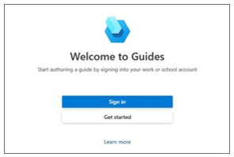
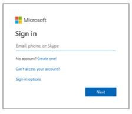
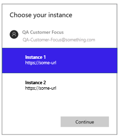

# Install, open, and sign in to the Dynamics 365 Guides PC app

Use these instructions to install the [!include[cc-microsoft](../includes/cc-microsoft.md)] [!include[pn-dyn-365-guides](../includes/pn-dyn-365-guides.md)] PC app (if it hasn't already been installed for you) and to sign in. For information on technical requirements for the PC app, see [Device and licensing requirements](requirements.md).

> [!NOTE]
> You must have a license to install the [!include[pn-dyn-365-guides](../includes/pn-dyn-365-guides.md)] PC app. You can also sign up for a free trial. For more information, see [Setup overview](setup.md).

## Install the app

1. On a computer that is running [!include[pn-ms-windows-short](../includes/pn-ms-windows-short.md)] 10, make sure that you have the latest [!include[pn-ms-windows-short](../includes/pn-ms-windows-short.md)] 10 build (10.0.16299 or later).

2. Go to **Start**  \> **[!include[cc-microsoft](../includes/cc-microsoft.md)] Store** , and then search for "[!include[pn-dyn-365-guides](../includes/pn-dyn-365-guides.md)]."

3. Select **Install** to download and install [!include[pn-dyn-365-guides](../includes/pn-dyn-365-guides.md)].

## Sign in to the app

1. Open the [!include[pn-dyn-365-guides](../includes/pn-dyn-365-guides.md)] app from the **Start** menu on your computer.

2. On the **Welcome to Guides** page, select **Sign in**.

    

3. In the **Sign in** dialog box, select **Work or school account**, and then select **Continue**.

4. On the **Sign in** page, enter the user account and password that your organization assigned to you.

    

5. Select the instance that you want to use, if there is more than one instance. Then select **OK**.

    

## What's next?

[Create a guide](create-guide.md) 
[Anchor your guide to the real world](anchor.md) 
[Structure your guide in the Outline page](structure-guide.md) 
[Create steps and add 3D content or 2D media](create-steps-assign-media.md) 
[Add a website or Power Apps link to a step](pc-app-website-powerapps-link.md) 
[Create and copy a link to a guide or step](pc-app-copy-link-guide-step.md) 
[Learn about keyboard shortcuts](keyboard-shortcuts-pc-app.md) 
[Deactivate a guide](pc-app-deactivate-guide.md) 
[Learn what makes a great mixed reality guide](great-guide.md)

[!INCLUDE[footer-include](../includes/footer-banner.md)]
