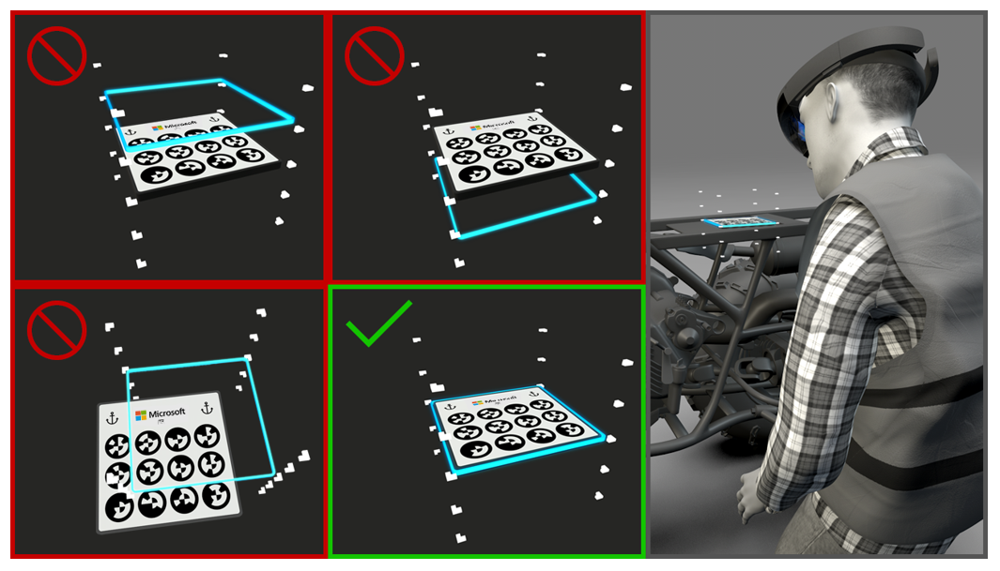

# Known issues with the Dynamics 365 Guides HoloLens app

## I can't open a non-English Example guide

Some customers might have installed the Example guide that is included with Microsoft Dynamics 365 Guides in an existing instance. As of the April 28, 2020, release, the Example guide is obsolete and will no longer be installed in new instances. 

As part of this change, you won't be able to open an existing non-English (localized) Example guide. If you try, you will be redirected to the **Guides** list.

## The account picker becomes unresponsive if you stay on it for more than 25 seconds during HoloLens sign-in 

On the page where you can select among the different accounts that are saved on [!include[pn-hololens](../includes/pn-hololens.md)], you must select an option within 25 seconds. After 25 seconds, the page becomes unresponsive, and you must restart the app. This issue has been fixed on RS5 but still exists on RS4 if you have that version installed.

## When you place large assets on HoloLens, you might experience minor loading delays

The [!include[pn-hololens](../includes/pn-hololens.md)] app currently loads the guide right after you open it. As you use the guide, the app loads it in the background. If your guide contains large 3D models and media, you might experience loading delays of a few seconds.

## The circular code anchor method requires the user's consent to use the camera

The first time that you open the [!include[pn-dyn-365-guides](../includes/pn-dyn-365-guides.md)] app on [!include[pn-hololens](../includes/pn-hololens.md)], it asks for your consent to use the camera. If you plan to use circular code anchors in your guides, you must answer **Yes** to this prompt. This step is required for every device that you use the [!include[pn-dyn-365-guides](../includes/pn-dyn-365-guides.md)] app on. If user consent wasn't previously given on a device, you can give it by going to the **Settings** menu on [!include[pn-hololens](../includes/pn-hololens.md)] (in the operating system). 

## An incorrect profile picture is shown in the app 

If an incorrect profile picture is shown, make sure that you're signed in. Select the profile picture, sign out, and then sign back in by using your [!include[pn-dyn-365](../includes/pn-dyn-365.md)] credentials. Your profile picture should appear correctly.

By using the correct credentials to sign in, you ensure that your work progress is correctly tracked in [!include[pn-dyn-365](../includes/pn-dyn-365.md)].

## The video preview on a step is blurry

The [!include[pn-hololens](../includes/pn-hololens.md)] app converts and resizes videos when they are uploaded, to ensure optimal performance on [!include[pn-hololens](../includes/pn-hololens.md)]. If your video was recorded at a very high resolution, or if it's very large, the transcoding process might degrade its quality. To fix this issue, record and upload a new video, keeping its length and resolution in mind.

As a best practice, video clips should not be too long. We recommend **a maximum of two minutes**. This limit helps operators focus on one meaningful task at a time and keeps them from getting overwhelmed. 

## When the see-through style is applied to a 3D model, it might show gray areas instead of correctly rendering textures 

There are rendering issues for the "see through" style on some 3D models. Some surfaces on these models will look gray. If you experience this issue, use another style. If you **must** use this style and need help with it, contact customer service.

## When you move a 3D model during authoring on HoloLens, the movement of the model might seem slow

By default, the movement is set to be slow, so that authors can carefully and precisely place 3D models. If the manipulation sphere around the model is blue, the default movement is used. You can move your hand faster, or you can wiggle the model a little to switch it to faster movement. 

## How do I address hardware offset in HoloLens 1 devices to ensure accurate placement of holograms for circular code anchor alignment?
 
Because of manufacturing idiosyncrasies, the angle of each [!include[pn-hololens](../includes/pn-hololens.md)] 1 PV camera can differ slightly across devices. (The PV camera is the camera above the nose bridge.) Therefore, because the PV camera is used to scan the printed marker, holograms might appear slightly misaligned when the same guide and the same circular code anchor are used on multiple devices.
 
To fix this issue, each user can manually adjust for the offset in the [!include[pn-dyn-365-guides](../includes/pn-dyn-365-guides.md)] [!include[pn-hololens](../includes/pn-hololens.md)] app and save the settings to the device. In this way, users don't have to adjust the offset every time that they use the device. 

We recommend that IT staff go through the following steps before they provision devices to [!include[pn-dyn-365-guides](../includes/pn-dyn-365-guides.md)] authors or operators. This setup must be done only one time. It doesn't have to be repeated unless the app is uninstalled or a new operating system is installed.
 
### Step 1 – Set up circular code anchor

#### On the PC

- Open the PC app, and then create a guide [by using the circular code anchor method](anchor.md). Alternatively, you can use an existing guide that already uses the circular code anchoring method.

#### On HoloLens

- Run the [!include[pn-hololens](../includes/pn-hololens.md)] Calibration app to ensure correct fit and interpupillary distance (IPD).
 
### Step 2 – Open the guide and align it on HoloLens

1.	Open the HoloLens app, select **Operator** or **Author** mode, and then open the guide that you used in step 1.

2.	Select **Scan** to begin the alignment process. Accept the permissions prompts that appear. 

3. Look for your circular code anchor, let the device find it, and wait for the blue outline animation. The blue outline shows where the circular code anchor is located, according to the calculations that [!include[pn-hololens](../includes/pn-hololens.md)] has done.

### Step 3 – Adjust the offset

The blue outline is the same size as the anchor. You can move it up or down along the rails that are located at the anchor's corners. Look at the anchor from above. Is the blue outline too far to the left or right of the anchor? If so, try to adjust [!include[pn-hololens](../includes/pn-hololens.md)] to make sure that it correctly fits your head.

Tap and hold the blue outline, and move it up or down until it exactly overlaps the anchor. Look at the anchor from the side to make sure that the outline is exactly aligned.
 
As the following illustration shows, the media panel visually indicates what you must do.

After you've verified that the blue outline and the anchor are aligned, select **Confirm** to complete the process. 

The next time that this device is used to load a guide, the operator or author can just scan the anchor. The blue outline won't have to be adjusted again. 

If, at any point, you must readjust the offset, you can trigger the offset adjustment process by turning on the **Adjust Offset** setting. This setting triggers the normal alignment process, beginning with the scanning of the circular code anchor.

## See also

[Known issues with Dynamics 365 Guides generally](known-issues.md) 
[Known issues with the PC app](known-issues-pc-app.md) 
[Dynamics 365 Guides FAQ](faq.md)

[!INCLUDE[footer-include](../includes/footer-banner.md)]
