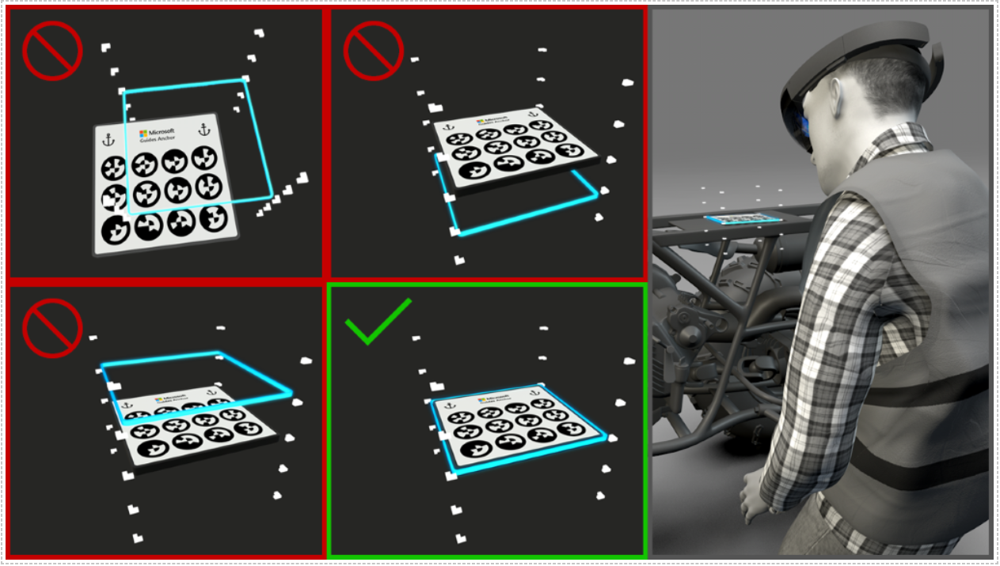
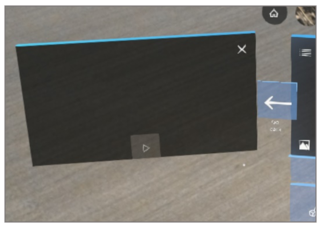

# Known Issues with Microsoft Dynamics 365 Guides in preview

[!INCLUDE [cc-beta-prerelease-disclaimer](../includes/cc-beta-prerelease-disclaimer.md)]
 
## Offline use is not supported
At this time, offline use in the Dynamics 365 Guides apps is not supported. Also, you must have an active and reliable internet connection to use the apps. 

## Recalibrating takes you back to the first step

If you’re using the Microsoft HoloLens application, and you select the **Alignment** button from any step to recalibrate your HoloLens, after recalibrating, you’ll land on the first step of your guide. This is by design. You (or the operator) will want to recheck all steps after recalibrating, as this can change hologram alignment.

## Voice commands not tested thoroughly

We haven’t tested voice commands thoroughly for different accents or gender, which means they might not work in some cases. We’ll test voice commands thoroughly in a later release.

## Instruction cards and holograms may render inside objects in the real world

The HoloLens app uses understanding of the environment to render holograms, but it doesn’t use this information to render the instruction cards (Step cards). As a result, at this time, instruction cards may sometimes render inside objects in the real world. 

## IPD settings are not saved for each user

At this time, interpupillary distance (IPD) settings aren’t saved automatically for each user. For now, we don’t recommend sharing a HoloLens device. If you need to share a device, make sure to recalibrate HoloLens whenever you switch users. Note that multiple users can share the same HoloLens device if their IPDs are similar. 

## No way to secure a guide
Currently, we don’t support permissions or versioning. Therefore, anyone assigned a Guides license in your organization will be able to open or edit a guide.

## Recent guides list isn’t scoped to user
The **Recent** list of guides is currently not scoped to the user accessing it. This will be supported in a later release.

## Search is not supported at this time
At this time, you can’t search for a guide in the list in either application. 

## When placing large assets on HoloLens, you might see minor loading delays
The HoloLens app currently loads the guide right after you open it, and in the background as you use the guide. If your guide contains large 3D models and media, you might experience loading delays of a few seconds.

## Guides can’t be renamed or deleted

At this time, renaming or deleting guides is not supported.

## You can create guides with the same name without overwriting old guides

You can create multiple guides with the same name. While this prevents unintentional overwrites of old files, it's confusing when you choose a guide from a list. We recommend looking up the names of existing guides when creating new ones.

## 3D content and media cannot be renamed or deleted after uploading

At this time, we do not support renaming or deleting 3D content and media once they have been uploaded to the server. While it’s possible to rename them in Dynamics 365, doing so can have unintended consequences on any guides that use this content.

## 3D content and media will be overwritten if you upload new content with the same name

We do not support multiple files with the same name in the current release. When uploading new 3D models or media, check to make sure a file with the same name does not exist in the library. You can, however, have different types of files with the same name—for example, a bolt.png image and a bolt.glb 3D model.

## Can’t use the same name for more than one guide

When you create a new guide, make sure to use a unique name. If you use a name that’s already used for another guide, it won’t overwrite the other guide, but the app won’t be able to tell which guide to open the next time.

## Can’t use the same name for 3D parts that you upload, even if they have different extensions

The app currently looks up media by file names. So, for example, if you have a picture.jpg file and a picture.png, the app doesn’t know which file to show for the step. So it’s best to always use unique file names for media files you upload.

## Uploading new 3D models with names matching any of the pre-packaged models in the 3D toolkit will overwrite the files in the 3D toolkit

Avoid using any names for your custom 3D models that match model names in the 3D toolkit.

## Addressing hardware offset in HoloLens 1 devices to ensure accurate placement of holograms for printed anchor alignment
 
The angle of each HoloLens 1 PV camera (the camera placed above the nose bridge) can be slightly different across devices due to manufacturing idiosyncrasies. Since the PV camera is used to scan the printed marker, this means holograms can appear slightly misaligned when using the same guide and same printed marker on multiple devices.
 
To fix this issue, the Dynamics 365 Guides HoloLens app provides the ability to manually adjust for this offset and save the settings to the device so that each user does not need to set the offset each time. We recommend that IT staff go through the following steps before provisioning devices to Dynamics 365 Guides authors or operators. This is a one-time setup and does not need to be repeated unless the app is uninstalled or a new operating system is installed.
 
### Step 1 – Set up printed anchor

#### On the PC

1.	Create a printed marker using the specifications described in [Author in the PC application](https://docs.microsoft.com/dynamics365/mixed-reality/guides/pc-authoring#choose-an-alignment-method).

2.	Open the authoring app on the PC, and then create a guide using the printed anchor method (or you can use an existing guide that uses a printed anchor).

#### On HoloLens

- Run the HoloLens Calibration app for yourself to ensure proper fit and IPD.
 
### Step 2 – Open the guide and align it on HoloLens

1.	On HoloLens, open the Dynamics 365 Guides app, select **Operator** or **Author** mode, and then open the guide used in step 1.

2.	Select **Scan** to begin the alignment process. Accept the permissions prompts that appear. 

3. Look for your printed marker, allow the device to find the marker, and wait for the blue outline animation. The blue outline shows where the printed marker is located, as calculated by HoloLens.

### Step 3 – Adjust the offset

The blue outline is the same size as the marker. You can move it up or down along the rails positioned at its corners. Look at the printed marker from above. Is the blue outline too far to the left or right of the printed marker? If so, try adjusting the HoloLens device to make sure it fits correctly on your head.

Tap and hold the blue outline and move it up or down until it overlaps with the marker exactly. Make sure that the outline is exactly aligned by looking at the marker from the side. 
 
The media panel shows the following image to visually indicate what you need to do.

  

After you have verified that the blue outline and the printed marker are lined up, select **Confirm** to complete the process. 

The next time this device is used to load a guide, the operator/author can just scan the marker; they won't have to adjust the blue outline again.

If, at any point, you need to readjust this setting, you can trigger the offset adjustment process again by selecting the **Adjust Offset** setting. When you turn this setting on, it triggers the normal alignment process, beginning with the scanning of the printed marker.

## Troubleshooting

### PC authoring application issues

#### I can’t sign in

To sign in, you must use the Microsoft Dynamics 365 sign-in credentials for your organization. It will resemble: johndoe@contoso.onmicrosoft.com. You can’t use a Microsoft account (used for Outlook.com, Windows Store, and so on) or your corporate credentials to sign in. 

If you see any of the following errors, please contact your IT administrator or refer to our self-serve documentation at http://aka.ms/guidesdocs. 

- Dynamics 365 Guides isn't set up correctly, or you might not have permission to access it. Contact your administrator or refer to http://aka.ms/guidesdocs.

- Your client app version does not support your Dynamics 365 Guides solution version. Please update your client app, contact your administrator, or see the self-serve documentation at http://aka.ms/guidesdocs.

- You don't have a license to use Dynamics 365 Guides. Contact your administrator, or [sign up for a free trial subscription]().

#### Staying on the account picker for more than 25 seconds during HoloLens sign-in will make it unresponsive

When you get to the screen where you can select between different saved accounts on HoloLens, choose an option within 25 seconds. After 25 seconds, it becomes unresponsive, and you will need to restart the app. This issue has been fixed on RS5 but still exists on RS4 if you have that installed.

#### “Create account” link when signing in with a new account doesn’t work
When signing in with a brand new account on the PC and HoloLens apps, there is a link to create a new account:

  
 
Please do not use this link to create an account–it doesn’t work.

#### I can’t see guides that I created or guides created by my teammates

If you don’t see any guides, either your internet connection is unstable, or you might have signed in to an instance that doesn’t have any guides. First, check your internet connection. If you’re connected, try signing in again, but this time make sure you sign into the instance that has the guides you were looking for. If you still don’t see any guides, contact your administrator.

#### I don’t see media or 3D content that I uploaded to the app

When you upload content, at this time, the app doesn’t automatically scroll to the place in the library where the content is uploaded. To find the content, go to the library (right side of the screen), and then select the appropriate tab (**3D parts**, **Pictures**, **Videos**, or **3D toolkit**).

The PC app shows notifications (in the top title bar) if there are any errors during uploading. Check to make sure your content is in the right file format, as shown in the following table. 

|Media|Supported formats|
|--------------|--------------------------------------------|
|3D content|FBX, GLB, glTF|
|Images|PNG, JPG, JPEG, GIF, TIFF|
|Videos|MP4, MOV, WMV|

<!--note from editor: Add TM to "glTF" in table?   -->

If you still can’t find your content, contact your administrator.

#### I have an issue that isn’t listed in these troubleshooting steps

Please contact customer service: [https://docs.microsoft.com/en-us/dynamics365/get-started/support/](https://docs.microsoft.com/en-us/dynamics365/get-started/support/). This page can also be found by signing in to your Dynamics 365 account and selecting the **Support** link.

### HoloLens application issues

#### I can’t sign in

To sign in, you must use the Microsoft Dynamics 365 sign-in credentials for your organization. It will resemble: johndoe@contoso.onmicrosoft.com. You can’t use a Microsoft account (used for Outlook.com, Microsoft Store, and so on) or your corporate credentials to sign in. 

If you see any of the following errors, please contact your IT administrator or refer to our self-serve documentation at http://aka.ms/guidesdocs. 

- Guides isn't set up correctly, or you might not have permission to access it. Contact your administrator or use the documentation link below.

- Your client app version does not support your Dynamics 365 Guides solution version. Please update your client app, contact your administrator, or see the self-serve documentation http://aka.ms/guidesdocs.

- You don't have a license to use Dynamics 365 Guides. Contact your administrator.

#### Staying on the account picker more than 25 seconds during HoloLens sign-in will make it unresponsive

When you get to the screen where you can select between different saved accounts on HoloLens, choose an option within 25 seconds. After 25 seconds it will become unresponsive, and you will need to restart the app. This bug has been fixed on RS5, but still exists on RS4 if you have that installed.

#### Printed anchor method requires user’s consent to use the camera

When the Dynamics 365 Guides application on HoloLens is launched for the first time, the app will ask the user to provide consent to use the camera. If you plan to use printed anchors in your guides, you will need to say **Yes** to this prompt. This is required for every device you use the Dynamics 365 Guides application on. If this consent was not provided previously, you can go to the **Settings** menu on the HoloLens (operating system) and provide consent to the app. 

#### “Create account” link when signing in with a new account doesn’t work

When signing in with a brand new account on the PC and HoloLens apps, there is a link to create a new account:

 
  
Please do not use this link to create an account–it doesn’t work.

#### I don’t see any guides in the Guides list

If you don’t see any guides, either your internet connection is unstable, or you might have signed into an instance that doesn’t have any guides. First, check your internet connection. If you’re connected, try signing in again, but this time make sure you sign into the instance that has the guides you were looking for. If you still don’t see any guides, contact your administrator.

#### I can’t find the guide I created

Look for newly created guides in the **All** tab in the list of guides. The **Recents** list shows only those guides that have been previously opened on the device and does not include any guide recently created in the PC authoring application. 

#### The profile picture shown in the app is incorrect 

Make sure you’re signed in. To do this, select the profile picture, and then sign out and sign back in with your Dynamics 365 credentials. Your profile picture should appear correctly.

Signing in with the right credentials ensures that your work progress is correctly tracked in Dynamics 365.

#### The video preview on a step is blurry

The HoloLens app converts and resizes videos when they’re uploaded to ensure optimal performance on HoloLens. If your video was recorded at a very high resolution, or if it’s extremely large, the transcoding process might have degraded its quality. Re-record and upload a new video, keeping length and resolution in mind.

As a best practice, video clips should not be too long (**maximum of 2 minutes**). This helps operators focus on one meaningful task at a time and keeps them from getting overwhelmed. 

#### Deleting an asset from a step (from the bin) in the PC app will remove all previously placed instances on HoloLens

If you’re editing an existing guide, where an asset was placed in a bin in the PC app, and then instances of that asset were placed in the world on HoloLens, note that deleting the asset from the bin removes all of the placed assets in space. Adding the asset again will not restore the placed instances. To restore, press the **Undo** button in the PC app to revert the change.

#### Uploading glTF files with dependencies across different folders might result in upload errors

Some glTF files may have dependencies in other folders that the app may not have permissions to when uploading. This might result in errors or broken 3D models in the gallery. Please make sure you either have permissions to all dependencies, or that you have all of them in the same folder when uploading glTF models. 

<!--note from editor:  Include TM after glTF above?  -->

#### The see-through style, when applied to a 3D model might show gray areas instead of rendering textures properly

There are some problems with rendering the “see through” style on some 3D models. Some surfaces on these models will look gray. Please use another style if you see this problem, or contact customer service if this is a must-have and you need help with it.

#### After playing a video in HoloLens, its thumbnail might disappear

After playing a video on HoloLens, you might see an empty media panel. This is a bug. The video is still there and you can play it by tapping on the play button.

 
 
#### When moving a 3D model during authoring on HoloLens, the movement of the model may seem slow

To allow authors to place 3D models carefully and precisely, the default movement is set to be slow. To indicate this, the manipulation sphere around the model will be blue. You can move your hand faster, or wiggle the model a bit to switch it to move faster. 

#### I have an issue that isn’t listed in these troubleshooting steps
Please contact customer service: [https://docs.microsoft.com/en-us/dynamics365/get-started/support/](https://docs.microsoft.com/en-us/dynamics365/get-started/support/). This page can also be found by signing in to your Dynamics 365 account and selecting the **Support** link.

### See also

[Dynamics 365 Guides in preview FAQ](faq.md)

