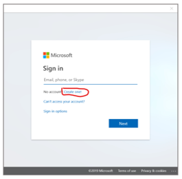

# Known issues with Microsoft Dynamics 365 Guides

## I can't install or upgrade the Dynamics 365 Guides solution

To install or upgrade the Dynamics 365 Guides solution, you must have admin permissions for Dynamics 365 Guides. You must also have a [Dynamics 365 Guides license assigned to your user account](add-users.md#assign-a-dynamics-365-guides-license-to-an-existing-user).

[Learn more about updating the Dynamics 365 Guides solution](upgrade.md).

## I can't sign in

To sign in, you must use the [!include[cc-microsoft](../includes/cc-microsoft.md)] [!include[pn-dyn-365](../includes/pn-dyn-365.md)] sign-in credentials for your organization. It will resemble: `johndoe@contoso.onmicrosoft.com`. You can't use a [!include[cc-microsoft](../includes/cc-microsoft.md)] account (used for Outlook.com, [!include[pn-ms-windows-short](../includes/pn-ms-windows-short.md)] Store, and so on) or your corporate credentials to sign in. 

If you see any of the following errors, contact your IT admin, or see the self-service documentation at <https://aka.ms/guidesdocs>:

- [!include[pn-dyn-365-guides](../includes/pn-dyn-365-guides.md)] isn't set up correctly, or you might not have permission to access it. Contact your admin, or see the [self-service documentation](./index.md).

- Your client app version doesn't support your [!include[pn-dyn-365-guides](../includes/pn-dyn-365-guides.md)] solution version. Update your client app, contact your admin, or see the [self-service documentation](./index.md).

- You don't have a license to use [!include[pn-dyn-365-guides](../includes/pn-dyn-365-guides.md)]. Contact your admin, or [sign up for a free trial subscription](setup.md).

## I don't see any guides in the Guides list

If you don't see any guides, either your internet connection is unstable, or you might have signed in to an instance that doesn't have any guides. First, check your internet connection. If you're connected, try to sign in again, and make sure that you sign in to the instance that has the guides that you're looking for. If you still don't see any guides, contact your admin.

## The Create account link doesn't work when I try to use a new account to sign in

When signing in with a brand new account on the PC and [!include[pn-hololens](../includes/pn-hololens.md)] apps, there is a link to create a new account:

 
Please do not use this link to create an account–it doesn't work.

## I can't see guides that I created or guides that my teammates created

If you don't see any guides, either your internet connection is unstable, or you might have signed in to an instance that doesn't have any guides. First, check your internet connection. If you're connected, try signing in again, but this time make sure you sign into the instance that has the guides you were looking for. If you still don't see any guides, contact your administrator.

## Text wrapping on the PC and in HoloLens might differ in rare cases

In rare cases, you might notice that text is wrapped in the Step card view in [!include[pn-hololens](../includes/pn-hololens.md)] but not on the PC. This issue occurs because, for the sake of readability, [!include[pn-dyn-365-guides](../includes/pn-dyn-365-guides.md)] renders fonts at different sizes on the PC and in [!include[pn-hololens](../includes/pn-hololens.md)], and different widths of characters might cause them to go to the next line. To ensure that this issue doesn't affect the operator experience, validate the text for all steps in the [!include[pn-hololens](../includes/pn-hololens.md)] app before you share your guides with operators.

## I have an issue that isn't listed in these troubleshooting steps

Please contact customer service: [https://docs.microsoft.com/dynamics365/get-started/support/](/dynamics365/get-started/support/). This page can also be found by signing in to your [!include[pn-dyn-365](../includes/pn-dyn-365.md)] account and selecting the **Support** link.

## See also

[Known issues with the PC app](known-issues-pc-app.md) 
[Known issues with the HoloLens app](known-issues-hololens-app.md) 
[Dynamics 365 Guides FAQ](faq.md)

[!INCLUDE[footer-include](../includes/footer-banner.md)]
