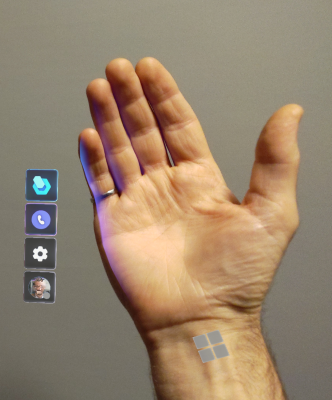

# Use the Main menu in the Dynamics 365 Guides version 7.0 HoloLens app

Version 7.0 of Dynamics 365 Guides introduced a new Main menu. After you sign in to the HoloLens app, you're prompted to look at the palm of your hand, which opens the Main menu. You can use this menu to choose an activity by using touch.

The following table describes the available activities.

|Choose this button|To|
|--------|-------------------------------------------------------------------------------------------------|
||Do a work item.   Work items include:  - Select and open a guide. - Search for a guide. - Choose a role (Author or Operator).|
||Make a call.   Call choices include:  - Select a contact from the **Recents** list. - Search for a contact. - Start a call. - View the Call window.|
||Change a setting.|
|| Sign out.|

> [!TIP]
> You can work with a guide as an author or operator and make a call at the same time. This is useful if you need to consult with a remote expert on a procedure. The remore expert can see everything that you see on your HoloLens and provide instructions as needed. You can also make a call 

## The Main menu is at your beck and call

The Main menu is always attached to your hand. No need to remember where you last accessed it in your environment! To open it again, just look at the palm of your hand. You can interact with the menu with one or two hands.

## What's next?

[Make a call](make-call.md)
