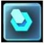
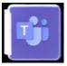
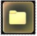

# Use the Main menu in Dynamics 365 Guides to start an activity

You can use the Main menu in the Microsoft Dynamics 365 Guides HoloLens app to start an activity, such as starting a call with a Microsoft Teams user or opening a file or a guide. After signing in to the app, just look at the palm of your hand to open the Main menu, and then use direct touch to choose an activity button. 

> [!NOTE]
> You must look at the palm of your hand to open the Main menu. If you turn your palm toward you but don't look at it, the Main menu won't open. This is to keep holographic screens from appearing when you don't want them to appear. 

The following table describes each button on the Main menu.

|Button|Description|
|--------|-------------------------------------------------------------------------------------------------|
||Select and open a guide or search for a guide.|
||Call a Microsoft Teams collaborator, share files, screens, or annotations, and chat.|
||Open a OneDrive for Business file. |
|| Access your profile settings or sign out.|

## Summon the Main menu whenever you need to start an activity or switch activities

When you're working with complex machinery in a busy environment, you need the right holographic information at your fingertips to help you with your work, but you also need to be able to clear holographic content quickly to focus on the task at hand. The Main menu makes it very quick and easy to access the information you need but also helps avoid holographic clutter because it doesn't follow you around in your environment. For example, if you're on a call and working with a guide, you don't need to remember where the Call window is—**just look at the palm of your hand again to bring the Main menu to you**, and then select the **Call activity** button. 

Need to open a different guide? Summon the Main menu again, select the **Work activity** button, and then select the guide you want to open. 

When the Main menu is open, you can move it wherever you want (or pivot it) by grabbing it with your hand(s). 

## When to use touch vs. gaze in Dynamics 365 Guides

The following table summarizes when to use direct touch vs. gaze in the Dynamics 365 Guides version 7.0 HoloLens app.

|Area|Direct touch or gaze?|
|------------------|----------------------------------------------------------|
|Main menu and submenus|Direct touch. Use touch for any of the following actions:  - Sign in/sign out - Select an instance - Find and open a guide - Start a call  - Change a setting - Try a guide (demo)|
|Call window|Direct touch|
|Instruction cards|**Authors** can use a combination of gaze, air tap, hand rays, direct touch, or voice commands, depending on the task.  **Operators** can use gaze, air tap, and voice commands.

## What's next?

- [Find and open a guide](find-guide.md)
- [Make a call (Preview)](make-call.md)
- [Learn about permissions required to use the HoloLens app](hololens-permissions.md)
