# Migrate Dynamics 365 Guides content from one Microsoft Dataverse instance to another using the Content Migration Tool (Public Preview)

[!include [rename-banner](~/includes/cc-data-platform-banner.md)]

The Content Migration Tool (Public Preview) for Microsoft Dynamics 365 Guides is a [Windows PowerShell](https://docs.microsoft.com/windows-server/administration/windows-commands/powershell) script that copies content from one instance of Microsoft Dataverse to another. You can migrate all the content in an instance or just specific types of content (for example, 3D objects, images, and videos). After the migration is completed, the content exists in both instances. The content in the source instance isn't changed in any way.

The tool connects to two Microsoft Dataverse instances at the same time. It reads the content in the source instance and writes it to the destination instance. The instances can be part of the same tenant, or they can be in different tenants.

The tool supports migration between commercial and/or Microsoft Government Community Cloud (GCC) environments.

> [!IMPORTANT]
> By using the Content Migration Tool (Public Preview) for Dynamics 365 Guides, you acknowledge and accept all the limitations of using a preview tool. For example, you accept that the terms and commitments for Dynamics 365 Guides and other Microsoft commercial services and products don't apply to the Content Migration Tool. You also assume all risks that are associated with migrating your data between Dynamics 365 tenants. These risks include but aren't limited to the risk of different security, compliance, and privacy commitments, the risk of damage to or loss of data, and the risk of unavailability or interruption of the tool.

The tool supports the following types of migration.

| Type of migration | What is migrated? |
|-------------------|-------------------|
| All content | Everything that is stored in the instance that is active. (Telemetry events that are associated with a guide are excluded.) |
| Guides and associated content | Active guides, and any 3D objects, images, or videos that are related to those guides. Inactive content that is associated with a guide is also migrated. You can migrate all existing guides at one time, or you can select specific guides to migrate. |
| All 3D objects, images, and videos | All active 3D objects, images, and videos that are stored in the instance. |
| Only 3D objects | Active 3D objects only. You can migrate all existing 3D objects at one time, you can migrate all 3D objects that belong to a 3D object collection, or you can select specific 3D objects to migrate. |
| Only images | Active images only. You can migrate all existing images at one time, or you can select specific images to migrate. |
| Only videos | Active videos only. You can migrate all existing videos at one time, or you can select specific videos to migrate. |

> [!NOTE]
> - [Website and Power Apps links](pc-app-website-powerapps-link.md) are migrated when you migrate guides. However, for Power Apps, you must manually import the apps into the new instance and update the links in the appropriate steps.
> - The Content Migration Tool doesn't support migration of guides that are based on schema v3 or v4. If you've updated your Dynamics 365 Guides solution to the latest version, but you still have a guide that is based on schema v3 or v4, you can [do a manual upgrade](https://docs.microsoft.com/dynamics365/mixed-reality/guides/upgrade#troubleshooting-you-receive-a-guide-cannot-be-opened-error-message).
> - For 3D objects that belong to a 3D object collection, the parent 3D object won't be migrated unless you have the **System Admin** role.

## Prerequisites

- You must have a Dynamics Insider Program account to access the download files.

- You must be a system admin for the computer that you use to run the Windows PowerShell script.

- You must use [Windows PowerShell](https://docs.microsoft.com/powershell/scripting/install/installing-windows-powershell?view=powershell-7#how-to-check-the-version-of-powershell) version 5.1.18362.752 or later.

- Both the source instance and the destination instance must use Dynamics 365 Guides solution version 500.0.0 or later. Make sure that the destination instance is on the same version as, or a newer version than, the source instance.

- You must have credentials to sign in to the source instance in the **System Admin** role (preferable) or **Operator/Author** role (required).

- You must have credentials to sign in to the destination instance in the **System Admin** role (preferable) or **Author** role (required).

We also highly recommend that you [back up the contents](https://docs.microsoft.com/power-platform/admin/backup-restore-environments#create-a-manual-backup) of both instances before you start the migration process.

> [!NOTE]
> The Content Migration Tool doesn't support multi-factor authentication.

## Register for the Dynamics Insider Program

1. Go to [https://experience.dynamics.com/Account/Login/Register?returnUrl=%2Finsider%2F](https://experience.dynamics.com/Account/Login/Register?returnUrl=%2Finsider%2F), and register by using an account of your choice (or sign in if you're already registered).

    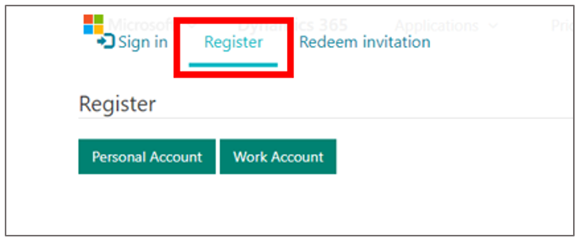

    > [!NOTE]
    > Approval of an application for the Dynamics Insider Program might take up to a day. If you still don't have access after 24 hours, post a message on [the Dynamics 365 Guides community forum](https://community.dynamics.com/365/guides).

2. After you've registered, on the **Welcome Insider** page, under **Upcoming and Active Public Preview Programs**, search for **Dynamics 365 Guides - Content Migration Tool (Public Preview)**, and select it.

    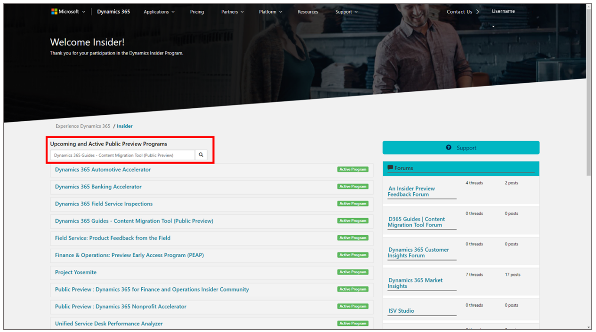

3. Select **Join now**.

    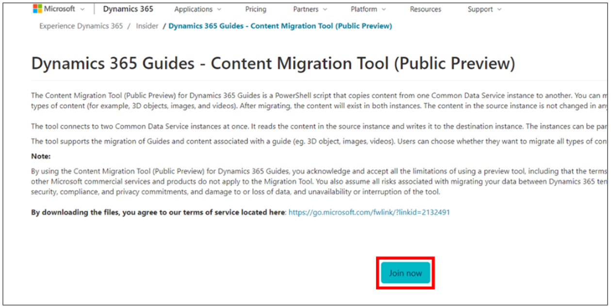

4. Select **View Program Downloads**.

    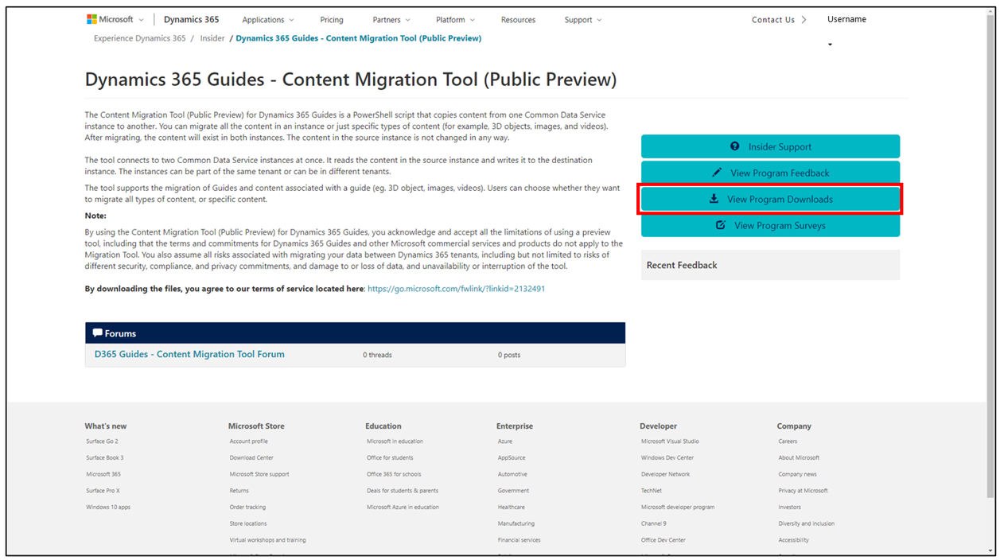

5. Download the **ContentMigrationTool\_D365Guides\_v500.0.1.0.zip** folder by selecting the link in the **File Name** column. The file is automatically saved in your **Downloads** folder.

    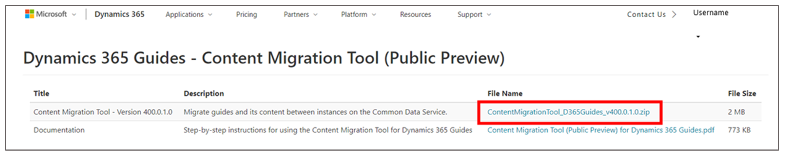

## Run the script

1. In File Explorer in Windows, select the zipped folder, and then, on the **Home** tab, select **Properties** \> **Properties**.

    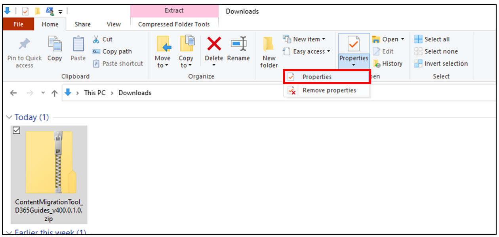

2. In the **Properties** dialog box, on the **General** tab, select the **Unblock** check box, and then select **Apply**.

    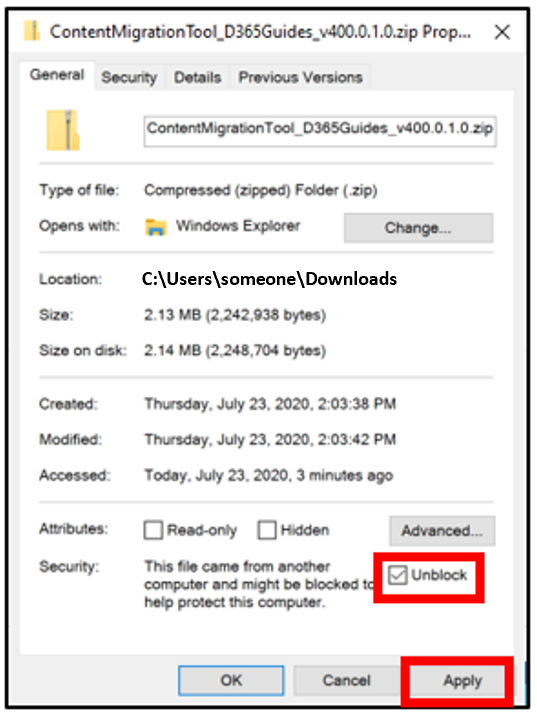

3. Extract the contents of the zipped folder by following these steps:

    1. In File Explorer, select the zipped folder.

    2. On the **Compressed Folder Tools** under **Extract**, select **Extract all**.

        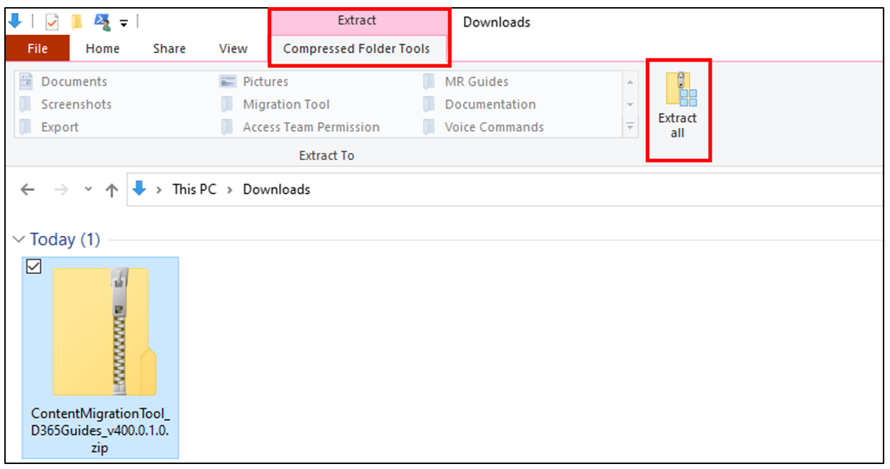

4. Go to the File Explorer location where you extracted the contents of the zipped folder, and then go to the **ContentMigrationTool\_D365Guides\_v500.0.1.0** \> **MigrationToolScripts** folder.

5. Run Windows PowerShell [as an administrator](https://docs.microsoft.com/previous-versions/windows/it-pro/windows-server-2012-R2-and-2012/hh831491(v=ws.11)#run-a-program-as-administrator-or-as-another-user) by following these steps:

    1. On the **File** menu, select **Open Windows PowerShell** \> **Open Windows PowerShell as administrator**.

        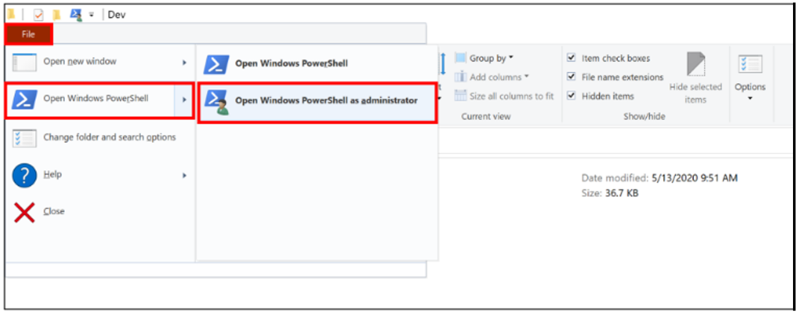

    2. In the **User Account Control** message box, select **Yes** to allow Windows PowerShell to make changes to your device.

6. Enter **Set-ExecutionPolicy RemoteSigned**, and then select **Y** to accept the change in execution policy.

    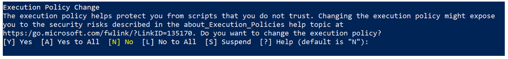

7. Enter **.\ContentMigrationTool\_PublicPreview\_Dynamics365Guides.ps1**, and then select **Enter**.

    > [!NOTE]
    > Be sure to include the period at the beginning of the string.

8. Select any key to continue.

9. In the **PowerShell Interactive Login** dialog box, connect to the source instance by following these steps:

    1. In the **Deployment Type** field group, select the **Microsoft 365** option.

    2. Select the **Display list of available organizations** check box.

    3. Select the **Show Advanced** check box.

    4. In the **Online Region** field, select the online region for your instance. If your environment is in a GCC region, select **North America 2**. If you don't know the region, select **Don't know**.

    5. In the **User Name** and **Password** fields, enter the user name and password for the Microsoft Dataverse instance that you want to connect to.

    6. Select **Login**. If you don't select an organization to connect to, the tool connects to the last organization that was successful for both the source instance and the destination instance. If there is only one instance in the tenant, Windows PowerShell automatically connects to the default instance. In this case, you can skip ahead to step 11.

        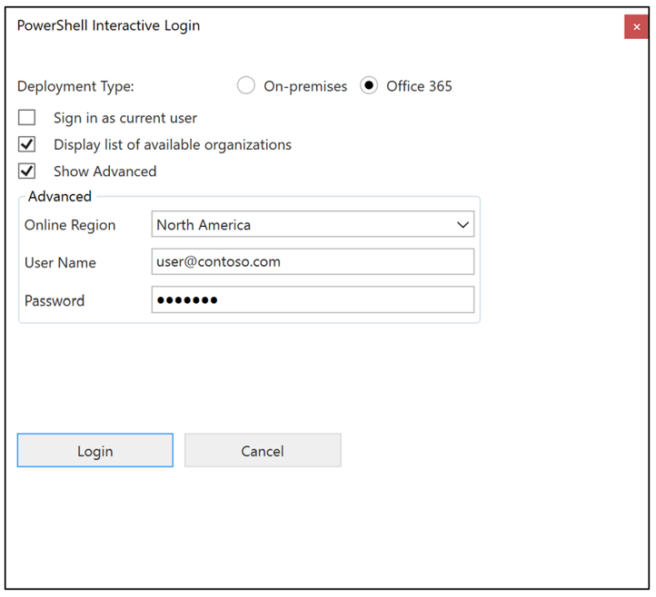

    7. In the **Starting Login Process** dialog box, select the source instance (organization) to connect to.

        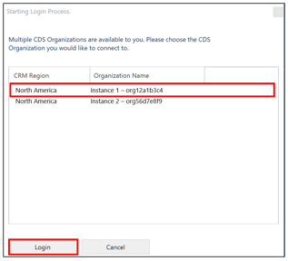

    8. Select **Login**.

10.	In the **PowerShell Interactive Login** dialog box, connect to the destination instance by following these steps:

    1. In the **Deployment Type** field group, select the **Microsoft 365** option.

    2. Select the **Display list of available organizations** check box.

    3. Select the **Show Advanced** check box.

    4. In the **Online Region** field, select the online region for your instance. If your environment is in a GCC region, select **North America 2**. If you don't know the region, select **Don't know**.

    5. In the **User Name** and **Password** fields, enter the user name and password for the Microsoft Dataverse instance that you want to connect to.

    6. Select **Login**.

        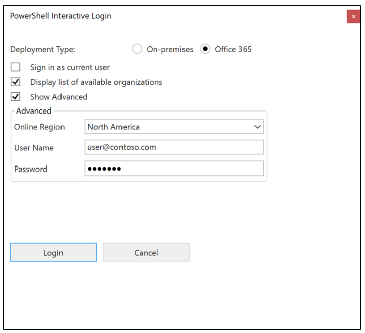

    7. In the **Starting Login Process** dialog box, select the destination instance (organization) to connect to.

        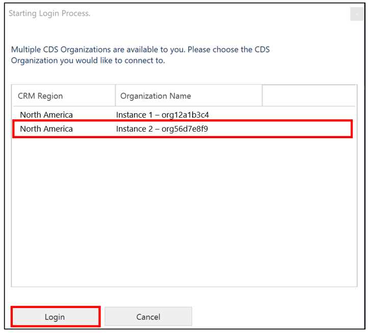

    8. Select **Login**.

11.	On the **Main Menu** page, select an option by entering the number that corresponds to it, and then select **Enter**.

    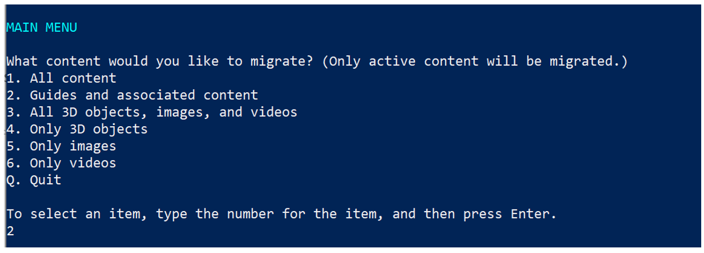

    > [!TIP]
    > In numbered lists where you can select more than one option, such as the numbered list on the **Select Guides to Migrate** page, separate the numbers for your selections with a comma, and then select **Enter**.
    > 
    > 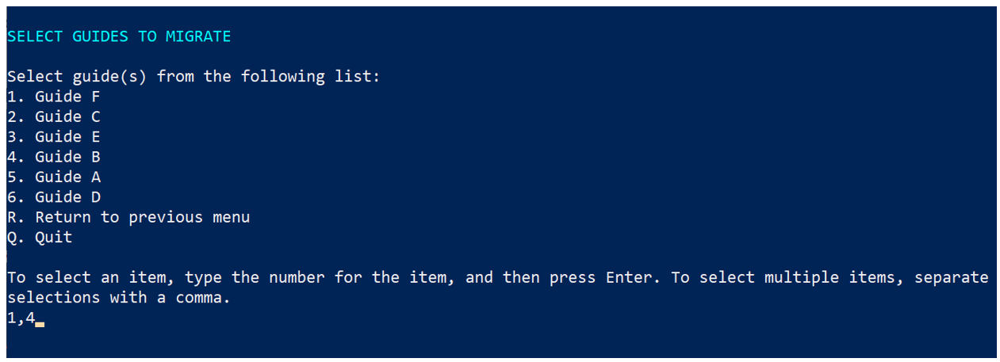

12.	When you're prompted to confirm your selection, enter **Y**, and then select **Enter**. To cancel the action, enter **N**, and then select **Enter**.

    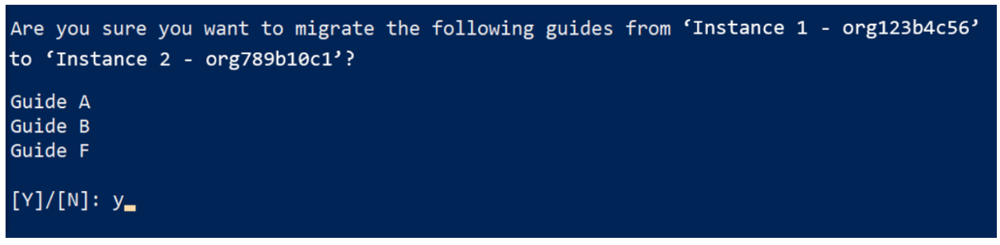
