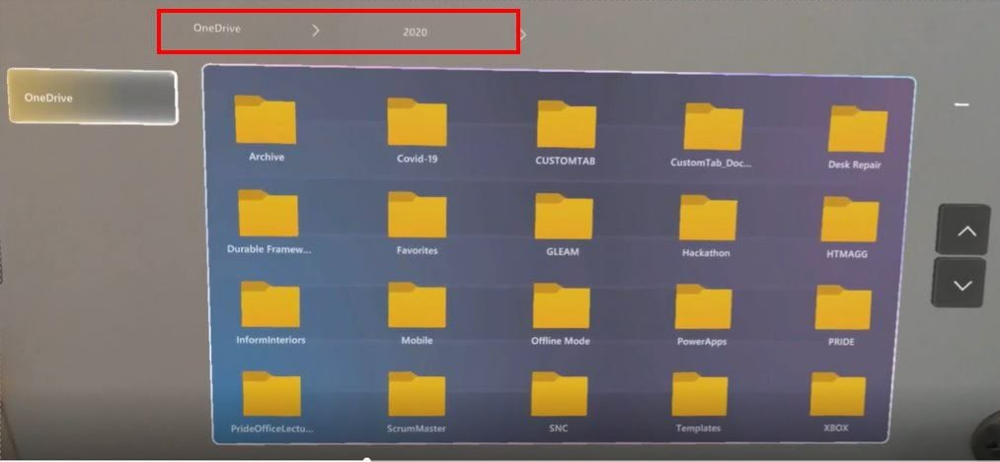

## Open a OneDrive for Business file in Dynamics 365 Guides on HoloLens

You can open a OneDrive for Business file from the Main menu in the Microsoft Dynamics 365 Guides HoloLens app. This makes it easy to open a file whether you're on a call, authoring a guide, or operating a guide. You can only open image files and .pdf files through the Main menu, however. 

> [!NOTE]
> You can't open content from shared SharePoint folders or personal OneDrive folders in Dynamics 365 Guides.

1. Look at the palm of your hand to open the **Main** menu, and then select the **Files** button.

    

2. In the OneDrive screen, use direct touch to open a folder. When you open a folder, breadcrumbs appear at the top of the screen to show you where you are in the folder structure.

    
    
    You can select a folder in the breadcrumbs to access that folder. If there are too many folders to list in the breadcrumbs, an ellipsis (...) appears at the beginning of the breadcrumbs. To go back to the root folder, select the **OneDrive** button.
    
    > [!TIP]
    > If a folder name is truncated, you can see the full folder name by hovering your cursor over the folder. 
    
3. When you open a file, the file appears in a new window. You can manipulate that window like any other window in Dynamics 365 Guides.

    
    
> [!NOTE]
> If a remote collaborator on Microsoft Teams sends a file to a Dynamics 365 Guides user through chat, the file is displayed in the same way as if the user opened the file from their OneDrive for Business folder, but the file can't be saved to the user's OneDrive for Business folder. To send a file this way in chat, the Teams user must attach the file to a message. The file can't be embedded (pasted) in the message. 
