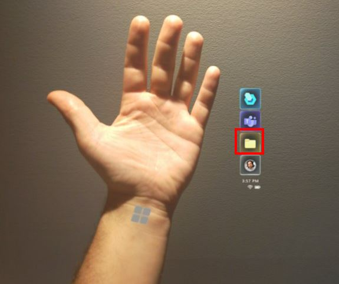
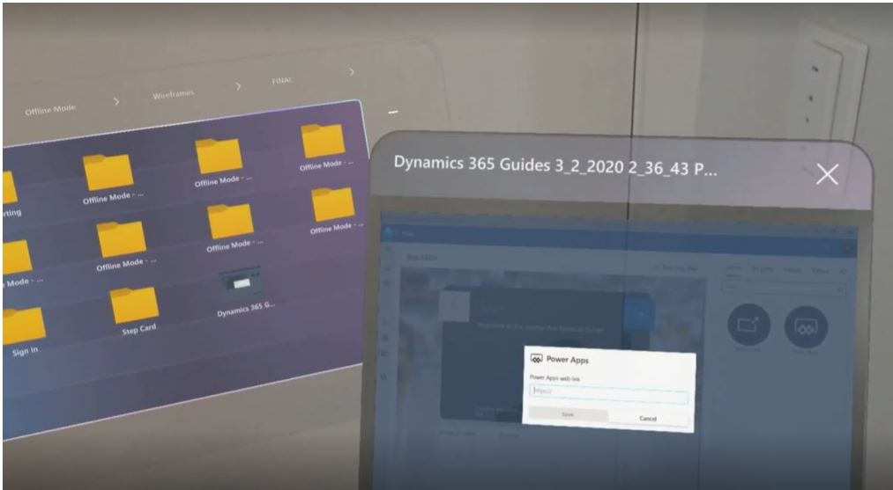

## Access a OneDrive for Business file in Dynamics 365 Guides on HoloLens

You can access OneDrive for Business files from the Main menu in the Microsoft Dynamics 365 Guides HoloLens app. This makes it easy to find a file whether you're on a call, authoring a guide, or operating a guide. You can only open image files and .pdf files through the Main menu, however. 

> [!NOTE]
> Dynamics 365 Guides does not support uploading content from shared SharePoint sites or personal OneDrive folders.

1. Look at the palm of your hand to open the **Main** menu, and then select the **Files** button.

    

   This opens the OneDrive screen.

2. Use direct touch to open a folder. When you open a folder, breadcrumbs appear at the top of the screen to show you where you are in the folder structure.

    
    
    You can select a folder in the breadcrumb to access that folder. If there are too many folders to list in the breadcrumps, an ellipsis (...) appears at the beginning of the breadcrumb. To go back to the root folder, select the **OneDrive** button.
    
    > [!TIP]
    > If a folder name is truncated, you can see the full folder name by hovering your cursor over the folder. 
    
3. When you open a file, the file appears in a new window. You can manipulate that window like any other window in Dynamics 365 Guides.

    
