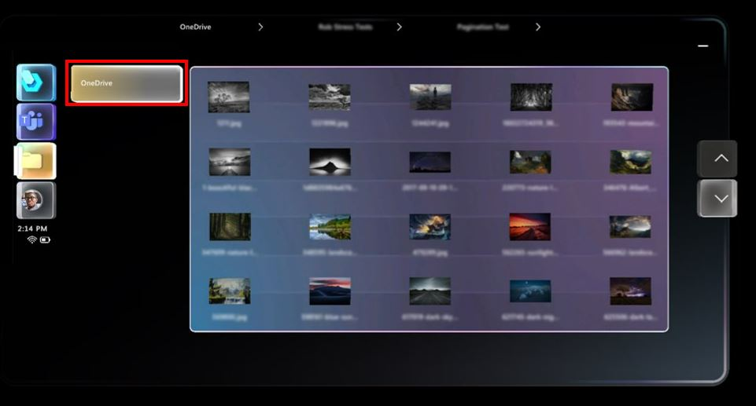

# Open a OneDrive for Business file in Dynamics 365 Guides on HoloLens

You can open a OneDrive for Business file from the **Main** menu in the Microsoft Dynamics 365 Guides HoloLens app. This makes it easy to open a file whether you're on a call, authoring a guide, or operating a guide. You can only open image files and .pdf files through the **Main** menu, however. 

> [!NOTE]
> You can't open content from shared SharePoint folders or personal OneDrive folders in Dynamics 365 Guides.

1. Look at the palm of your hand to open the **Main** menu, and then select the **Files** button.

    

2. In the OneDrive screen, use direct touch to open a folder. When you open a folder:

    - Breadcrumbs appear at the top of the screen to show you where you are in the folder structure. 
    - You can select a folder in the breadcrumbs to access that folder. 
    - If there are too many folders to list in the breadcrumbs, an ellipsis (...) appears at the beginning of the breadcrumbs. 

    
        
    > [!TIP]
    > If a folder name is truncated, you can see the full folder name by hovering your cursor over the folder. 
    
3. If you want to go back to the root OneDrive folder at any time, select the **OneDrive** button.

    
    
    > [!NOTE]
    > If a PDF document includes a lot of vector content and embedded graphics, the document might take a while to load. 
   
## Manipulate the file screen
   
When you open a OneDrive file, the file appears in a new window. You can use direct touch to move the window around, and to size it. 

You can also interact with the screen by using your hand rays and air tap (far-field interactions). Using far-field interactions is particularly useful for situations where you want to move the window further away from you. 

    
## Share a OneDrive file through Teams chat

If a remote collaborator sends a file to a Dynamics 365 Guides user through Teams chat, the file is displayed in the same way as if the user opened the file from their OneDrive for Business folder, but the file can't be saved to the user's OneDrive for Business folder. To send a file this way in chat, the Teams user must attach the file to a message. The file can't be embedded (pasted) in the message. 

## See also

- [Chat and share files with a Microsoft Teams user](calling-chat-file-sharing.md)
- [Screen sharing with Microsoft Teams users](calling-screen-sharing.md)

