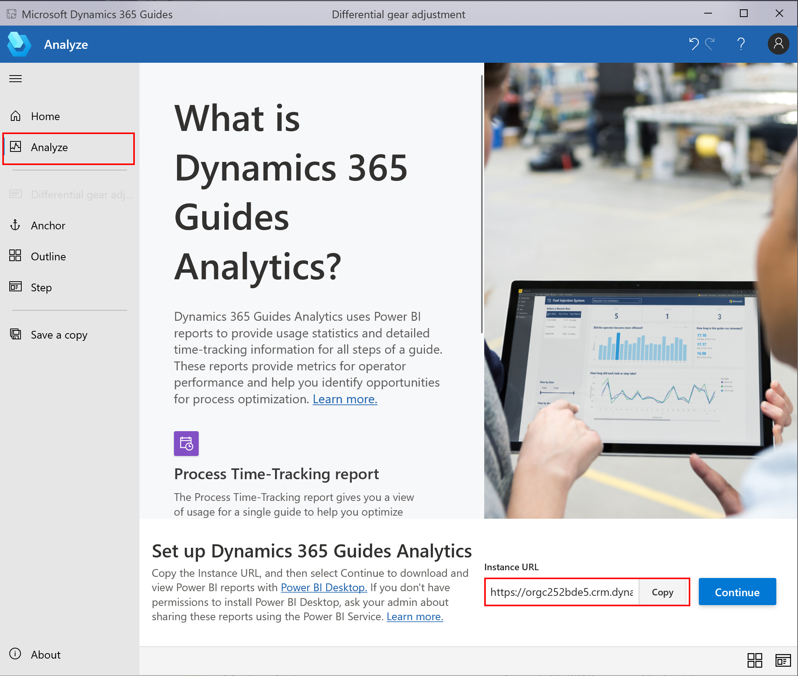
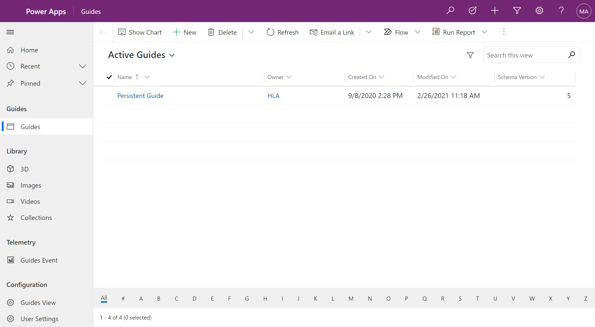

# Open the model-driven app in Dynamics 365 Guides

If you're an admin or an author for Dynamics 365 Guides, you can use the Guides model-driven app to do things that you can't do in the PC app or HoloLens app. For example, you can:

- [Create workflows in Microsoft Power Apps to automate Dynamics 365 Guides processes](workflow-examples-overview.md)

- [Create folders to organize your guides](admin-create-folders.md)

- [Change a thumbnail for a video associated with a step](pc-app-add-media.md#change-a-video-thumbnail)

> [!CAUTION] 
> The Guides model-driven app isn't intended as a replacement for authoring in the PC and HoloLens apps. If you use the model-driven app to create, update, or delete records, you might make Dynamics 365 Guides nonfunctional or prevent users from using the PC or HoloLens apps in the intended way. Currently, guide modification through the model-driven app isn't fully supported unless specifically covered in the Dynamics 365 Guides documentation and should be reserved for experienced Dynamics 365 developers who are familiar with Microsoft Dataverse.

## Access the model-driven app

1. In the PC authoring app, sign in to the Dynamics 365 instance that includes the guide.

2. Select the **Analyze** tab, and then under **Instance URL**, select **Copy**, and then paste the value into the address bar of a web browser.

    

3. Sign in, and then in the left pane of the Power Apps screen, select **Guides** to open the model-driven app.

    

## See also

- [Create workflows in Microsoft Power Apps to automate Dynamics 365 Guides processes](workflow-examples-overview.md)
- [Create folders to organize your guides](admin-create-folders.md)
- [Change a thumbnail for a video associated with a step](pc-app-add-media.md#change-a-video-thumbnail)
