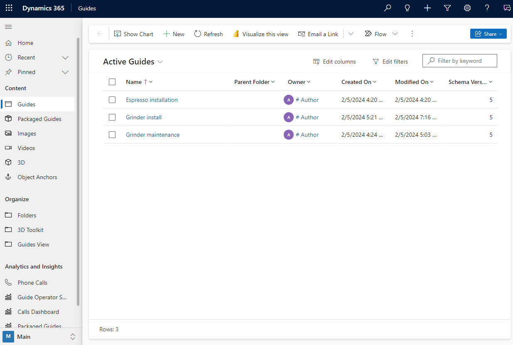

# Open the model-driven app in Dynamics 365 Guides

When you create a guide in the PC authoring app, the content is stored in Microsoft Dataverse. The Guides model-driven app enables you to access and view guide content quickly from Microsoft Dataverse.

> [!CAUTION]
> The Guides model-driven app isn't intended as a replacement for authoring in the PC and HoloLens apps. If you use the model-driven app to create, update, or delete records, you might make Dynamics 365 Guides nonfunctional or prevent users from using the PC or HoloLens apps in the intended way. Currently, guide modification through the model-driven app isn't fully supported unless specifically covered in the Dynamics 365 Guides documentation and should be reserved for experienced Dynamics 365 users who are familiar with Microsoft Dataverse.

## Prerequisites

- Guides admin or author role

## Access the model-driven app

1. In the PC authoring app, sign in to the Dynamics 365 instance that includes the guide.

1. Select the **Analyze** tab, and then under **Instance URL**, select **Copy**, and then paste the value into the address bar of a web browser.

    

1. Sign in, and then in the left pane of the Power Apps screen, select **Guides** to open the model-driven app.

    

[!INCLUDE[footer-include](../includes/footer-banner.md)]
