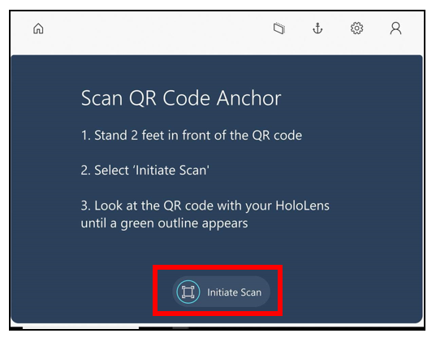
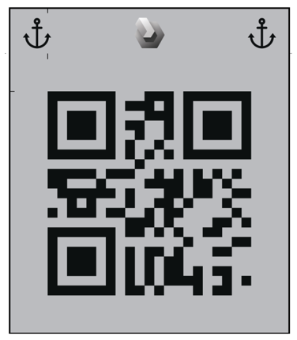
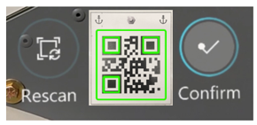
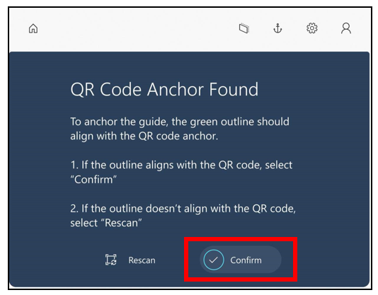
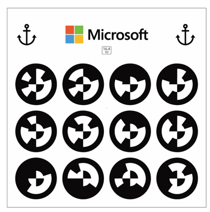
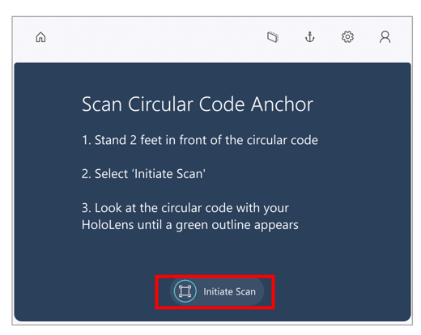
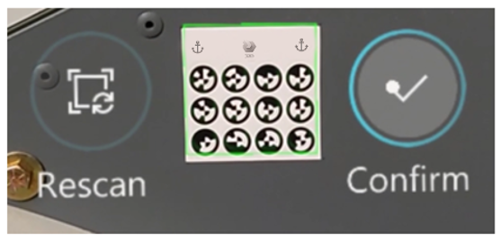
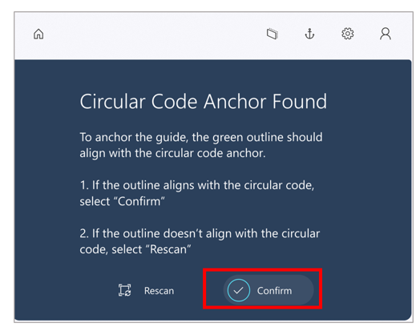
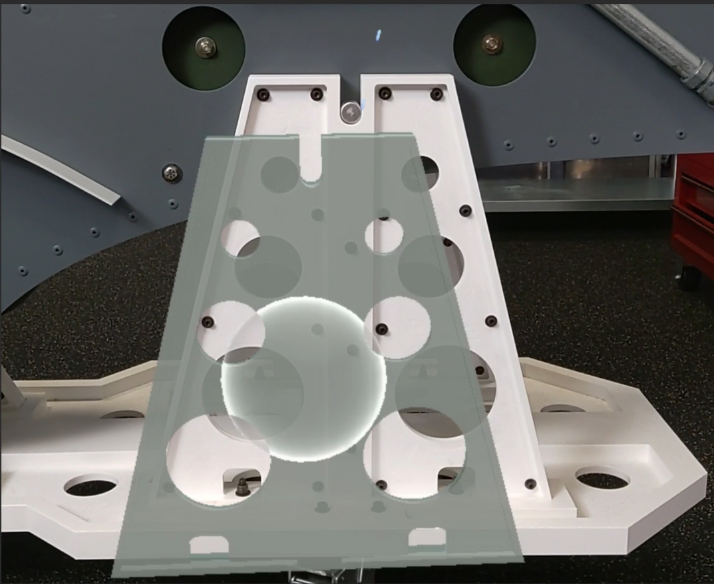
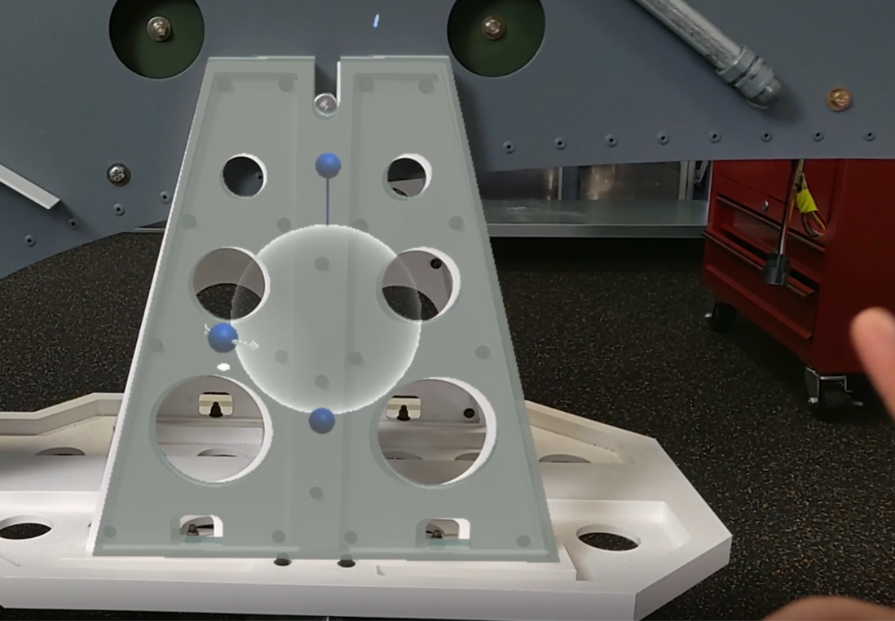

# Anchor a guide in the Dynamics 365 Guides HoloLens app (for operators)

When you open a guide in [!include[cc-microsoft](../includes/cc-microsoft.md)] [!include[pn-dyn-365-guides](../includes/pn-dyn-365-guides.md)], the first thing that you see is the anchoring instructions for the guide. For example, if a QR code is used to anchor the guide, you see the **Scan QR Code Anchor** page.

Like the calibration of [!include[cc-microsoft](../includes/cc-microsoft.md)] [!include[pn-hololens](../includes/pn-hololens.md)], anchoring a guide is a crucial step. You anchor a guide to make sure that the holographic instructions line up with your real-world environment. If the holograms don't line up, you'll likely be confused when you try to do a task. You could even cause damage. For example, you might drill a hole in the wrong place.

## Three types of anchors

The way that you anchor your guide depends on the type of anchor that the author selected for the guide. There are three types of anchors: 

- QR code anchor

- Circular code anchor

- Holographic anchor

This topic provides step-by-step instructions for each type of anchor.

## Anchor your guide by using a QR code anchor

1. Look for a QR code anchor that is attached to a physical object in your real-world environment. The QR code anchor will resemble this illustration.

    

2. Put on your HoloLens, and open the guide. If a QR code is used to anchor the guide, you will see the **Scan QR Code Anchor** page.

3. On the **Scan QR Code Anchor** page, select **Initiate Scan**. 

    

3. On your [!include[pn-hololens](../includes/pn-hololens.md)], you will see a hologram that resembles the QR code anchor. Align the anchor hologram with the QR code anchor. When the green box is aligned, gaze at **Confirm** to select it.

    

4. On the **QR Code Anchor Found** page, select **Confirm**.

    
    
    > [!TIP]
    > You can re-align holographic content that might seem offset from the real world (for example, a rectangle that should be referencing a tool, but is floating in the air away from the tool bench). When using a QR code anchor, a good way to control hologram offset is to make sure the green outline aligns with the QR code. If the green outline isn’t aligned, you may need to tap the **Anchor** button to rescan. 

## Anchor your guide by using a circular code anchor

1. Look for a circular code anchor that is attached to a physical object in your real-world environment. The circular code anchor will resemble this illustration.

    

2. Put on your HoloLens, and open the guide. If a circular code is used to anchor the guide, you will see the **Scan Circular Code Anchor** page.

3. On the **Scan Circular Code Anchor** page, select **Initiate Scan**. 

    

4. On your [!include[pn-hololens](../includes/pn-hololens.md)], you will see a hologram that resembles the circular code anchor. Align the anchor hologram with the circular code anchor. When the green box is aligned, gaze at **Confirm** to select it.

    

5. On the **Circular Code Anchor Found** page, select **Confirm**.

    
    
    > [!TIP]
    > You can re-align holographic content that might seem offset from the real world (for example, a rectangle that should be referencing a tool, but is floating in the air away from the tool bench). When using a circular code anchor, a good way to control hologram offset is to make sure the green outline aligns with the circular code. If the green outline isn’t aligned, you may need to tap the **Anchor** button to rescan. 

## Anchor your guide by using a holographic anchor

For a holographic anchor, you align a hologram on your [!include[pn-hololens](../includes/pn-hololens.md)] with a similar object in the real world. For example, in the following illustration, a holographic anchor is being aligned with its physical counterpart in the real world.

To align the holographic anchor with its real-world counterpart, air tap and hold to move the hologram. Tap and hold the blue spheres to rotate the hologram as required.

> [!TIP]
> You can re-align holographic content that might seem offset from the real world (for example, a rectangle that should be referencing a tool, but is floating in the air away from the tool bench). When using a holographic anchor, select the **Anchor** button to make sure the digital version of the real object and the object itself are still aligned.

## Where alignment information is stored

When you align your guide, if you're using the [!include[cc-microsoft](../includes/cc-microsoft.md)] [!include[pn-hololens](../includes/pn-hololens.md)] Commercial Suite, the alignment information is stored on [!include[pn-hololens](../includes/pn-hololens.md)], so you don't have to realign the guide every time that you open it. However, you can realign a guide at any time if you think that the holograms are out of alignment by using the **Anchor** button. For more information, see [Operate a guide](operator-step-card-orientation.md).

## What's next?

[Calibrate your HoloLens](operator-calibrate.md) 
[Install the app and sign in](install-sign-in-operator.md) 
[Gestures for navigating the app](operator-gestures.md) 
[Operate a guide](operator-step-card-orientation.md)

[!INCLUDE[footer-include](../includes/footer-banner.md)]