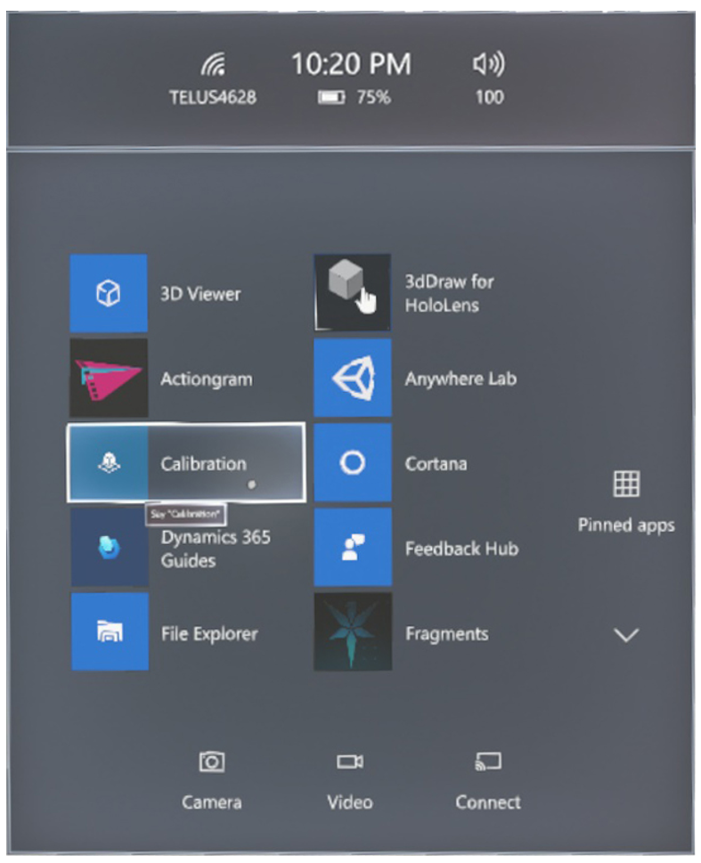

# Calibrate your HoloLens 1 device to use with Dynamics 365 Guides

[!include[cc-microsoft](../includes/cc-microsoft.md)] [!include[pn-dyn-365-guides](../includes/pn-dyn-365-guides.md)] uses holograms to show you, as an operator, exactly what you must do to perform a real-world task. For example, your guide might show you how to assemble a door for a commercial aircraft. It's very important to calibrate the HoloLens display for your own eyes so that holograms are properly displayed and perceived as accurately positioned in space. Otherwise, you might drill a hole in the wrong place or assemble the wrong part. To make sure that holograms are correctly aligned, you must calibrate your [!include[pn-hololens](../includes/pn-hololens.md)] device. You can complete this step by using the Calibration app that comes with your [!include[pn-hololens](../includes/pn-hololens.md)].

> [!IMPORTANT]
> Starting with Dynamics 365 Guides version 502.2011.28001 (December 8, 2020 release), HoloLens operating system version 10.0.17134 (Redstone 4) will no longer be supported. This version of the operating system is used only on HoloLens 1. HoloLens 1 customers must upgrade to HoloLens version 10.0.17763 or later to continue to receive the latest updates. Please work with your IT admin to update your HoloLens operating system. If you choose not to upgrade, you will still be able to use the current version of Dynamics 365 Guides if the application is already installed on the device. For any new or refactored HoloLens 1 devices, version 10.0.17763 or later is required to install Dynamics 365 Guides. 

## Calibrate your HoloLens by using the Calibration app

1. Use the bloom gesture to open the **Start** menu.

2. If **Settings** isn't pinned to the **Start** menu, select the plus sign (**+**) button to view all apps.

    > [!NOTE]
    > To select something by using your [!include[pn-hololens](../includes/pn-hololens.md)] device, gaze at it to target it, and then air tap to select it. 

3. Select **Settings**.

4. Select **System**.

5. Select **Utilities**.

6. Select **Open Calibration**.

7. Follow the on-screen instructions.

[Learn more about HoloLens calibration](https://docs.microsoft.com/windows/mixed-reality/calibration).

## What's next?

[Install the app and sign in](install-sign-in-operator.md) 
[Gestures for navigating the app](operator-gestures.md) 
[Anchor your guide](operator-anchor.md) 
[Operate a guide](operator-step-card-orientation.md)
