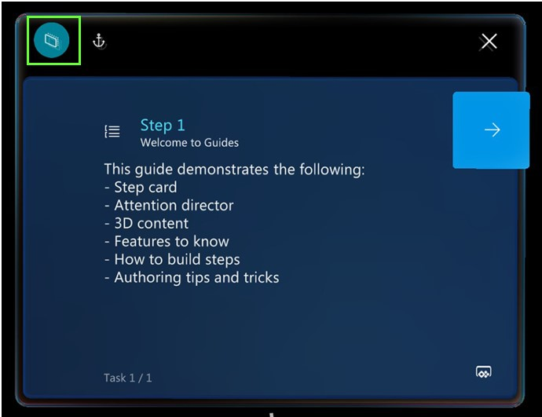
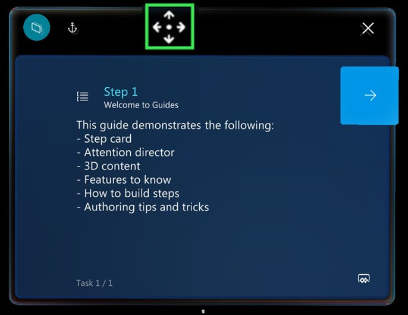

# Turn Follow mode off or on in the Dynamics 365 Guides HoloLens app

When you're using the Dynamics 365 Guides HoloLens app, wherever you look, the Step card follows your gaze. While you're working, you never have to think about where your instructions are. If you don't want the Step card to follow you around (you want to pin the Step card in a particular place), you can turn off **Follow** mode from the navigation bar.

If you raise your hand, a navigation bar appears on the Step card. You can use this navigation bar to move the Step card wherever you want it. 

## What's next?

- [Get oriented with the Step card](operator-step-card-orientation.md)
- [Use the dotted line to find the focus area for a step](operator-dotted-line.md)
- [Use triggers to move between steps](operator-trigger.md)
- [Open a website from the Step card](operator-website-link.md)
- [Open an app in Power Apps from the Step card](operator-powerapps-link.md)
- [Turn holograms off and on](operator-holograms-off.md)
- [Work offline](operator-offline-mode.md)
- [Use voice commands](voice-commands.md)

[!INCLUDE[footer-include](../includes/footer-banner.md)]
