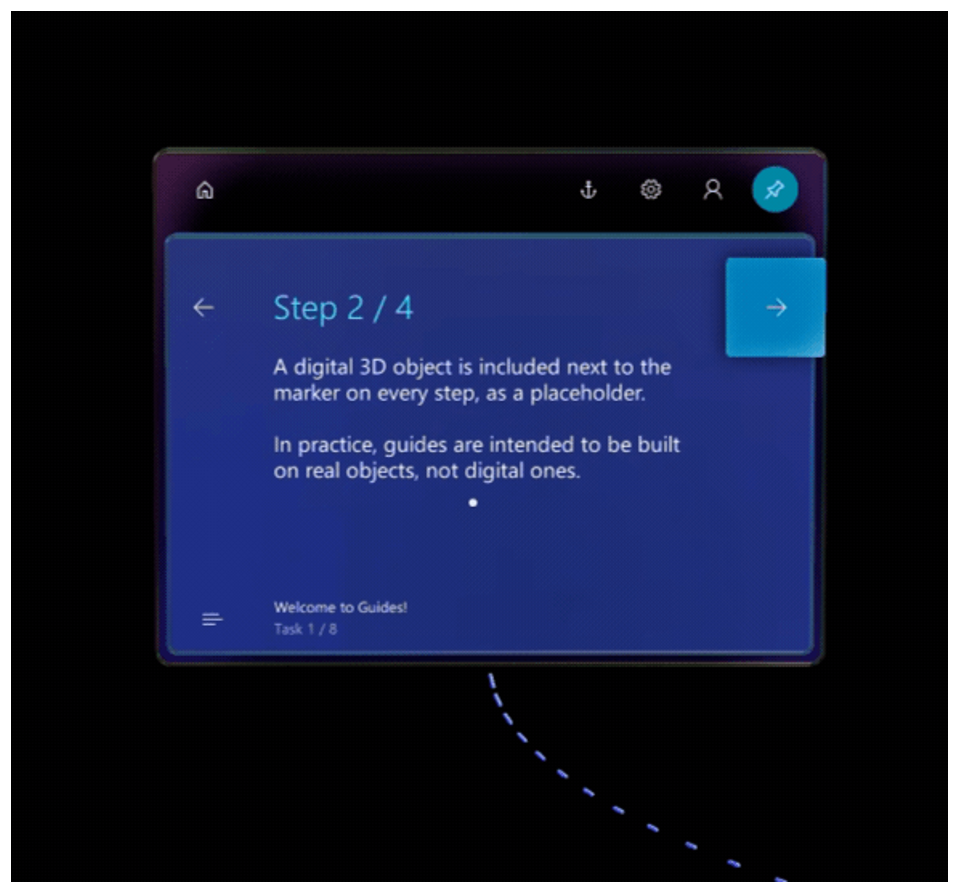
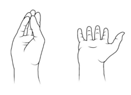
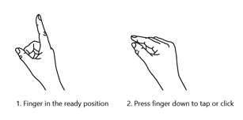

# HoloLens 1 gestures for operating (navigating) a guide in Dynamics 365 Guides

To move through a guide as an operator in [!include[cc-microsoft](../includes/cc-microsoft.md)] [!include[pn-dyn-365-guides](../includes/pn-dyn-365-guides.md)], you use your gaze and a few gestures.

> [!IMPORTANT]
> In Dynamics 365 Guides version 502.2011.28001 (December 8, 2020 release) and later, HoloLens operating system version 10.0.17134 (Redstone 4) is no longer supported. This version of the operating system is used only on HoloLens 1. HoloLens 1 customers must upgrade to HoloLens version 10.0.17763 or later to continue to receive the latest updates. Work with your IT admin to update your HoloLens operating system. If you choose not to upgrade, you can continue to use the current version of Dynamics 365 Guides that is already installed on the device. However, HoloLens version 10.0.17763 or later is required to install Dynamics 365 Guides on any new or refactored HoloLens 1 device. 

## Gaze

Gaze on [!include[pn-hololens](../includes/pn-hololens.md)] is as easy as it sounds. In some cases, you can select an item (for example, an app, menu, or button) just by gazing at a selection box next to it. For example, when you first start the [!include[pn-hololens](../includes/pn-hololens.md)] app, you will gaze at the box to the left of **Operate** in the **Select Mode** dialog box to select **Operate** mode. The selection is completed when the box is filled up by your gaze.

Gaze is very useful if your hands are busy with tools or parts.

In other cases, you first use gaze to target an object in [!include[pn-dyn-365-guides](../includes/pn-dyn-365-guides.md)], and you then act on the object by using a gesture such as an air tap.

In both cases, when you gaze, be sure to turn your whole head, not just your eyes.

## Gestures

As you work with a guide, you will also have to use some gestures. This section lists the most important gestures.

### Bloom

The bloom gesture opens the **Start** menu or the **Quick Actions** menu, depending on the version of [!include[pn-hololens](../includes/pn-hololens.md)] that you're using. Most of the time, you will have to use the bloom gesture only once to get to **Start**. However, you will sometimes have to use it twice. If you're ever unsure what to do, the bloom gesture can help you get reoriented.

To do the bloom gesture, follow these steps.

1. Hold out one of your hands with the palm facing up and all your fingertips together.

2. Open your hand.

### Air tap

You can use air tap, together with gaze, to select apps, other holograms, and gaze/dwell buttons. To do an air tap, follow these steps.

1. Gaze at a hologram.

2. Hold your hand straight out in front of you in a loose fist, and point your index finger straight up toward the ceiling. You don't have to raise your whole arm. Keep your elbow low and comfortable.

3. Tap your finger down, and then quickly raise it back up again.

### The gesture frame

[!include[pn-hololens](../includes/pn-hololens.md)] has sensors that can see a few feet to each side of you. When you use gestures, you must keep them inside that frame. Otherwise, [!include[pn-hololens](../includes/pn-hololens.md)] won't see them. As you move around, the frame moves with you. When your hand is inside the frame, the pointer looks like a ring. If [!include[pn-hololens](../includes/pn-hololens.md)] can't see your hand, the pointer becomes a dot.

## Need a tutorial on gestures?

For a tutorial on some basic gestures, use the bloom gesture to go to **Start**, and then select **Learn Gestures**. If you're having trouble with gestures, see [HoloLens and holograms: FAQ](https://support.microsoft.com/help/13456/hololens-and-holograms-faq).

## What's next?

[Calibrate your HoloLens](operator-calibrate.md) 
[Anchor your guide](operator-anchor.md) 
[Operate a guide](operator-step-card-orientation.md)

[!INCLUDE[footer-include](../includes/footer-banner.md)]