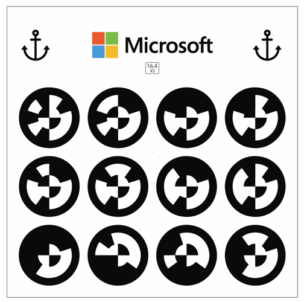

# Operate a guide in Dynamics 365 Guides

[Watch a video on operating a guide](https://aka.ms/guidesoperate)

Welcome to [!include[cc-microsoft](../includes/cc-microsoft.md)] [!include[pn-dyn-365-guides](../includes/pn-dyn-365-guides.md)]! This operator's manual is designed to help operators understand how to use a holographic guide created with [!include[pn-dyn-365-guides](../includes/pn-dyn-365-guides.md)]. It describes everything that you, as the operator, need to know about the [!include[pn-dyn-365-guides](../includes/pn-dyn-365-guides.md)] user interface and how to accomplish tasks in a real-world environment, such as a busy factory floor. If you’re like other first-line workers in this type of environment, you probably have your hands full of tools and parts as you do your work. With [!include[pn-dyn-365-guides](../includes/pn-dyn-365-guides.md)], you can stay heads-up and keep your tools in your hands as you follow step-by-step holographic instructions to accomplish your tasks. 

## First things first – calibrate your HoloLens 
[!include[pn-dyn-365-guides](../includes/pn-dyn-365-guides.md)] uses holograms to show you exactly what you need to do to accomplish a real-world task. For example, your guide might show you how to assemble a door for a commercial aircraft. Since instructions are provided through holograms on [!include[cc-microsoft](../includes/cc-microsoft.md)] [!include[pn-hololens](../includes/pn-hololens.md)], it’s extremely important to make sure that the holograms are aligned properly. Otherwise you might drill a hole in the wrong place or even assemble the wrong part! To make sure holograms are properly aligned, you need to calibrate your [!include[pn-hololens](../includes/pn-hololens.md)] device. You can do this by using the Calibration app that comes with your [!include[pn-hololens](../includes/pn-hololens.md)]. 

  

### Calibrate your HoloLens by using the Calibration app 

1.	Use the bloom gesture to open the **Start** menu. 

2.	Select **+** to view all apps, if **Settings** isn't pinned to **Start**.

    > [!NOTE]
    > To select something with your [!include[pn-hololens](../includes/pn-hololens.md)] device, gaze at it to target it, and then air tap to select it. 
   
3.	Select **Settings**. 

4.	Select **System**. 

5.	Select **Utilities**. 

6.	Select **Open Calibration**. 

7.	Follow the instructions on your screen. 

[Learn more about HoloLens calibration](https://docs.microsoft.com/windows/mixed-reality/calibration). 

## Navigate with gaze and gestures 
To navigate through a guide, you’ll use your gaze and a few gestures. 

### Gaze 

Gaze on [!include[pn-hololens](../includes/pn-hololens.md)] is pretty much as easy as it sounds. In some cases, you can select an item (an app, menu, or button, for example) just by gazing at a selection box next to the item. For example, when you first start the [!include[pn-hololens](../includes/pn-hololens.md)] app, you’ll gaze at the box to the left of **Operate** in the following dialog box to select **Operate** mode.

  

The selection is completed when the box is filled up by your gaze. Using gaze is extremely helpful if your hands are occupied with tools or parts.  

In other cases in [!include[pn-dyn-365-guides](../includes/pn-dyn-365-guides.md)], you use gaze to target an object, and then act on the target with a gesture, such as an air tap. In either case, when you gaze, make sure to turn your whole head—not just your eyes.  

### Gestures 
You’ll also need to use some gestures as you work with a guide. This section lists the most important gestures to know about. 

#### Bloom 

The bloom gesture opens the **Start** menu or the **Quick Actions** menu, depending on which version of HoloLens you're using. Most of the time, you need to use the bloom gesture only once to get to **Start**, but sometimes you'll need to use it twice. If you're not sure what to do at any time, the bloom gesture is a good way to get reoriented.

To do the bloom gesture:

1.	Hold out your hand with your palm up and your fingertips together.

2.	Open your hand. 

     
 

#### Air tap 

Use air tap, along with gaze, to select apps and other holograms and any gaze/dwell buttons. To do an air tap: 

1.	Gaze at a hologram. 

2.	Hold your hand straight out in front of you in a loose fist, then point your index finger straight up toward the ceiling. You don’t need to raise your whole arm—keep your elbow low and comfortable. 

3.	Tap your finger down, and then quickly raise it back up again. 

      
 
#### The gesture frame

[!include[pn-hololens](../includes/pn-hololens.md)] has sensors that can see a few feet to either side of you. When you use gestures, you'll need to keep them inside that frame, or [!include[pn-hololens](../includes/pn-hololens.md)] won't see them. As you move around, the frame moves with you. When your hand is inside the frame, the cursor looks like a ring. When [!include[pn-hololens](../includes/pn-hololens.md)] can't see your hand, the cursor changes to a dot. 

#### Need a tutorial on gestures? 
For a tutorial on some basic gestures, use the bloom gesture to go to **Start**, and then select **Learn Gestures**. If you're having trouble with gestures, see [HoloLens and holograms: FAQ](https://support.microsoft.com/help/13456/hololens-and-holograms-faq). 

## Get started with the HoloLens app 

Now that your [!include[pn-hololens](../includes/pn-hololens.md)] device is calibrated, and you know how to get around by gazing and using gestures, it’s time to open a guide and get some work done. Start by installing the app if someone hasn’t already installed it for you. 

### Install the HoloLens app

1.	Make sure you have [!include[pn-hololens](../includes/pn-hololens.md)] build 10.0.14393.0 or later installed on your [!include[pn-hololens](../includes/pn-hololens.md)] device. We recommend updating to newer versions when available. See [Manage updates to HoloLens](https://docs.microsoft.com/HoloLens/hololens-updates) for instructions on using [!include[pn-ms-windows-short](../includes/pn-ms-windows-short.md)] Update for Business.

2.	On your [!include[pn-hololens](../includes/pn-hololens.md)] device, use the [bloom gesture](authoring-gestures.md) to open the **Home** menu, and then open the [!include[cc-microsoft](../includes/cc-microsoft.md)] Store app and search for “[!include[pn-dyn-365-guides](../includes/pn-dyn-365-guides.md)]”.

3.	Select **Install** to download and install the [!include[pn-dyn-365-guides](../includes/pn-dyn-365-guides.md)] application.

### Sign in to the HoloLens app

If you sign in with a brand new [!include[pn-hololens](../includes/pn-hololens.md)] device, you’ll be prompted to walk through the Setup wizard. In the Setup wizard, you can sign in with an existing account or create a new one, depending on the version of [!include[pn-ms-windows-short](../includes/pn-ms-windows-short.md)] that you’re running. The Setup wizard also walks you through steps to calibrate and prepare [!include[pn-hololens](../includes/pn-hololens.md)]. For more information on calibration, see the “First things first” section of this topic.
 
### Open and sign in to HoloLens for the first time

1.	Go to **All Apps**.

    

2.	Select the down arrow.

    

3.	Open the [!include[pn-dyn-365-guides](../includes/pn-dyn-365-guides.md)] application.

    
 
4.	In the **Welcome** screen, select **Sign in**. 

5.	In the **Email and accounts** screen, select **Work or school account**, and then select **Continue**. 

6.	In the **Work or school account** screen, enter the credentials provided by your administrator. The credentials will look something like this: username@domain.com.  For example, if your user name is LauraO and you work for the Contoso company, the email name would be laurao@contoso.com.

    
 
7.	Select an instance to use if you have more than one instance, and then select **Continue**.	
   
8.	In the **Guides** dialog box, gaze at the selection box for the guide you want to open.  

9.  In the **Select Mode** dialog box, gaze at the box to the left of **Operate** until the box fills, which selects that item. 

    
   
### Anchor your guide 
The first thing you see when you open a guide is the anchoring instructions for the guide.  

 

> [!NOTE]
> The screen above shows the anchoring instructions for a printed anchor. This screen would look different if you need to anchor your guide with a digital anchor. The anchoring instructions will tell you how to go about anchoring your guide.

Anchoring a guide is a crucial step, just like calibrating [!include[pn-hololens](../includes/pn-hololens.md)]. You anchor a guide to make sure that the holographic instructions line up with your real-world environment. If the holograms don’t line up, you’ll likely be confused when you try to do a task. You could even cause damage. For example, you might drill a hole in the wrong place. 

#### Printed anchors vs digital anchors

There are two types of anchors: a printed anchor and a digital anchor. The way you anchor your guide depends on which method is used.

**To anchor your guide using a printed anchor**

1. Look for a printed anchor attached to a physical object in your real-world environment. The printed anchor looks like this: 

   

2. On your HoloLens [!include[pn-hololens](../includes/pn-hololens.md)], you’ll see a hologram that looks very similar to the printed anchor. Find the printed anchor in your real-world environment, and then align the anchor hologram with the printed anchor.    
   
3. When the green box is aligned to the printed anchor, gaze at **Confirm** to select it.

    

4. When you see the **Printed anchor found** screen, follow the instructions on the screen, and then select **Confirm** to continue. 
 
    

**To anchor your guide with a digital anchor**

With a digital anchor, you align a hologram on your [!include[pn-hololens](../includes/pn-hololens.md)] with a similar object in the real world. 

 

To align the digital anchor with its real-world counterpart, air tap and hold to move the hologram, and tap and hold the blue spheres to rotate the hologram, if needed.

#### Where alignment information is stored 

When you align your guide, if you’re using the [!include[cc-microsoft](../includes/cc-microsoft.md)] [!include[pn-hololens](../includes/pn-hololens.md)] Commercial Suite, the alignment information is stored on [!include[pn-hololens](../includes/pn-hololens.md)] so you don’t have to realign the guide every time you open it. You can realign a guide at any time, though, if you feel the holograms are out of alignment. For more information, read about the **Anchor** button in the next section. 
 
## Get oriented with the Step card 

When you open a guide, you’ll see the Step card, which is the hub of everything you do in a guide. The Step card  provides the instructions that you follow to complete a task. It also includes the two buttons that you use to navigate through a guide—the **Next Step** and **Go Back** buttons. As you go through the steps in a task, the Step card follows you on [!include[pn-hololens](../includes/pn-hololens.md)] to keep your instructions where you need them. 

  

In addition to the **Next Step** and **Go Back** buttons, the Step card includes a number of different buttons and UI elements to help you take various actions. 

   

Here’s a description of the buttons and other UI elements in the Step card:

|Number|Button/Example|Name|Description|
|---|--|------------------|------------------------------------------------------------------------------------|
|1||Home|Choose a different guide.|
|2||Follow mode|Have the Step card follow you around or lock it to a location.  If you turn off Follow mode, the Step card stays where it is. You can grab the card at any time by using the navigation bar to move it wherever you like. For more information, see the **Follow and pinning** section later in this topic.|
|3||Anchor button|Re-anchor (realign) the guide.  [!include[pn-hololens](../includes/pn-hololens.md)] can sometimes lose tracking, which causes holograms to be misaligned. To fix this, you need to re-anchor the guide by gazing at a printed anchor or digital anchor again. For more information, see “Anchor your guide” earlier in this topic.|
|4||Settings|Shows the build of [!include[pn-dyn-365-guides](../includes/pn-dyn-365-guides.md)] that you’re using.| 
|5||Profile|Sign in and out.| 
|6||Step progress|Shows where you are in the step.|
|7||Outline|Go to the **Outline** page.  Use the **Outline** page to quickly navigate around your guide. Here’s what the **Outline** page looks like for the Pylon wiring guide:  | 
|8||Task name|The name of the task you're working on.| 
|9||Task progress|Shows where you are in the task.| 
 
## Use a dotted line to help you find the focus area for a step 
Step cards are linked by holographic dotted lines to physical areas in your work area. These dotted lines help you find the area where you need to take an action. 

### Dotted line tips and tricks 

- Follow the dotted line to find the physical area where you need to do the work. Follow the dotted line back to the Step card to read the instructions. 

- If the dotted line points behind you, step to the side, and then continue to follow the dotted line. 
Note that the dotted line might go through real-world objects at times. 

## Follow and pinning 

You’ll notice that wherever you look, the Step card follows your gaze. As you’re working, you never have to worry about where your instructions are. You can stop the Step card from following you by turning the Follow mode behavior off from the navigation bar. 

You can grab the navigation bar at any time to place the card where you like.

## Access a website linked from the Step card

If a Step card includes a **Website link** button, you can go to that website by selecting the button. For example, there might be a link to a parts diagram or a parts inventory system. The website opens in the HoloLens Edge browser. When you close the browser, you go back to the step you were on. 

## Turn off holograms 
You can turn holograms off (or turn them back on) with a glance if you ever feel like they’re getting in the way. To turn off a hologram, gaze at the “eye” in the middle of the dotted line. 

  

## Useful links for more information

That's all the info you need to use a guide created with [!include[pn-dyn-365-guides](../includes/pn-dyn-365-guides.md)]! To learn more about [!include[cc-microsoft](../includes/cc-microsoft.md)] mixed-reality apps and [!include[pn-hololens](../includes/pn-hololens.md)], here are some helpful links: 

- [Watch a video on operating a guide](https://aka.ms/guidesoperate)
- [What is mixed reality?](https://docs.microsoft.com/windows/mixed-reality/mixed-reality)
- [Microsoft Dynamics 365 Layout](https://dynamics.microsoft.com/mixed-reality/layout/)
- [Microsoft Dynamics 365 Remote Assist](https://dynamics.microsoft.com/mixed-reality/remote-assist/)
- [Connecting to Wi-Fi on HoloLens](https://docs.microsoft.com/windows/mixed-reality/connecting-to-wi-fi-on-hololens)
- [Calibrate your HoloLens](https://docs.microsoft.com/windows/mixed-reality/calibration)

