# Operator's manual for Dynamics 365 Guides in preview

[!INCLUDE [cc-beta-prerelease-disclaimer](../includes/cc-beta-prerelease-disclaimer.md)]
 
Welcome to Microsoft Dynamics 365 Guides in preview! This operator's manual is designed to help operators understand how to use a holographic guide created with Dynamics 365 Guides. It describes everything that you, as the operator, need to know about the Dynamics 365 Guides user interface and how to accomplish tasks in a real-world environment, such as a busy factory floor. If you’re like other first-line workers in this type of environment, you probably have your hands full of tools and parts as you do your work. With Dynamics 365 Guides, you can stay heads-up and keep your tools in your hands as you follow step-by-step holographic instructions to accomplish your tasks. 

## First things first–calibrate your HoloLens 
Dynamics 365 Guides uses holograms to show you exactly what you need to do to accomplish a real-world task. For example, your guide might show you how to assemble a door for a commercial aircraft. Since instructions are provided through holograms on Microsoft HoloLens, it’s extremely important to make sure that the holograms are aligned properly. Otherwise you might drill a hole in the wrong place or even assemble the wrong part! To make sure holograms are properly aligned, you need to calibrate your HoloLens device. You can do this by using the Calibration app that comes with your HoloLens. 

  

### Calibrate your HoloLens by using the Calibration app 

1.	Use the bloom gesture to open the **Start** menu. 

2.	Select **+** to view all apps, if **Settings** isn't pinned to **Start**.

    > [!NOTE]
    > To select something with your HoloLens device, just gaze at it to target it, and then air tap to select it. 
   
3.	Select **Settings**. 

4.	Select **System**. 

5.	Select **Utilities**. 

6.	Select **Open Calibration**. 

7.	Follow the instructions on your screen. 

[Learn more about HoloLens calibration](https://docs.microsoft.com/en-us/windows/mixed-reality/calibration). 

## Navigate with gaze and gestures 
To navigate through a guide, you’ll use your gaze and a few gestures. 

### Gaze 

Gaze on HoloLens is pretty much as easy as it sounds. In some cases, you can select an item (an app, menu, or button, for example) just by gazing at a selection box next to the item. For example, when you first start the HoloLens app, you’ll gaze at the box to the right of **Operator** in the following dialog box to select the Operator mode.

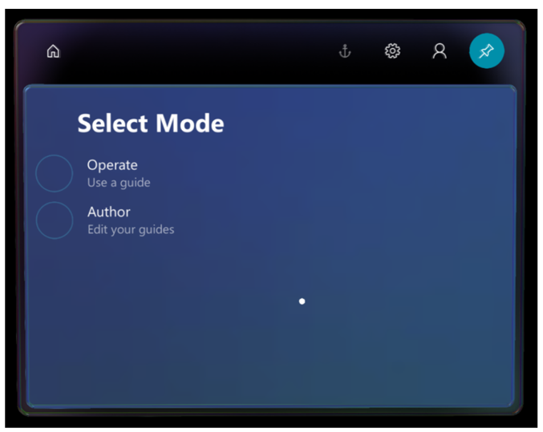  

The **Operator** selection is completed when the box is filled up by your gaze. Using gaze is extremely helpful if your hands are occupied with tools or parts.  

In other cases in Dynamics 365 Guides, you use gaze to target an object, and then act on the target with a gesture, such as an air tap. In either case, when you gaze, make sure to turn your whole head—not just your eyes.  

### Gestures 
You’ll also need to use some gestures as you work with a guide. This section lists the most important gestures to know about. 

#### Bloom 

The bloom gesture opens the **Start** menu (or hides the **Start** menu). Most of the time, you need to use the bloom gesture only once to get to **Start**, but sometimes you'll need to use it twice. If you're not sure what to do at any time, the bloom gesture is a good way to get reoriented.

To do the bloom gesture:

1.	Hold out your hand with your palm up and your fingertips together.

2.	Open your hand. 

     
 

#### Air tap 

Use air tap, along with gaze, to select apps and other holograms. To do an air tap: 

1.	Gaze at a hologram. 

2.	Hold your hand straight out in front of you in a loose fist, then point your index finger straight up toward the ceiling. You don’t need to raise your whole arm—keep your elbow low and comfortable. 

3.	Tap your finger down, and then quickly raise it back up again. 

  
 
#### The gesture frame

HoloLens has sensors that can see a few feet to either side of you. When you use gestures, you'll need to keep them inside that frame, or HoloLens won't see them. As you move around, the frame moves with you. When your hand is inside the frame, the cursor looks like a ring. When HoloLens can't see your hand, the cursor changes to a dot. 

#### Need a tutorial on gestures? 
For a tutorial on some basic gestures, use the bloom gesture to go to **Start**, and then select **Learn Gestures**. If you're having trouble with gestures, see [HoloLens and holograms: FAQ](https://support.microsoft.com/en-us/help/13456/hololens-and-holograms-faq). 

## Get started with the HoloLens app 

Now that your HoloLens device is calibrated, and you know how to get around by gazing and using gestures, it’s time to open a guide and get some work done. Start by installing the app if someone hasn’t already installed it for you. 

### Install the HoloLens app

1.	Make sure you have HoloLens build 10.0.14393.0 or later installed on your HoloLens device. We recommend updating to newer versions when available. See [Manage updates to HoloLens](https://docs.microsoft.com/en-us/HoloLens/hololens-updates) for instructions on using Windows Update for Business.

2.	On your HoloLens device, use the [bloom gesture](authoring-gestures.md) to open the **Home** menu, and then open the Microsoft Store app and search for “Dynamics 365 Guides (Preview)”.

3.	Select **Install** to download and install the Dynamics 365 Guides application.

### Sign in to the HoloLens app

If you sign in with a brand new HoloLens device, you’ll be prompted to walk through the Setup wizard. In the Setup wizard, you can sign in with an existing account or create a new one, depending on the version of Windows that you’re running. The Setup wizard also walks you through steps to calibrate and prepare HoloLens. For more information on calibration, see the “First things first” section of this topic.
 
### Open and sign in to HoloLens for the first time

1.	Go to **All Apps**.

    

2.	Select the down arrow.

    

3.	Open the Dynamics 365 Guides application.

    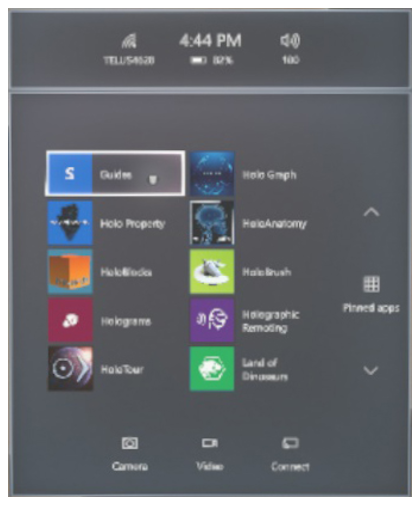
 
4.	In the **Welcome** screen, select **Sign in**. 

5.	In the **Email and accounts** screen, select **Work or school account**, and then select **Continue**. 

6.	In the **Work or school account** screen, enter the credentials provided by your administrator. The credentials will look something like this: username@domain.com.  For example, if your user name is LauraO and you work for the Contoso company, the email name would be laurao@contoso.com.

    
 
7.	Select an instance to use if you have more than one instance, and then select **Continue**.

8.	In the **Select Mode** dialog box, gaze at the box to the left of **Operate** until the box fills, which selects that item. 

    
   
7.	In the **Guides** dialog box, gaze at the selection box for the guide you want to open. For example, gaze at the selection box for Example Guide, the guide that comes with the preview release of Dynamics 365 Guides.  
   
### Anchor your guide 
The first thing you see when you open a guide is the anchoring instructions for the guide.  

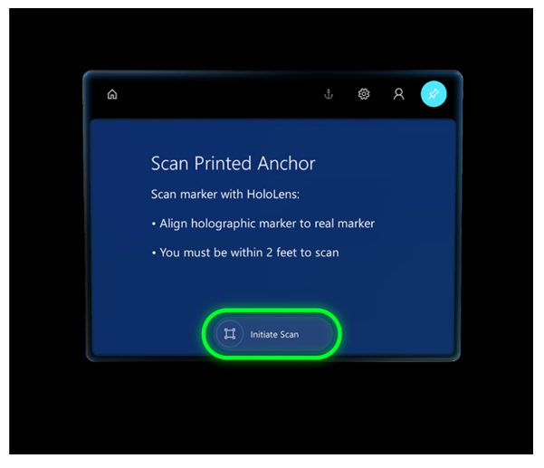  

The anchoring instructions are written by the person who created the guide. Anchoring a guide is a crucial step, just like calibrating HoloLens. You anchor a guide to make sure that the holographic instructions line up with your real-world environment. If the holograms don’t line up, you’ll likely be confused when you try to do a task. You could even cause damage. For example, you might drill a hole in the wrong place. 

If the guide is set up with printed anchor, you’ll look for a printed anchor attached to a physical object in your real-world environment. The printed anchor looks like this: 

In the HoloLens, you’ll see a hologram that looks very similar to the printed anchor. Find the printed anchor in your real-world environment, and then align the anchor hologram with the printed marker to align the guide. 

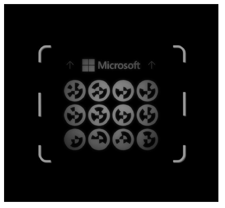  

After anchoring a guide, if you're anchoring your guide to a printed anchor, you’ll see the **Printed anchor found** screen. Follow the instructions on the screen, and then select **Confirm** to continue. 
 
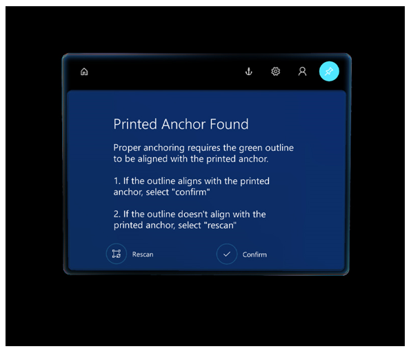 

> [!NOTE]
> There are two ways to anchor a guide. The method illustrated above is called a printed anchor because you gaze at a physical marker to anchor your guide. The other type of anchor is a *digital anchor*. With a digital anchor, you use gestures to align the guide to a digital 3D representation laid over a physical object in your work area. If the author of the guide chose a digital anchor when they created the guide, you’d align a hologram on HoloLens with a digital 3D representation of the same object in your real world. 

When you align your guide, if you’re using the Microsoft HoloLens Commercial Suite, the alignment information is stored on HoloLens so you don’t have to realign the guide every time you open it. You can realign a guide at any time, though, if you feel the holograms are out of alignment. For more information, read about the **Anchor** button in the next section. 
 
## Get oriented with the Step card 

When you open a guide, you’ll see the Step card, which is the hub of everything you do in a guide. The Step card  provides the instructions that you follow to complete a task. It also includes the two buttons that you use to navigate through a guide—the **Next Step** and **Go Back** buttons. As you go through the steps in a task, the Step card “tags along” with you on HoloLens to keep your instructions where you need them. 

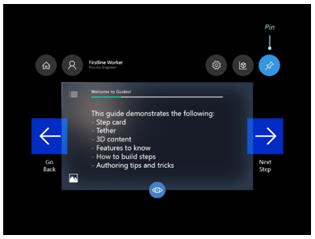

> [!NOTE]
> The preceding screen shot shows the first step of Example Guide, the guide created for the preview release of Dynamics 365 Guides. In Example Guide, the first step provides an overview of the tasks included in the guide.  

In addition to the **Next Step** and **Go Back** buttons, the Step card includes a number of different buttons and UI elements to help you take various actions. 

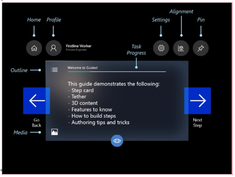
   

Here’s a description of the buttons and other UI elements in the Step card:

Button|Name|Description|
|-----|------------------|------------------------------------------------------------------------------------|
||Home|Choose a different guide| 
||Settings|Access the following settings:  - **Fit box.** Use to make sure you’re wearing your HoloLens device correctly. Fit is very important. Otherwise holograms might be misaligned in your environment. When you select this setting, you’ll see borders in your field of view to help you make sure you’re wearing the HoloLens properly.  - **Noise cancellation.** Enables you to use voice commands to navigate the app when there’s a lot of noise in your environment (a factory floor, for example). The app supports noise levels up to 80 decibels.  - **Dynamic volume.** Adjusts the volume dynamically based on noise in the environment. For example, if the environment is very noisy, the volume adjusts upward automatically.  - **Build number.** Shows the build of Dynamics 365 Guides that you’re using.| 
||Profile|Sign in and out.| 
||Alignment|Realign your guide. HoloLens can sometimes lose tracking, which causes holograms to be misaligned. To fix this, you need to realign the guide by gazing at a printed marker or digital 3D representation again. For more information, see “Align your guide” earlier in this topic.| 
||Pin|Lock the Step card in place. This is useful if you want to keep the Step card in one location while you complete the step or task. If you pin the Step card, it doesn’t follow you around. You can pin or unpin it any time you want.|
||Outline|Go to the Outline page. Use the Outline page to quickly navigate around your guide. Here’s what the Outline page looks like for Example Guide:  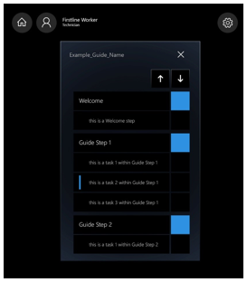| 
||Task progress|Shows where you are in the task.| 
||Media|Close the image or video associated with the step. (If there’s an image or video associated with a step, it appears automatically when you go to that step.)| 
 
## Use a tether to help you find the focus area for a step 
Step cards are linked by holographic tethers to physical areas in your work area. These tethers help you find the area where you need to take an action. 

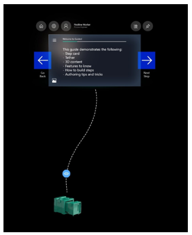

### Tether tips and tricks 

- Follow the tether to find the physical area where you need to do the work. Follow the tether back to the Step card to read the instructions. 

- If the tether points behind you, step to the side, and then continue to follow the tether. 
Note that the tether might go through real-world objects at times. 

## Tag along and pinning 

You’ll notice that wherever you look, the Step card follows your gaze—it “tags along.” As you’re working, you never have to worry about where your instructions are. You can pin the Step card, however, if you want to turn off the tag-along feature. To pin the Step card, select **Pin**. Once it’s pinned, you can grab it and move it wherever you like. 

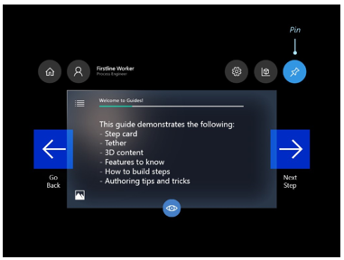

## Turn off holograms 
You can turn holograms off (or turn them back on) with a glance if you ever feel like they’re getting in the way. To turn off a hologram, gaze at the “eye” in the middle of the tether. 

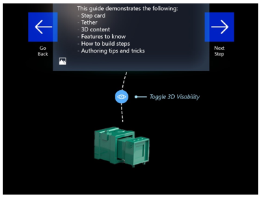
  

## Useful links for more information

That's all the info you need to use a guide created with Dynamics 365 Guides! To learn more about Microsoft mixed-reality apps and HoloLens, here are some helpful links: 

- [What is mixed reality?](https://docs.microsoft.com/en-us/windows/mixed-reality/mixed-reality)
- [Microsoft Dynamics 365 Layout](https://dynamics.microsoft.com/en-us/mixed-reality/layout/)
- [Microsoft Dynamics 365 Remote Assist](https://dynamics.microsoft.com/en-us/mixed-reality/remote-assist/)
- [Connecting to Wi-Fi on HoloLens](https://docs.microsoft.com/en-us/windows/mixed-reality/connecting-to-wi-fi-on-hololens)
- [Calibrate your HoloLens](https://docs.microsoft.com/en-us/windows/mixed-reality/calibration)

