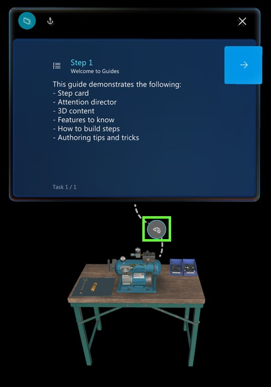

# Turn holograms off and on when you're operating a guide in the Dynamics 365 Guides HoloLens app

If you ever feel that holograms are getting in the way when you're operating a guide in the Microsoft Dynamics 365 Guides HoloLens app, you can turn them off with a glance. To turn off a hologram, gaze at the eye symbol in the middle of the dotted line.

To turn them back on, gaze at the eye symbol again. 

## What's next?

- [Get oriented with the Step card](operator-step-card-orientation.md)
-  [Use the dotted line to find the focus area for a step](operator-dotted-line.md)
-  [Turn Follow mode off or on](operator-follow-mode.md)
-  [Use triggers to move between steps](operator-trigger.md)
-  [Open a website from the Step card](operator-website-link.md)
-  [Open an app in Power Apps from the Step card](operator-powerapps-link.md)
-  [Work offline](operator-offline-mode.md)
-  [Use voice commands](voice-commands.md)

[!INCLUDE[footer-include](../includes/footer-banner.md)]
