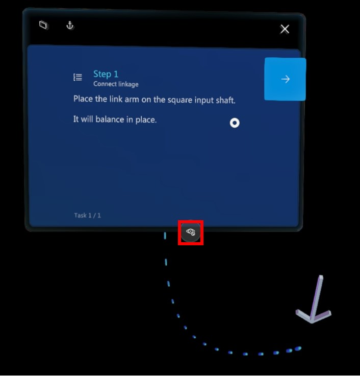

# Work with holograms in the Guides HoloLens

You can work with the holograms placed in your view by understanding applied styles, grab, move, or rotate interactable holograms, or turn holograms off to focus on your real-world environment.

## Interact with holograms in the Guides HoloLens app

If an author has made an object interactable, a hand icon shows in the middle of the object. You can explore the object in the Guides HoloLens app using natural hand gestures.

- To grab a hologram near you, pinch your thumb and index finger together on the hologram and hold. Use this grab gesture to move, resize, and rotate. To let go, release your fingers.

- To resize a hologram, use both hands to pinch the hologram and stretch your hands apart to make it larger or move your hands together to make it smaller.

- To quickly move the hologram back to its original authored state and position, press the circular arrow just above the hand icon.
<!-- Say "Guides, Reset Step" to move all objects back to their starting positions. -->

- To move the hologram back to its original authored state and position by hand, grab the hologram and move it closer and closer to where you think it should be. In some cases, the author may have opted to leave you a lightly visible or ghost outline of the part, marking a hint of its original placement. Continue until you see a green dashed outline appear, then release the hologram and it will snap back in place.

## Understand applied styles

Authors add styles to provide visual cues for your holograms. For example, a red flashing object means to avoid that area or object. An outline means to pick something up. A dotted line means where to place something. For more information, see [Use a style for emphasis](hololens-app-styles.md).

## Turn holograms off and on

If you ever feel that holograms are getting in the way when you're operating a guide in the Microsoft Dynamics 365 Guides HoloLens app, you can turn them off with a glance. To turn off a hologram, gaze at the eye symbol at the bottom of the instruction card.

To turn them back on, gaze at the eye symbol again. 