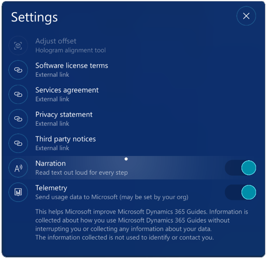

# Have HoloLens narrate Dynamics 365 Guides instructions

You can turn on narration to have Microsoft HoloLens read steps out loud when you're operating a guide in Dynamics 365 Guides. You can use narration when you're anchoring a 
guide or whenever you're working with an instruction, question, or completion step. This is useful if you don’t want your workflow to be interrupted by having to constantly look
up at the instruction card.  

You can turn on narration through Settings or by using a voice command.

Narration uses the built-in HoloLens Text-to-Speech system. Text is narrated for any default language that supports Text to Speech.  

## Turn narration on or off in Settings

If you turn narration on or off in Settings, narration will stay on or off for the current and subsequent steps.

- In the **Settings** dialog box, move the **Narration** slider to the on position.

   

## Turn narration on or off by using a voice command

Use the commands in the following table to turn voice commands on or off.

|Voice command |Action| 
|----------------------------|-----------------------------------------------------------------|
|Response 1| Select Response 1. Replace "1" with "2" or "3" to go to Response 2 or 3.  |
|Response 1 Text|Select Response 1 text. Replace "1" with "2" or "3" to go to Response 2 or 3 text.|
|Narration On |Start narration for current and subsequent steps.  If narration is already on when you use this voice command, the narrator will repeat the instructions for the current step.| 
|Narration Off| Turn off narration for current and subsequent steps. |

 
