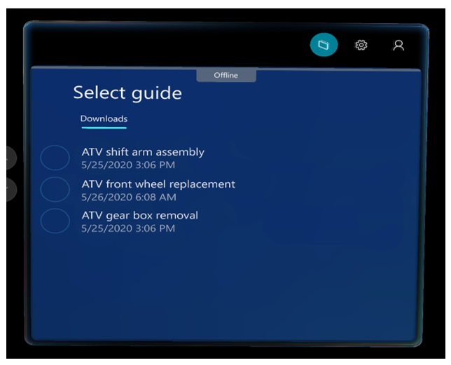
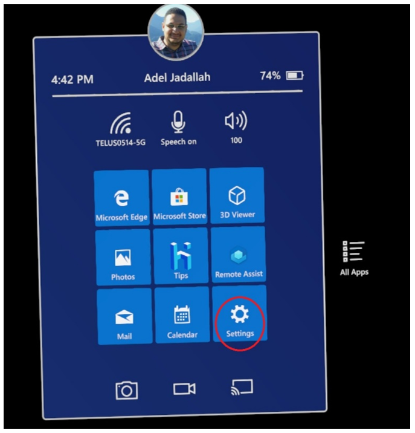
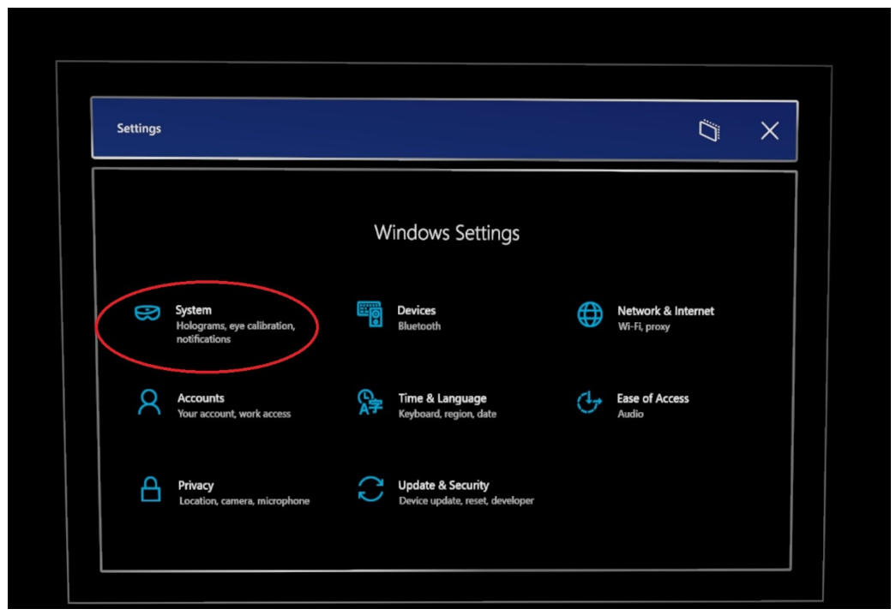
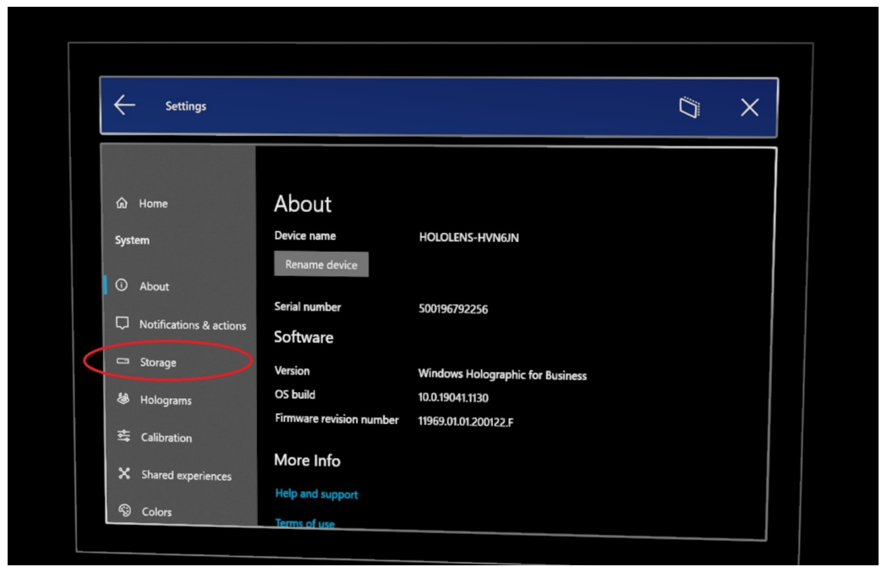
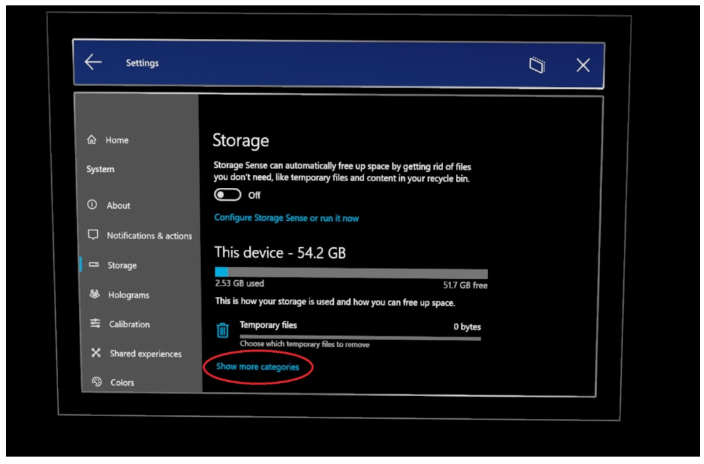
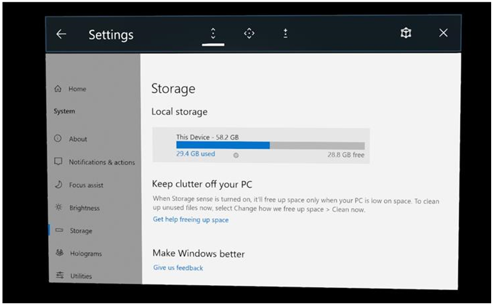
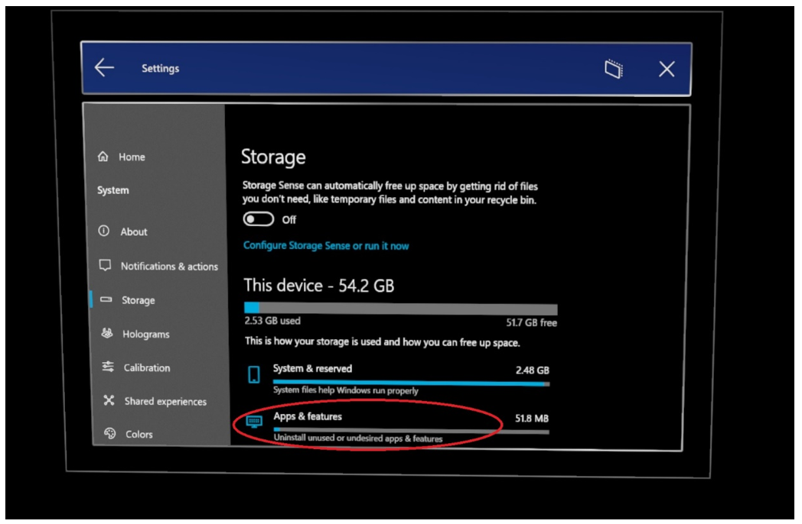
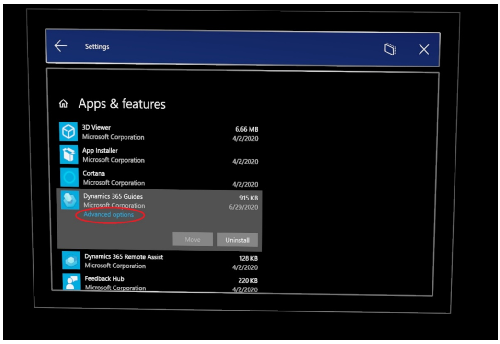
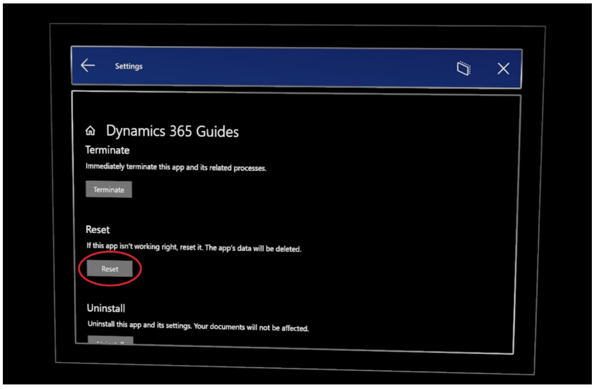

# Work offline as an operator in Dynamics 365 Guides

You can work offline with a guide on HoloLens 1 or HoloLens 2 (for example, when you're working on a factory floor) if you don't have access to the internet or have an intermittent internet connection. 

You don't need to do anything to set up **Offline** mode. When you open a guide when you're connected to the internet, the guide is automatically downloaded for offline use. If you lose your internet connection or turn off your Wi-Fi connection, the guide will automatically be available and you'll see the **Offline** banner at the top of your screen.

Any guide that's available for offline use will appear under the **All** tab. If no guides are available offline, you'll see this message: 

"No guides are available offline."

## Signing in while offline

If you go offline, Dynamics 365 Guides automatically signs you into the last account you used when you were online. 

> [!IMPORTANT]
> If you sign out when you're offline, you won't be able to sign back in again until you reconnect to the internet.

## Working with multiple users or devices

Guides are specific to the user and the HoloLens. If you're sharing a HoloLens with another user and you both want to use the same guide, each of you will need to open the guide when you have an internet connection to automatically download the guide. 

Likewise, if you use more than one HoloLens, you'll need to open the guide on each HoloLens while you have an internet connection so you can download the guide for offline use.

## Accessing a guide offline with a QR code

You can access a guide using a QR code link as long as you've used the guide while you had an internet connection.

## Using the Dynamics 365 Guides demo when you're offline

The demo available through the Dynamics 365 Guides Home screen is available for use without an internet connection.

## How often do you need to come back online?

The Azure Active Directory default configuration for sign-in frequency is a rolling window of 90 days. However, from a Power BI (telemetry) perspective, only a few app sessions are stored on the device. To keep your Power BI dashboards up-to-date, make sure to come back online regularly. [Learn more about configurable token lifetimes in Azure Active Directory (Preview)](/azure/active-directory/develop/active-directory-configurable-token-lifetimes).

## Limitations with Offline mode

- You can't author a guide in **Offline** mode.

- If you make changes to a guide as an author, those changes will not automatically apply to your downloaded guide. You must re-open the guide on the device you want to use offline to make sure the latest changes have been dowloaded. 

- If a guide is deactivated after it's downloaded to a HoloLens, the downloaded version will remain on the HoloLens until the cache is cleared, but you will not be able to open it online or access any updates.

- If you lose permissions to a guide that has already been downloaded to your HoloLens, the downloaded version will remain on the HoloLens until the cache is cleared, but you will not be able to open it online or access any updates. 

You can clear the content and settings cached on a HoloLens by resetting it. 

> [!NOTE]
> When you select **Reset**, you also clear the settings for the Dynamics 365 Guides app.

1. From the **Start** screen, select **Settings**.

    
    
2. Select **System**.

    

3. Select **Storage**.

    
    
4. Select **Show more categories**.

    
    
    > [!NOTE]
    > If you don't see the **Show more categories** command, select the storage bar to move to the next step. 
    
5. Select **Apps & features**.

    

6. Select **Dynamics 365 Guides**, and then select **Advanced options**.

    

7. Scroll down on the page, and then select **Reset**.

    

8. In the pop-up message, select **Reset**. A check mark will appear next to the **Reset** button.

## What's next?

 [Get oriented with the Step card](operator-step-card-orientation.md) 
 [Use the dotted line to find the focus area for a step](operator-dotted-line.md) 
 [Turn Follow mode off or on](operator-follow-mode.md) 
 [Use triggers to move between steps](operator-trigger.md) 
 [Open a website from the Step card](operator-website-link.md) 
 [Open an app in Power Apps from the Step card](operator-powerapps-link.md) 
 [Turn holograms off and on](operator-holograms-off.md) 
 [Use voice commands](voice-commands.md) 

[!INCLUDE[footer-include](../includes/footer-banner.md)]