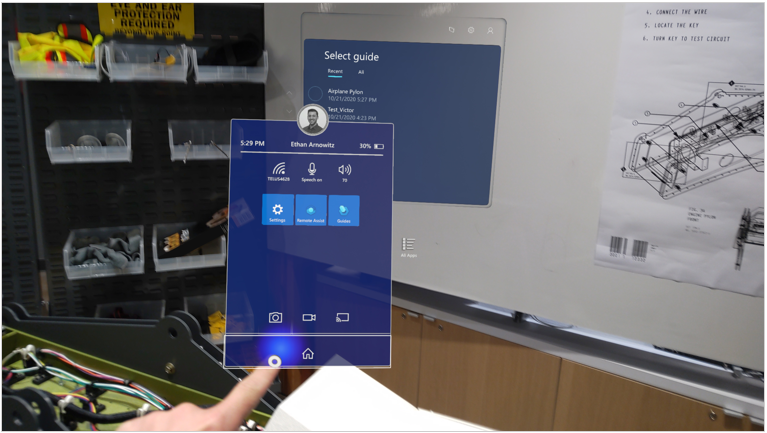
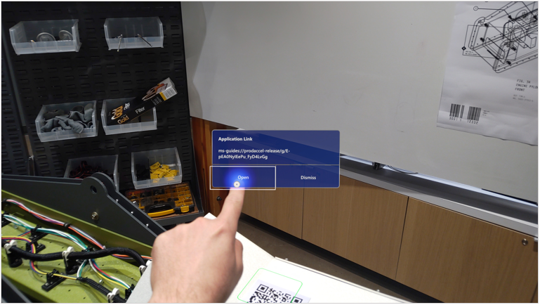
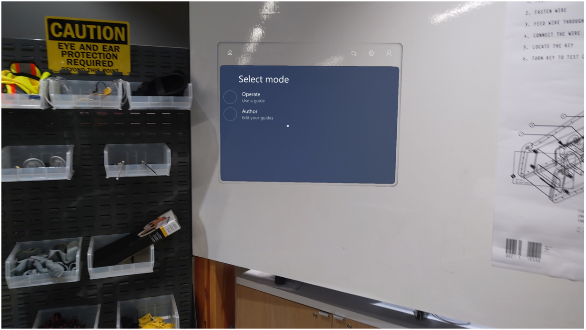
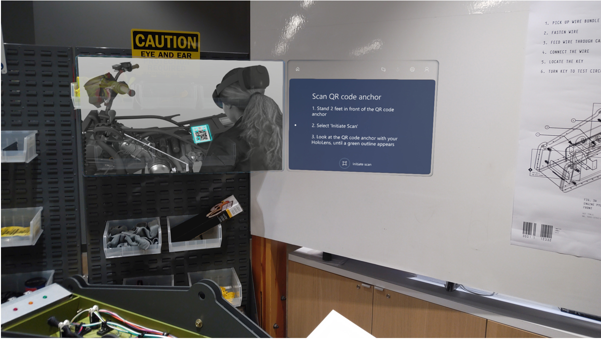
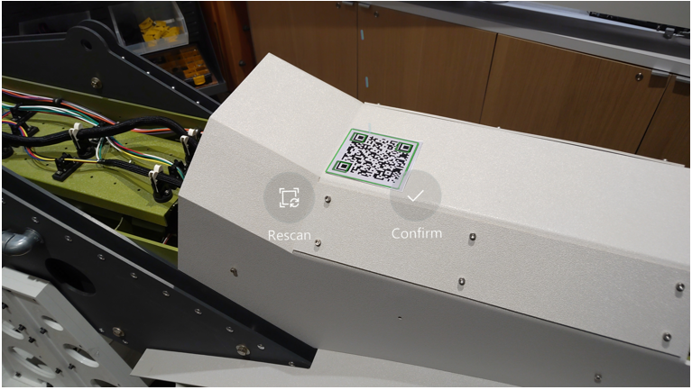

# Open a guide in Dynamics 365 Guides by scanning a QR code 

You can open a guide in Microsoft Dynamics 365 Guides by scanning a QR code that includes an embedded link to a guide. This can be a printed QR code or a digital QR code included in a digital document. 

> [!NOTE]
> This feature is available only on HoloLens 2.
 
## Open a guide by scanning a QR code

1. On your HoloLens, go to [mixed reality home](https://docs.microsoft.com/hololens/hololens2-basic-usage#start-menu-mixed-reality-home-and-apps). This is the first thing you see when you start HoloLens.

    > [!NOTE]
    > If you're not sure if you're at mixed reality home, [open the **Start** menu](https://docs.microsoft.com/hololens/hololens2-basic-usage#start-menu-mixed-reality-home-and-app), and then look for the **Home** button at the bottom of the menu. If the **Start** menu doesn't have a **Home** button, you're already at mixed reality home.
    
     

2. Gaze at the QR code. When a green outline appears with a play button, press the play button. 

    
    
3. In the **Application Link** dialog box, select **Open**.

    

     This launches Dynamics 365 Guides.    
    
    > [!NOTE] 
    > If you haven't previously signed into the account, you'll be prompted to do so. 
    
4. If the account has both Author and Operator permissions, you'll be asked to choose which mode you want to open the guide in. 

    

    If you only have Operator permissions, the guide is automatically launched in Operator mode.    
    
5. After the guide is opened, you'll see the anchoring step for the embedded guide or step. Select **Initiate scan** to anchor the guide.
    
    
 
    > [!NOTE]
    > When you open a guide by using a QR code with an embedded link, the guide isn't automatically anchored. After you open the guide, you have to anchor it using the anchor
    provided by the author of the guide. After you anchor the guide for the first time, it will remember it’s spatial position the next time you open it. 
    If it remembers your anchor alignment, you will still need to confirm that it's in the correct position. [Learn more about anchoring a guide](operator-anchor.md).
    
    
    

[!INCLUDE[footer-include](../includes/footer-banner.md)]