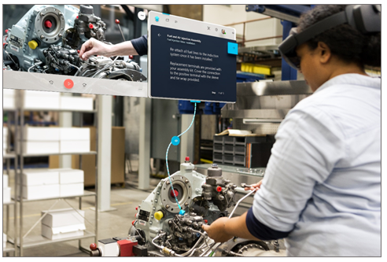

# Overview of operating a guide in Dynamics 365 Guides

 [Watch a video about operating a guide](https://aka.ms/guidesoperate)

Welcome to [!include[cc-microsoft](../includes/cc-microsoft.md)] [!include[pn-dyn-365-guides](../includes/pn-dyn-365-guides.md)]! This set of topics is designed to help operators learn how to use holographic guides that are created with [!include[pn-dyn-365-guides](../includes/pn-dyn-365-guides.md)]. The topics describe everything that you, as the operator, must know about the [!include[pn-dyn-365-guides](../includes/pn-dyn-365-guides.md)] user interface (UI). They also explain how to perform tasks in real-world environments, such as a busy factory floor. If you're like other first-line workers in this type of environment, your hands are probably full of tools and parts as you do your work. [!include[pn-dyn-365-guides](../includes/pn-dyn-365-guides.md)] helps you keep your head up and your tools in your hands as you follow step-by-step holographic instructions to accomplish your tasks.

> [!NOTE]
> If you're a [!include[pn-dyn-365-guides](../includes/pn-dyn-365-guides.md)] admin, you can assign a role so that operators can view guides but can't edit them. For more information, see [Assign an Author or Operator role to a user](assign-role.md).

## What's next?

[Calibrate your HoloLens](operator-calibrate.md) 
[Install the app and sign in](install-sign-in-operator.md) 
[Gestures for navigating the app](operator-gestures.md) 
[Anchor your guide](operator-anchor.md) 
[Operate a guide](operator-step-card-orientation.md)

[!INCLUDE[footer-include](../includes/footer-banner.md)]