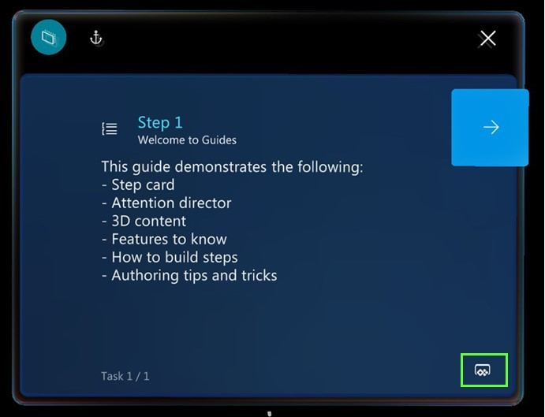

# Open an app created in Power Apps from the Dynamics 365 Guides HoloLens app

If a Step card in the Microsoft Dynamics 365 Guides HoloLens app includes a **Power Apps** button, you can open an app by selecting the button. The app is opened in a browser on HoloLens. When you close the browser, you return to the step. 

> [!IMPORTANT]
> To run Power Apps from Dynamics 365 Guides, you must have a Power Apps license. You must also have permission to view the app that was created in Power Apps.

>[!NOTE]
>On HoloLens 1, the Dynamics 365 Guides app enters sleep mode when you select a Power Apps link from a step. You can tap the Dynamics 365 Guides app at any time to return to the guide and resume where you left off. If you're using HoloLens 2, the Dynamics 365 Guides app remains active when you select a Power Apps link.

## What's next?

- [Get oriented with the Step card](operator-step-card-orientation.md)
- [Use the dotted line to find the focus area for a step](operator-dotted-line.md)
- [Turn Follow mode off or on](operator-follow-mode.md)
- [Use triggers to move between steps](operator-trigger.md)
- [Open a website from the Step card](operator-website-link.md)
- [Turn holograms off and on](operator-holograms-off.md)
- [Work offline](operator-offline-mode.md)
- [Use voice commands](voice-commands.md)

[!INCLUDE[footer-include](../includes/footer-banner.md)]
