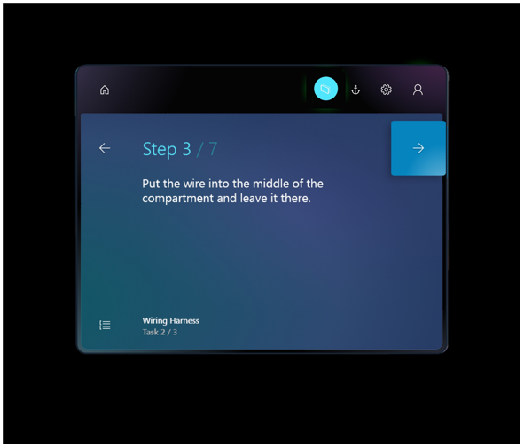
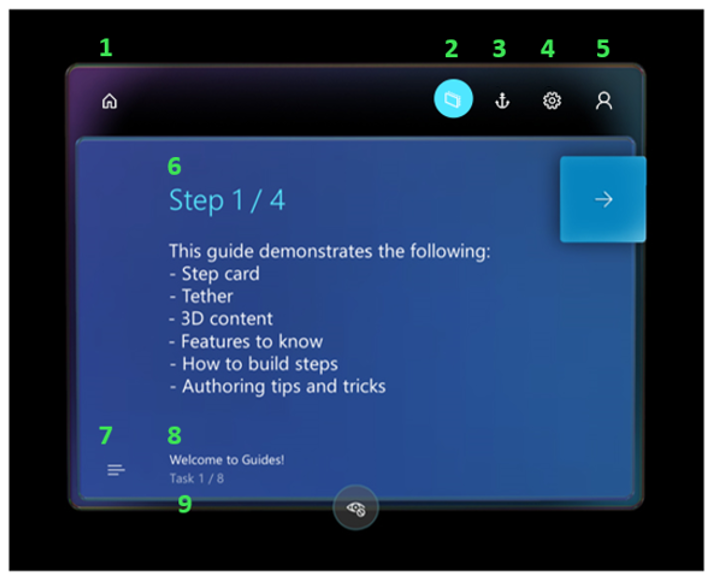
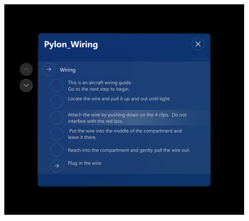

# Get oriented with the Step card as an operator in Dynamics 365 guides

 [Watch a video about operating a guide](https://aka.ms/guidesoperate)

When you open a guide as an operator by using the [!include[pn-dyn-365-guides](../includes/pn-dyn-365-guides.md)] HoloLens app, you see the Step card. The Step card is the hub of everything that you do in a guide. It provides the instructions that you follow to complete a task. It also includes two buttons that you use to navigate through a guide: **Next** and **Back**. As you go through the steps in a task, the Step card follows you on [!include[pn-hololens](../includes/pn-hololens.md)], to keep the instructions where you need them.

> [!NOTE]
> When you select the **Back** button in the Step card, it returns you to the most-recently-visited step (similar to a web browser **Back** button). 

## Step card overview

In addition to the **Next** and **Back** buttons, the Step card includes several buttons and user interface (UI) elements that help you perform various actions.

Here's a description of the buttons and other UI elements on the Step card.

| Number | UI element | Name | Purpose |
|---|---|---|---|
| 1 |  | Home | Select a different guide. |
| 2 |  | Follow mode | Have the Step card follow you around, or lock it to a location.
If you turn off **Follow** mode, the Step card stays where it is. You can move the Step card wherever you want at any time. Just grab it by using the navigation bar. For more information, see the "Follow and pinning" section later in this topic.
 |
| 3 |  | Anchor button | Re-anchor (realign) the guide.
[!include[pn-hololens](../includes/pn-hololens.md)] can sometimes lose tracking, which causes holograms to become misaligned. To fix this issue, you must re-anchor the guide by gazing at the anchor again. For more information, see the [Anchor your guide](operator-anchor.md).
 |
| 4 |  | Settings | See the build of [!include[pn-dyn-365-guides](../includes/pn-dyn-365-guides.md)] that you're using. |
| 5 |  | Profile | Sign in and out. |
| 6 |  | Outline | Go to the **Outline** page.
You can use the **Outline** page to quickly move around your guide. The following illustration shows the **Outline** page for a Pylon wiring guide.

 |
| 7 |  | Step counter | Shows what step you're on in the task. |
| 8 |  | Task name | Shows the name of the task that you're working on. |
| 9 |  | Action button | Opens a website or Power Apps link. |

## What's next?

 [Watch a video about operating a guide](https://aka.ms/guidesoperate) 
 [Get oriented with the Step card](operator-step-card-orientation.md) 
 [Use the dotted line to find the focus area for a step](operator-dotted-line.md) 
 [Turn Follow mode off or on](operator-follow-mode.md) 
 [Use triggers to move between steps](operator-trigger.md) 
 [Open a website from the Step card](operator-website-link.md) 
 [Open an app in Power Apps from the Step card](operator-powerapps-link.md) 
 [Turn holograms off and on](operator-holograms-off.md) 
 [Work offline](operator-offline-mode.md) 
 [Use voice commands](voice-commands.md) 
