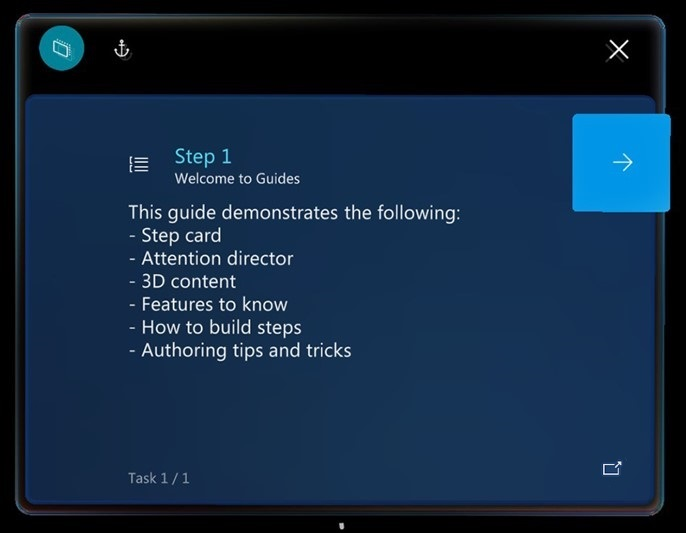

# Get oriented with the Step card as an operator in Dynamics 365 guides

 [Watch a video about operating a guide](https://aka.ms/guidesoperate)

When you open a guide as an operator by using the Dynamics 365 Guides HoloLens app, you see the Step card. The Step card is the hub of everything that you do in a guide. It provides the instructions that you follow to complete a task. It also includes two buttons that you use to navigate through a guide: **Next** and **Back**. As you go through the steps in a task, the Step card follows you on HoloLens, to keep the instructions where you need them.

> [!NOTE]
> When you select the **Back** button in the Step card, it returns you to the most-recently-visited step (similar to a web browser **Back** button). 

## Step card overview

In addition to the **Next** and **Back** buttons, the Step card includes several buttons and user interface (UI) elements that help do your tasks.

Here's a description of the buttons and other UI elements on the Step card.

| Number | UI element | Name | Purpose |
|---|---|---|---|
| 1 |  | Follow mode | Have the Step card follow you around, or lock it to a location.
If you turn off **Follow** mode, the Step card stays where it is. You can move the Step card wherever you want at any time. Just grab it by using the navigation bar. For more information, see the "Follow and pinning" section later in this topic.
 |
| 2 |  | Anchor button | Re-anchor (realign) the guide.
[!include[pn-hololens](../includes/pn-hololens.md)] can sometimes lose tracking, which causes holograms to become misaligned. To fix this issue, you must re-anchor the guide by gazing at the anchor again. For more information, see  [Anchor your guide](operator-anchor.md).
 |
| 3 |  | Outline | Go to the **Outline** page.
You can use the **Outline** page to quickly move around your guide. The following illustration shows the **Outline** page for the Pylon Wiring guide.

 |
| 4 |  | Step counter | Shows what step you're on in the task. |
| 5 |  | Task name | Shows the name of the task that you're working on. |
| 6 |  | Action button | Opens a website, email, guide, custom app, or Power Apps link. |

## Next steps

- [Watch a video about operating a guide (shows HoloLens 1 version)](https://aka.ms/guidesoperate)
- [Use the dotted line to find the focus area for a step](operator-dotted-line.md)
- [Turn Follow mode off or on](operator-follow-mode.md)
- [Use triggers to move between steps](operator-trigger.md)
- [Use voice commands](voice-commands.md)

[!INCLUDE[footer-include](../includes/footer-banner.md)]
