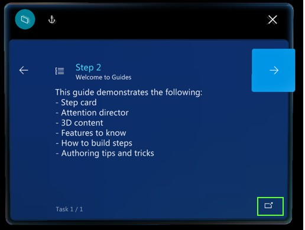

# Open a website, email, guide, or custom app from the Guides HoloLens app

If a Step card in the Microsoft Dynamics 365 Guides HoloLens app includes a **Link** button, you can go to the link by selecting the button. For example, there might be a link to a parts diagram, the HoloLens settings app, or email. Websites are opened in the Microsoft HoloLens Edge browser. When you close the browser, you go back to the step that you were working on.

[!INCLUDE [end-calls-suspend](../includes/end-calls-suspend.md)]

## See also

- [Get oriented with the Step card](operator-step-card-orientation.md)
- [Open an app in Power Apps from the Step card](operator-powerapps-link.md)
- [Use voice commands](voice-commands.md)

[!INCLUDE[footer-include](../includes/footer-banner.md)]
