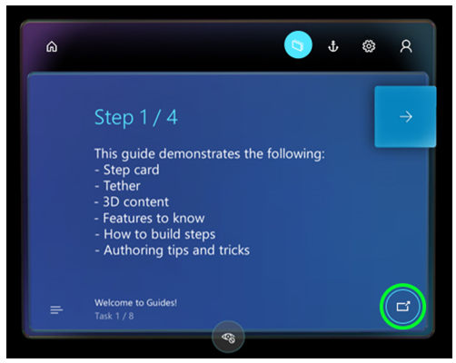

# Open a website from the Dynamics 365 Guides HoloLens app

If a Step card in the Microsoft Dynamics 365 Guides HoloLens app includes a **Website link** button, you can go to the website by selecting the button. For example, there might be a link to a parts diagram or a parts inventory system. The website is opened in the HoloLens Microsoft Edge browser. When you close the browser, you go back to the step that you were working on.

>[!NOTE]
>On HoloLens 1, the Dynamics 365 Guides app enters sleep mode when you select a website link from a step. You can tap the Dynamics 365 Guides app at any time to return to the guide and resume where you left off. If you're using HoloLens 2, the Dynamics 365 Guides app remains active when you select a website link.

## What's next?

 [Get oriented with the Step card](operator-step-card-orientation.md) 
 [Use the dotted line to find the focus area for a step](operator-dotted-line.md) 
 [Turn Follow mode off or on](operator-follow-mode.md) 
 [Use triggers to move between steps](operator-trigger.md) 
 [Open an app in Power Apps from the Step card](operator-powerapps-link.md) 
 [Turn holograms off and on](operator-holograms-off.md) 
 [Work offline](operator-offline-mode.md) 
 [Use voice commands](voice-commands.md) 

[!INCLUDE[footer-include](../includes/footer-banner.md)]