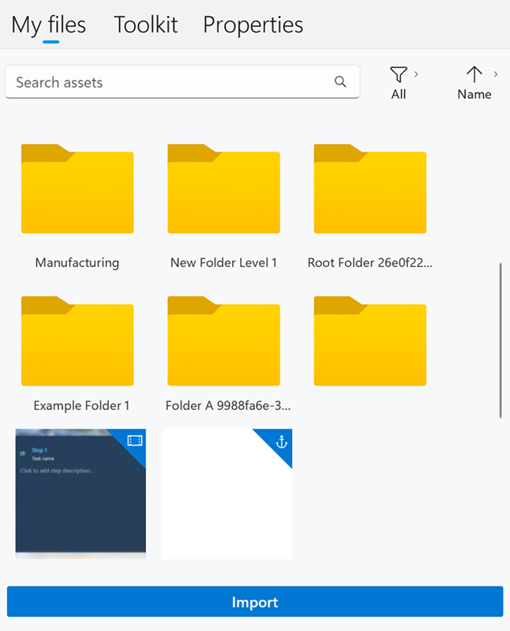

# Add a custom 3D part to a step in the Dynamics 365 Guides PC app

You can add 3D parts (objects specific to your company) in Microsoft Dynamics 365 Guides by importing them. A 3D part hologram helps operators find a 3D part in the real world. You can use a combination of third-party tools to prepare your 3D computer-aided design (CAD) objects. For more information, see [Overview of preparing 3D objects](./3d-content-guidelines/overview.md).

1. On the right side of the page, select the **My files** tab.

    

   [!INCLUDE [pc-app-filter-sort](../includes/pc-app-filter-sort.md)]

1. Drag the 3D part that you want to one of the **3D parts** boxes.

    

## Import a custom 3D object to use as a 3D part

You can import your own custom 3D objects and add them to **My files** or a folder in **My files**. To import files, you can drag them from a local file folder or use the **Import** command.

> [!TIP]
> You can set animation options (playback speed, direction, and looping) in the HoloLens app.

[!INCLUDE [import-include](../includes/pc-app-import.md)]

## View 3D object complexity statistics

On the step, select the 3D object and then select the **Properties** tab. The object statistics appear.

[!INCLUDE [supported-step-limits](../includes/supported-limits-steps.md)]

[!INCLUDE [supported-object-limits](../includes/supported-limits-objects.md)]

If the 3D object exceeds the recommended limits for optimal performance on the HoloLens, a warning appears on the step. Make the necessary changes to the object. Learn more: [Optimize your 3D objects](./3d-content-guidelines/optimize-models.md). 

Learn more [Supported files and limits](pc-app-supported-file-formats.md).

## Next steps

- [Step Editor overview](pc-app-step-editor-overview.md)
- [Add a 3D object from the toolkit](pc-app-add-3D-model.md)
- [Add an image or video file](pc-app-add-media.md)
- [Add a website or Power Apps link](pc-app-website-powerapps-link.md)
- [How to make a great mixed-reality guide](great-guide.md)

[!INCLUDE [footer-include](../includes/footer-banner.md)]
