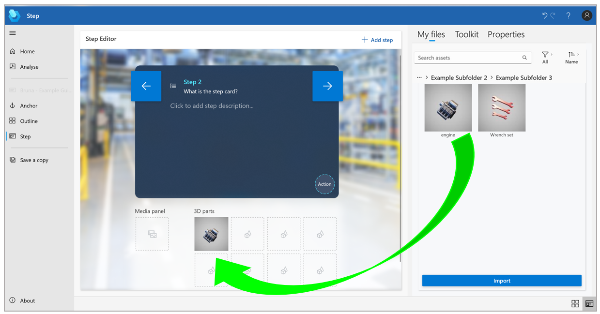

# Add a custom 3D part (that you import) to a step in the Dynamics 365 Guides PC app

You can add 3D parts (models specific to your company) in Microsoft Dynamics 365 Guides by importing them. A 3D part hologram helps operators find a 3D part in the real world. You can use a combination of third-party tools to prepare your 3D computer-aided design(CAD) models. For more information, see [Overview of preparing 3D models](./3d-content-guidelines/overview.md).

1. In the PC app, on the right side of the page, select the **3D parts** tab.

    

1. Drag the 3D part that you want to one of the **3D parts** boxes.

    

   > [!TIP]
   > To find items that were recently added to the gallery, you can sort by name or by the date when the item was added.

## Import a custom 3D model to use as a 3D part

You can import your own custom 3D models and add them to the **3D parts** library. To import files, you can drag them from a local file folder or use the **Import** command.

> [!TIP]
> You can set animation options (playback speed, direction, and looping) in the HoloLens app. 

### Import a file by using a drag-and-drop operation

1. Open Windows File Explorer, and go to the folder that contains the 3D models that you want to import.

1. Drag the files to the gallery.

    

### Import a file by using the Import command

1. Select **Import** in the lower-right corner of the page.

    

1. Find the files that you want to import, and then select **Open**.

    

> [!NOTE]
> If you have trouble importing a custom 3D part, [enable Guides to work in the background](known-issues-pc-app.md#cant-upload-3d-content).

## Next steps

- [Step Editor overview](pc-app-step-editor-overview.md)
- [Add a 3D model from the 3D toolkit](pc-app-add-3D-model.md)
- [Add an image or video file](pc-app-add-media.md)
- [Add a website or Power Apps link](pc-app-website-powerapps-link.md)
- [How to make a great mixed-reality guide](great-guide.md)

[!INCLUDE[footer-include](../includes/footer-banner.md)]
