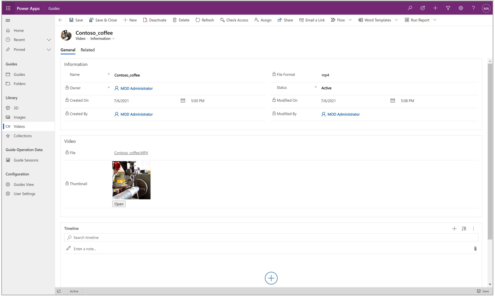
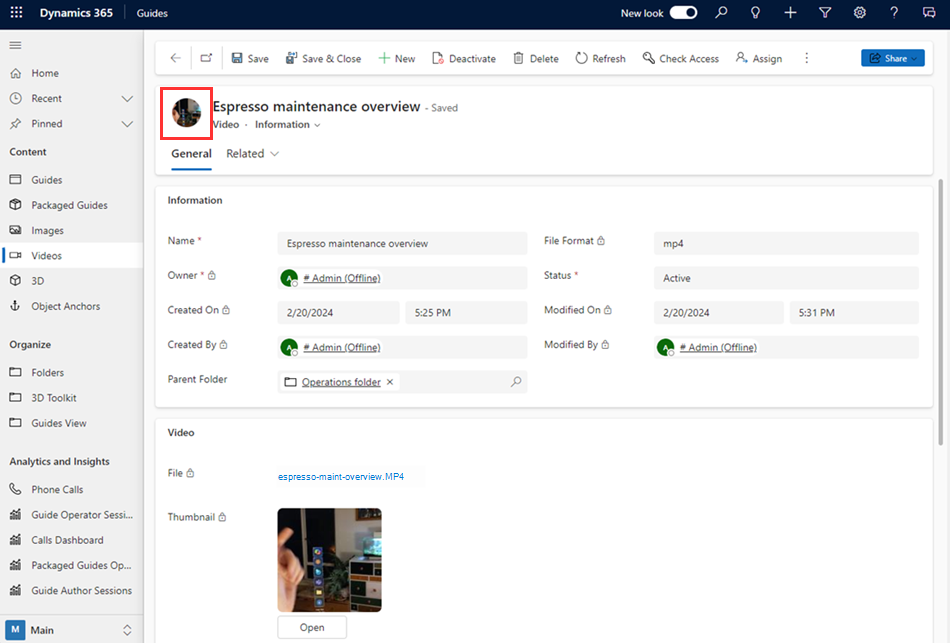
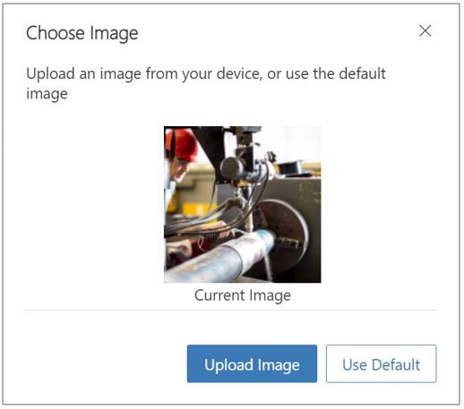

# Add an image or video to a step in the Dynamics 365 Guides PC app

You can add an image or video in the Dynamics 365 Guides PC app to help an operator with a complex step. You could add a diagram, for example, or a short video to explain a difficult process. 

1. In the PC app, on the right side of the page, select the **Images** or **Videos** tab.

    

2. Drag the image or video to the **Media panel** box. 

    
    
> [!NOTE]
> You can preview the image or video on the right side of the screen by selecting it (click or double-click) in the **Library**. 

## Change a video thumbnail

When you add a video to a step, the thumbnail for the video is automatically created. If you want to change the thumbnail to an image of your choice, you can use the Guides model-driven app. [Learn how to open the Guides model-driven app](open-model-driven-app.md). 

1. In the Guides model-driven app, open the video that has the thumbnail you want to replace.

    

2. At the top left of the screen, select the video circle.

   
    
3. In the **Choose Image** dialog box, select **Upload Image**, and then find the image you want to upload.

    
    
    > [!NOTE]
    > The image will automatically update in the model-driven app. To refresh the image in the PC app **Step Editor** page, open the **Outline** page, and then go back to the **Step Editor** page. 

## What's next?

[Step Editor overview](pc-app-step-editor-overview.md) 
[Add a 3D model from the 3D toolkit](pc-app-add-3D-model.md) 
[Add a 3D part](pc-app-add-3D-part.md) 
[Add a website or Power Apps link](pc-app-website-powerapps-link.md) 
[How to make a great mixed-reality guide](great-guide.md)

[!INCLUDE[footer-include](../includes/footer-banner.md)]
