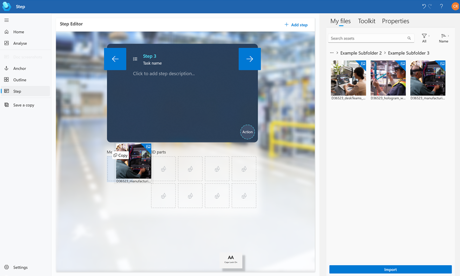
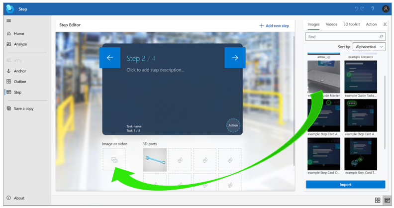

# Add an image or video to a step in the Dynamics 365 Guides PC app

[!include [rename-banner](~/includes/cc-data-platform-banner.md)]

You can add an image or video in the Dynamics 365 Guides PC app to help an operator with a complex step. You could add a diagram, for example, or a short video to explain a difficult process. 

1. In the PC app, on the right side of the page, select the **Images** or **Videos** tab.

    

2. Drag the image or video to the **Media panel** box.

    
    
> [!NOTE]
> You can preview the image or video on the right side of the screen by selecting it (click or double-click) in the **Library**. 

## What's next?

[Step Editor overview](pc-app-step-editor-overview.md) 
[Add a 3D model from the 3D toolkit](pc-app-add-3D-model.md) 
[Add a 3D part](pc-app-add-3D-part.md) 
[Add a website or Power Apps link](pc-app-website-powerapps-link.md) 
[How to make a great mixed-reality guide](great-guide.md)

[!INCLUDE[footer-include](../includes/footer-banner.md)]
