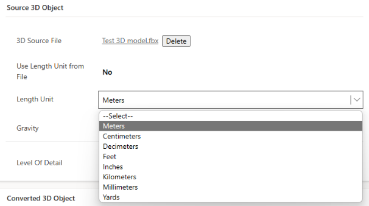

# Anchor a guide in Dynamics 365 Guides by using Azure Object Anchors Preview

Anchoring a guide with Azure Object Anchors (AOA) is a new preview capability for Dynamics 365 Guides on HoloLens 2. This feature is not available on HoloLens 1. This preview release supports large static objects only. AOA uses sensing and processing on HoloLens 2 to recognize a physical object and match it with a digital twin that has been  imported into Dynamics 365 Guides, converted to an object anchor, and assigned to a guide.  

Authors must do three steps to use object anchors:

1. Identify an appropriate object in the physical world to anchor the guide to. 

2. Import and convert a digital twin of that object through the Guides model-driven app. 

3. Choose **Object Anchor** as the anchor method for the guide and assign the resulting object anchor to the guide through the Dynamics 365 Guides PC app. 

## Requirements

To use AOA in Dynamics 365 Guides, you’ll need:

- An active Dynamics Guides license (trial or paid)

- Dynamics 365 Guides solution version 600.3.0.1 (July 27, 2021) or later

- A digital 3D model of your target object. You can start with any 3D model or you can capture the object by using third-party scanning applications. 

   > [!NOTE]
   > Your use of third-party applications is subject to terms between you and the third party. Microsoft Corporation isn't affiliated with, isn't a partner to, and doesn't endorse or sponsor any third-party products. Microsoft is not responsible for, and expressly disclaims all liability for damages of any kind arising out of the use of any third-party product. 

> [!NOTE]
> You may want to create a test Microsoft Dataverse environment separate from your production environment to test this preview feature. [Learn how to set up a Microsoft Dataverse environment](https://docs.microsoft.com/power-platform/admin/environments-overview).

## Best practices for choosing a target object for your object anchor

Keep the following recommendations in mind when choosing a target object for your object anchor.

### Static objects

For best results, target objects should be fixed and stationary during the scanning process. They should not have any parts that change during scanning or differ from the 3D source model as this might impact HoloLens ability to detect the object.

### Object size

To achieve accurate detection and alignment, the target object should be 1–10 meters for each dimension, as shown below.

### Topology

AOA works best on larger objects that have unique surfaces and asymmetric features.

- Do not use symmetrical objects as this can cause confusion about the orientation of the object.

- Use objects that have unique shapes and edges.

- Do not use objects that are mainly composed of thin pipes or wires.

### Object detection

Prior to starting object detection, make sure that your HoloLens 2 has a good understanding of the space by pre-scanning your environment before doing object detection. Look at the surrounding walls and unique objects with your HoloLens.

Then look at your target object to avoid false positives. This allows HoloLens to easily differentiate and detect the object. For larger objects, move around the object so that HoloLens is able to generate a better representation of the physical space. Standing in one spot limits the amount of surface information, which means that HoloLens might not meet its detection thresholds.

### Materials

Highly reflective and dark materials are difficult to detect with HoloLens. If HoloLens is unable to detect the surface, AOA will not be able to use sensor data for alignment and detection.

### Limitations

If the target object is moved, for absolute accuracy, the author or operator needs to clear the SR mesh before rescanning the anchor. To clear the SR mesh, on HoloLens, go to **Settings**, select **Holograms**, and then select **Clear all holograms**. 

> [!NOTE]
> This will clear all cached locations of all holograms you may have placed in other running HoloLens applications.

## Overall process for converting a 3D model to an object anchor and assigning it to a guide

Converting a 3D model into an object anchor and assigning it to a guide includes the following steps:

1. Choose the anchor type in the Anchor wizard.

2. Covert the 3D model in the Guides model-driven app.

3. Assign the object anchor to a guide in the Anchor wizard.

Each of these steps is described in detail below.

## Choose the anchor type in the Anchor wizard

1. In the PC app, on the **Outline** page, select **Anchor**, and then select **Set your anchor now** to open the Anchor wizard.

    

2. On the **Choose an anchor method** page, under **Object Anchor (Preview)**, select **Select**.

     

    > [!NOTE]
    > If you see the **Try Preview** button instead of the **Select** button, make sure that you have updated to Dynamics 365 Guides solution version 600.3.01, or contact your administrator. All regions other than Government Community Cloud (GCC) region tenants have access to the AOA preview.   
    > 
    > 

3. To add your 3D model as an object anchor, on the **Library** tab, select **Create**. 

    

    This opens the Guides model-driven app in your web browser.   

    > [!NOTE]
    > If you're prompted for credentials, sign in with the credentials for your environment. You need to have an author or administrator role with appropriate permissions to access the model-driven app. Users with the **Restricted author** role might not be able to access the model-driven app.     

## Convert the file in the Guides model-driven app

Use the instructions on the right side of the screen in the Guides model-driven app to select and convert your 3D file.

1. In the **Name** field, enter a name your object anchor, and then select **Save** at the top of the screen. 

     
    
   > [!Important]
   > The **Choose File** button in the next step won't appear until you select **Save**.

3. Under **Input**, select **Choose File**, and then browse to your 3D model and upload it. 

    

    > [!NOTE]
    > The following file types are supported: .obj, .fbx, .glb, .gltf, .ply. The maximum file size is 150 MB.  

4. Under **Conversion**:

    i. Confirm the gravity direction. The default value for the **Gravity** field is **-Y**. This sets the object anchor in the right orientation compared to the floor.
    
    ii. Verify the measurement type for the **Length Unit** field.

            

5. Select **Convert 3D File**. 

    This starts the conversion process. The **Conversion Status** field shows the status. You can also select **Refresh** to refresh the page status. During the conversion, you can create other object anchors or go back to the PC app to edit your guide. 

6. When the conversion is done, “Completed” appears in the **Conversion Status** field. You can then go back to the Anchor wizard in the PC app to assign the object anchor to the guide. If the conversion fails, start the process again.

### Assign a thumbnail to the object anchor (optional)

If you want to be able to easily identify your object anchor in the Library in the PC app, you can assign a thumbnail to your object anchor in the model-driven app. If you don't assign a thumbnail, a default object anchor thumbnail will be assigned. 

1. Select the circle next to the object anchor name.

    

2. In the **Choose Image** dialog box, select **Upload Image**, and then select the image to use for the thumbnail.

    

    The preview image changes after the image has finished uploading. 
    
3. Select **Change** to confirm the new image. 

## Assign the object anchor to a guide in the Anchor wizard 

1. Back in the PC app Anchor wizard, select **Next** and then **Back** to refresh the **Library**. You should see your object anchor in the **Library** under the **Object anchors** tab. 

2. Drag the object anchor to the **Anchor** icon in the **Assign an object anchor** area to assign it to the guide, and then select **Next**. 

    
    
    > [!TIP]
    > To preview the object anchor, in the Anchor wizard, select the object anchor thumbnail to open the **Properties** tab. You can also view the object anchor in the Guides model-driven app.
    > 
    > 

3. The next three steps in the Anchor wizard are optional: 

    a. Take a photo of the target object, and then select **Next**.

    b. Import the photo of the target object location, and then select **Next**.

    c. Add custom instructions as needed to help the operator find the target object, and then select **Done**.  

## Detect the object anchor in the HoloLens app 

1. Open the guide in the HoloLens app.  

2. Locate the target object in your physical environment.

3. Select **Initiate Scan**.  

4. Move around the object to scan it. HoloLens automatically recognizes the object based on the object anchor. 

5. Continue to move around the object if you’re prompted to do so.

    When the scan is successful, the object will have a green overlay. 

    

At this point, your guide should be successfully anchored to the object anchor. 

> [!NOTE]
> Objects that have moved or are moving may cause variable accuracy. If you have issues with object detection and content alignment, try clearing the mesh and all holograms. To do this, on HoloLens, go to **Settings** > **System** > **Holograms** > **Remove all holograms**. This will clear the location of all holograms placed in your world, not just the object anchor.   

## Troubleshooting

### 3D model conversion failure

The top reasons for 3D model conversion failure in the Guides model-driven app include:

- The 3D model uses an unsupported file format.

- The physical dimensions of the 3D model are larger than 10 meters or smaller than 1 meter.

- The 3D model file is bigger than the maximum supported file size (150 MB).

### Object anchor failure on HoloLens

The top reasons for object anchor failure on HoloLens include:

- Incorrect **Length Unit** type specified during model conversion.

- Incorrect gravity direction specified during model conversion.

- The 3D model provided during model conversion does not resemble the surfaces of the actual object detected by the HoloLens sensors.

You can confirm object measurements and **Length Unit** type by double-clicking the object anchor in the PC app to open the **Properties** tab.   
  

- If the dimensions of the object in the **Properties** tab are different from the actual object dimensions by a factor of 2 or more, an incorrect **Length Unit** type was likely used.

- If the gravity direction of the model in the 3D viewport (the down direction) is very different from the actual orientation of the object in its environment, an incorrect gravity direction was likely used, for example, if the chair in the above example is shown upside down or with its legs pointing to the side instead of pointing down.

   3D models that are converted correctly may not be detected on HoloLens if their model geometries differ greatly from the surfaces detected by HoloLens. You can view the object anchor geometry in the **Properties** tab and compare that with the Surface Reconstruction (SR) mesh of the object as seen by HoloLens. To view the object’s SR mesh, air tap while viewing the object in the HoloLens shell. A large difference in geometry between the anchor geometry and SR mesh indicates potential difficulty with object anchoring. 

## Known issues 

AOA is a preview feature for Dynamics 365 Guides and has the following limitations:

- The Content Migration tool does not support object-anchored guides.

- The Government Community Cloud (GCC) region is not supported. 

- If you switch from an object anchor to another anchor using **Change anchor method**, the saved position information for holograms is not migrated. Authors will need to check hologram placements.

- Objects that have moved or are moving may cause variable accuracy. 

