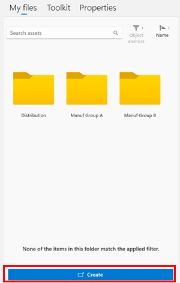

# Anchor a guide in Dynamics 365 Guides by using Azure Object Anchors (Preview)

Anchoring a guide with Azure Object Anchors (AOA) is a new preview capability for Dynamics 365 Guides on HoloLens 2. This feature is not available on HoloLens 1. The preview release supports larger static objects as anchors; subsequent releases will include support for sporadically moving objects. AOA uses sensing and processing on HoloLens 2 to detect a digital model and align it to a physical object. 

There are four basic steps required to create an anchor with AOA:

1. The author of the guide identifies an appropriate object in the physical world to anchor the guide to. 

2. The author converts a digital 3D model that matches the physical object into an object anchor through the Guides model-driven app. 

3. The author assigns the object anchor to a specific guide by using the Anchor wizard in the Dynamics 365 Guides PC app. 

4. After the operator opens the guide on HoloLens 2, the device searches for the object in the real-world environment. Once HoloLens recognizes the real-world object, the operator is automatically taken to the first step of the guide.

## Requirements

To use AOA in Dynamics 365 Guides, you’ll need:

- An active Dynamics Guides license (trial or paid)

- Dynamics 365 Guides solution version 600.3.0.1 (July 27, 2021) or later

- A test Microsoft Dataverse environment separate from your production environment. [Learn how to set up a Microsoft Dataverse environment](https://docs.microsoft.com/power-platform/admin/environments-overview).

- A digital 3D model of your target object. You can start with any 3D model or you can capture the object by using third-party scanning applications. 

> [!NOTE]
> Your use of third-party applications is subject to terms between you and the third party. Microsoft Corporation isn't affiliated with, isn't a partner to, and doesn't endorse or sponsor any third-party products. Microsoft is not responsible for, and expressly disclaims all liability for damages of any kind arising out of the use of any third-party product. 

## Best practices for choosing a target object for your object anchor

Keep the following recommendations in mind when choosing a target object for your object anchor.

### Static objects

For best results, target objects should be fixed and stationary during the scanning process. They should not have any parts that change during scanning or differ from the 3D source model as this might impact HoloLens ability to detect the object.

### Object size

To achieve accurate detection and alignment, the target object should be 1–10 meters for each dimension, as shown below.

### Topology

AOA works best on larger objects that have unique surfaces and asymmetric features.

- Do not use symmetrical objects as this can cause confusion about the orientation of the object.

- Use objects that have unique shapes and edges.

- Do not use objects that are mainly composed of thin pipes or wires.

### Object detection

Prior to starting object detection, make sure that your HoloLens 2 has a good understanding of the space by pre-scanning your environment before doing object detection. Look at the surrounding walls and unique objects with your HoloLens.

Then look at your target object to avoid false positives. This allows HoloLens to easily differentiate and detect the object. For larger objects, move around the object so that HoloLens is able to generate a better representation of the physical space. Standing in one spot limits the amount of surface information, which means that HoloLens might not meet its detection thresholds.

### Materials

Highly reflective and dark materials are difficult to detect with HoloLens. If HoloLens is unable to detect the surface, AOA will not be able to use sensor data for alignment and detection.

### Limitations

If the target object is moved, for absolute accuracy, the author or operator needs to clear the SR mesh when rescanning the anchor. To clear the SR mesh, on HoloLens, go to **Settings**, select **Holograms**, and then select **Clear all holograms**. 

> [!NOTE]
> This will clear all cached locations of all holograms you may have placed in other running HoloLens applications.

## Overall process for converting a 3D model to an object anchor and assigning it to a guide

Converting a 3D model into an object anchor and assigning it to a guide includes the following steps:

1. Choose the anchor type in the Anchor wizard.

2. Covert the 3D model in the Guides model-driven app.

3. Assign the object anchor to a guide in the Anchor wizard.

4. Assign the object anchor in the HoloLens app. 

Each of these steps is described in detail below.

## Choose the anchor type in the Anchor wizard

1. In the PC app, on the **Outline** page, select **Anchor** to open the Anchor wizard.

    

2. On the **Choose an anchor method** page, under **Object Anchor (Preview)**, select **Select**.

     

    > [!NOTE]
    > If you see the **Try Preview** button instead of the **Select** button, make sure that you have updated to Dynamics 365 Guides solution version 600.3.01, or contact your administrator. All regions other than Government Community Cloud (GCC) region tenants have access to the AOA preview.   
    > 
    > 

3. To add your 3D model as an object anchor, in the Anchor wizard, on the **Library** tab, select **Create**. 

    

    This opens the Guides model-driven app in your web browser.   

    > [!NOTE]
    > If you're prompted for credentials, sign in with the credentials for your environment. You need to have an author or administrator role with appropriate permissions to access the model-driven app. Users with the **Restricted author** role might not be able to access the model-driven app.     

## Convert the file in the Guides model-driven app

Use the instructions on the right side of the screen in the Guides model-driven app to select and convert your 3D file.

1. In the **Name** field, enter a name your object anchor, and then select **Save** at the top of the screen. 

     
    
   > [!Important]
   > The **Choose File** button won't appear until you select **Save**.

3. Under **Upload**, select **Choose File**, and then browse to your 3D model and upload it. 

    

    > [!NOTE]
    > The following file types are supported: .obj, .fbx, .glb, .gltf, .ply. The maximum file size is 150 MB.  

4. Under **Conversion**:

    i. Confirm the gravity direction. The default value for Gravity is **-Y**. This sets the object anchor in the right orientation compared to the floor.
    
    ii. Verify the measurement type for the **Length Unit** field.

            

5. Select **Convert 3D File**. 

    This starts the conversion process. The **Conversion Status** field shows the status. You can also select **Refresh** to refresh the page status. During the conversion, you can create other object anchors or go back to the PC app to edit your guide. 

6. When the conversion is done, “Completed” appears in the **Conversion Status** field. You can then go back to the Anchor wizard in the PC app to assign the object anchor to the guide. If the conversion fails, start the process again.

### Assign a thumbnail to the object anchor (optional)

You can also assign a thumbnail to your object anchor in the model-driven app to make it easier to find in the **Library**. If you don't assign a thumbnail, a default object anchor thumbnail will be assigned.  

1. Select the circle next to the object anchor name.

    

2. Select **Upload **Image**, and then select the image to use for the thumbnail.

    

    The preview image changes after the image has finished uploading. 
    
3. Select **Change** to confirm the new image. 

## Assign the object anchor to a guide in the Anchor wizard 

1. Back in the PC app Anchor wizard, select **Next** and then **Back** to refresh the **Library**. You should see your object anchor in the **Library** under the **Object Anchor** tab.    

2. Drag and drop the object anchor to assign it to the guide, and then select **Next**. 

    

3. The next three steps in the Anchor wizard are optional: 

    a. Take a photo of the target object, and then select **Next**.

    b. Import the photo of the target object location, and then select **Next**.

    c. Add custom instructions as needed to help the operator find the target object. 

4.	Select **Complete**.  

## Assign the object anchor in the HoloLens app 

1. Open the guide in the HoloLens app.  

2. Locate the target object in your physical environment.

3. Select **Initiate Scan**.  

4. Move around the object to scan it. HoloLens automatically recognizes the object based on the object anchor. 

5. Continue to move around the object if you’re prompted to do so.

    When the scan is successful, the object will have a green overlay. 

    

6. Confirm that the scan is accurately aligned to the target object. If not, select rescan to try again. 

    > [!TIP]
    > You can place arrows at key points on your target object (at the left end and right end of the object) in the first step of a guide and use those arrows to gauge the accuracy of the scan. 
    > 
    > 

At this point, your guide should be successfully anchored to the object anchor. 

> [!NOTE]
> Rescanning might cause variable accuracy. If you have issues with object detection and content alignment, try clearing the mesh and all holograms. To do this, on HoloLens, go to **Settings** > **System** > **Holograms** > **Remove all holograms**. This will clear the location of all holograms placed in your world, not just the object anchor.   

## Use an object anchor as an operator

For operators, anchoring a guide with an object anchor is similar to anchoring with other methods:

1.	Open the guide in the HoloLens app using HoloLens 2. 

2.	Select Initiate scan. 

3.	Scan the environment for the target object.

4.	The device will detect the object and automatically take the operator to the first step of the guide. 

> [!NOTE]
> Rescanning might cause variable accuracy. If you have issues with object detection and content alignment, try clearing the mesh and all holograms. To do this, on HoloLens, go to **Settings** > **System** > **Holograms** > **Remove all holograms**. This will clear the location of all holograms placed in your world, not just the object anchor.

## Known issues 

AOA is a preview feature in Dynamics 365 Guides and has the following limitations:

- The Content Migration tool is not supported. 

- The GCC region is not supported. 

- If you switch from an object anchor to another anchor using Change anchor method, the saved position information for holograms is not migrated. Authors will need to check hologram placements.

- Offline mode is not supported. 

- Rescanning may cause variable accuracy, especially with objects that have moved. 

