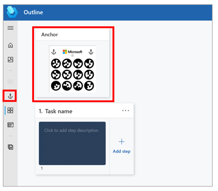
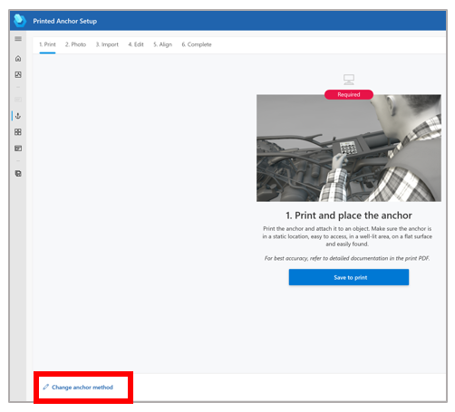

# Change from one anchor type to another in the Dynamics 365 Guides PC app

You can anchor a guide in Microsoft Dynamics 365 Guides by using a QR code anchor, circular code anchor, or holographic anchor. It's easy to change from one anchor type to another if a different anchor type will work better for your scenario. 

1. In the **Outline** page, select the anchor at the top of the page, or select the **Anchor** button in the left navigation pane to open the **Anchor** wizard.

    

2. In the lower-left corner of the wizard window, select **Change anchor method**.

    

3. Select the anchor type that you want to change to.

4. In the warning message that appears, select **Switch anchor method**.

## What's next?

Use the following table to find more information on anchoring.

|Area|Link|
|----------------------|------------------------------------------------------------------|
|Anchoring overview|[Overview of anchoring a guide](pc-app-anchor.md)|
|Creating types of anchors|[Create a QR code anchor in the PC app](pc-app-anchor-qr-code.md)|
||[Create a circular code anchor in the PC app](pc-app-anchor-circular-code.md)|
||[Create a holographic anchor in the PC app](pc-app-anchor-holographic.md)|
|Hologram precision|[Effect of calibration, pre-scanning, and environment](pc-app-anchor-improve-hologram-precision.md)|
||[Effect of anchor types/placement](pc-app-anchor-types-placement-precision.md)
|HoloLens app for authors|[Anchor your guide as an author in the HoloLens app](hololens-app-anchor.md)|
|HoloLens app for operators|[Anchor your guide as an operator in the HoloLens app](operator-anchor.md)

[!INCLUDE[footer-include](../includes/footer-banner.md)]