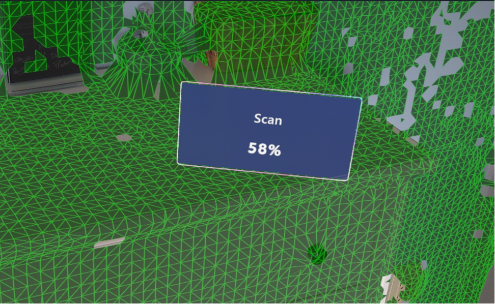

# Anchor a guide in Dynamics 365 Guides by using object anchors

> [!VIDEO https://www.youtube.com/embed/BXhMFjGFbTQ]

Object anchors uses sensing and processing on HoloLens 2 to recognize a physical object and match it with a digital twin in Guides. This feature supports large static objects only. Review [best practices for choosing a target object.](pc-app-anchor-object-best-practices.md)

## Overall process for creating an object anchor

To use object anchors, authors must complete the following steps:

1. [Identify an appropriate object in the physical world to anchor the guide to](#choose-the-anchor-type-in-the-anchor-wizard).

1. Import and [convert a digital twin](#convert-the-file-in-the-guides-model-driven-app) of that object through the Guides model-driven app.

1. Choose **Object Anchor** as the anchor method for the guide and [assign the resulting object anchor to the guide](#assign-a-thumbnail-to-the-object-anchor-optional) through the Guides PC app.

## Limitations

Object anchors for Dynamics 365 Guides has the following limitations:

- The Government Community Cloud (GCC) region isn't supported.

- If you switch from an object anchor to another anchor using **Change anchor method**, the saved position information for holograms isn't migrated. Authors should check hologram placements.

- Objects that have moved or are moving may cause variable accuracy.

## Prerequisites

- An active Dynamics 365 Guides license

- Dynamics 365 Guides solution version 900.0.0.1 (October 17, 2023) or later

- Dynamics 365 Guides HoloLens app version 900.2130.7001.0 (October 17, 2023) or later

- A digital 3D object of your target object. You can start with any 3D object or you can capture the object by using third-party scanning applications.

   > [!NOTE]
   > Your use of third-party applications is subject to terms between you and the third party. Microsoft Corporation isn't affiliated with, isn't a partner to, and doesn't endorse or sponsor any third-party products. Microsoft is not responsible for, and expressly disclaims all liability for damages of any kind arising out of the use of any third-party product.

## Choose the anchor type in the Anchor wizard

You can access the **Anchor** wizard from the **Outline** page in the PC app. The **Outline** page automatically appears after you create or open a guide.

1. On the **Outline** page, select **Set your anchor now**.

    

1. On the **Choose an anchor method** page, under **Object Anchor**, select **Select**.

   > [!NOTE]
   > If you see the **Try Preview** button instead of the **Select** button, make sure that you have updated to Dynamics 365 Guides solution version 900.0.0.1 and that you have updated to Dynamics 365 Guides PC app version 900.2130.7001.0, or contact your administrator. All regions other than Government Community Cloud (GCC) region tenants have access to object anchors.

1. To add your 3D object as an object anchor, on the **My files** tab, select **Create**.

    

    The Guides model-driven app opens in your web browser.

   > [!NOTE]
   > If you're prompted for credentials, sign in with the credentials for your environment. You need to have an author or administrator role with appropriate permissions to access the model-driven app. Users with the [**Restricted author** role](assign-role.md) might not be able to access the model-driven app.

## Convert the file in the Guides model-driven app

Use the instructions on the right side of the screen in the Guides model-driven app to select and convert your 3D file. The following file types are supported: .obj, .fbx, .glb, .gltf, and .ply. The maximum file size is 128 MB.  

1. In the **Name** field, enter a name for your object anchor and select the **Parent Folder** to create it in.

     

1. Select **Save** at the top of the screen.

   > [!IMPORTANT]
   > The **Choose File** button in the next step won't appear until you select **Save**.

1. Under **Source 3D Object**:

   1. Select **Choose File**, and then browse to your 3D object and upload it.

   1. Select the measurement type for the **Length Unit** field that matches the unit used to create the 3D object in the source file.

      

      > [!TIP]
      > If your upload file is type .fbx, then you can have Guides determine the length unit automaticallly. Select **Yes** for **Use Length Unit from File**.

   1. Choose the gravity direction that points downward on the vertical axis used to create the 3D object. This direction ensures the object anchor is converted upright compared to the floor. The default value for the **Gravity** field is **-Y**.

   1. Select a size for the **Level of Detail** field. Decide between faster detection and more accurate anchor position.

      - 4 cm: results in an object anchor that HoloLens detects faster but with less accuracy. Holograms placed on the object surface may seem to shift 2-3 cm between sessions.

      - 2 cm: results in better accuracy. You may only want to use it for smaller objects, as it requires more processing effort on the HoloLens.

        A rule of thumb is that the accuracy of holograms placed at the object's surface, is about 1/2 the level of detail you choose.

1. Under **Converted 3D Object**, select **Convert to Object Anchor** to start the conversion process.

    The **Conversion Status** field shows the status. You can also select **Refresh** to refresh the page status. During the conversion, you can create other object anchors or go back to the PC app to edit your guide.

1. When the conversion is done, “Succeeded” appears in the **Conversion Status** field.

Go back to the Anchor wizard in the PC app to assign the object anchor to the guide. Or, assign a thumbnail to the object anchor.

### Assign a thumbnail to the object anchor (optional)

To easily identify your object anchor in **My files** in the PC app, assign a thumbnail to your object anchor in the model-driven app. If you don't assign a thumbnail, a default object anchor thumbnail is assigned.

1. Select the circle next to the object anchor name.

    

1. In the **Choose Image** dialog box, select **Upload Image**, and then select the image to use for the thumbnail.

   The preview image changes after the image has finished uploading.

1. Select **Change** to confirm the new image.

## Assign the object anchor to a guide in the Anchor wizard

1. In the PC app Anchor wizard, select **Next** and then **Back** to refresh the **My files** tab. You should see your object anchor.

   > [!TIP]
   > The filter is automatically set to **Object anchors**.

1. Drag the object anchor to the **Anchor** icon in the **Assign an object anchor** area to assign it to the guide, and then select **Next**.

    

   > [!TIP]
   > To preview the object anchor, in the Anchor wizard, select the object anchor thumbnail to open the **Properties** tab. You can also view the object anchor in the Guides model-driven app.

1. The next three steps in the Anchor wizard are optional: 

   1. Take a photo of the target object, and then select **Next**.

   1. Import the photo of the target object location, and then select **Next**.

   1. Add custom instructions as needed to help the operator find the target object, and then select **Done**.  

## Detect the object anchor in the HoloLens app

1. Open the guide in the HoloLens app.  

1. Locate the target object in your physical environment.

1. Select **Initiate Scan**.  

1. Move around the object to scan it. HoloLens automatically recognizes the object based on the object anchor.

1. Continue to move around the object if you’re prompted to do so.

    When the scan is successful, the object has a green overlay.

    

At this point, your guide should be successfully anchored to the object anchor.

## Improve detection accuracy by tuning the minimum scan percentage

If you want to improve the accuracy of the anchor position, add text instructions and an image to the anchor step card in the PC app to encourage operators to scan the object well from all sides. Scanning more of the object with the HoloLens allows Guides to place the object anchor more accurately over the real object.

You can force operators to do better scans by setting a higher **Minimum Scan %** value using the Guides model-driven app. This field allows you to override the anchor's built-in minimum scan percentage required.

1. Use Guides on the HoloLens to do several practice scans of the object. When the object detection mesh turns from blue to green, it's reached the precomputed **Minimum Scan %**.

1. Continue to scan until it's scanned as thoroughly as you would want operators to scan it.

    

1. Note the **Scan %** achieved for each practice scan and decide on a reasonable minimum number.

1. In the model-driven app under **Converted 3D Object**, enter the new **Minimum Scan %** and select **Save**.

1. Use Guides on the HoloLens and do a test scan to make sure it works well. The minimum percentage should be high enough to require operators to scan more of the object, but not too high that it takes too much time or effort to complete.

   > [!TIP]
   > Guides only overrides values to increase the minimum scan percentage. It precomputes an absolute minimum scan percentage value for each object anchor. When scanning on HoloLens, it ignores any minimum scan percentage values set lower than its precomputed value.

Getting operators to scan the model from more angles improves the accuracy of the object anchor's position, which improves the accuracy of where holograms are shown to each operator.

## Next steps

- [Best practices for object anchors](pc-app-anchor-object-best-practices.md)
- [Anchor a guide in the HoloLens app](hololens-app-anchor.md)

[!INCLUDE[footer-include](../includes/footer-banner.md)]
