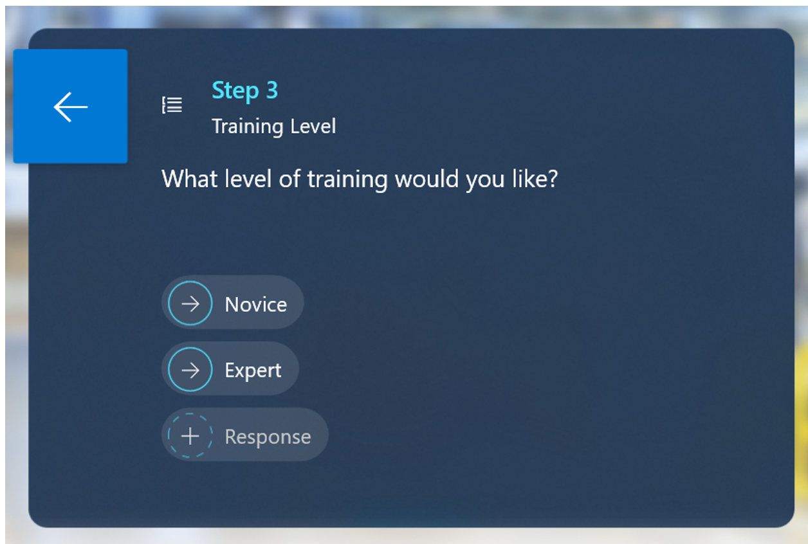
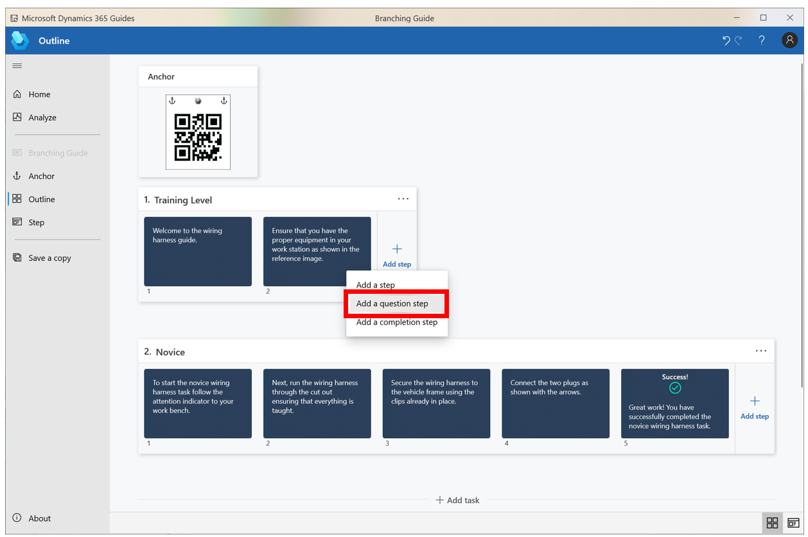
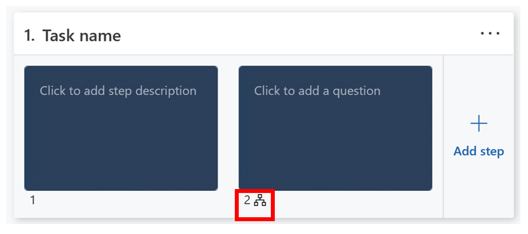
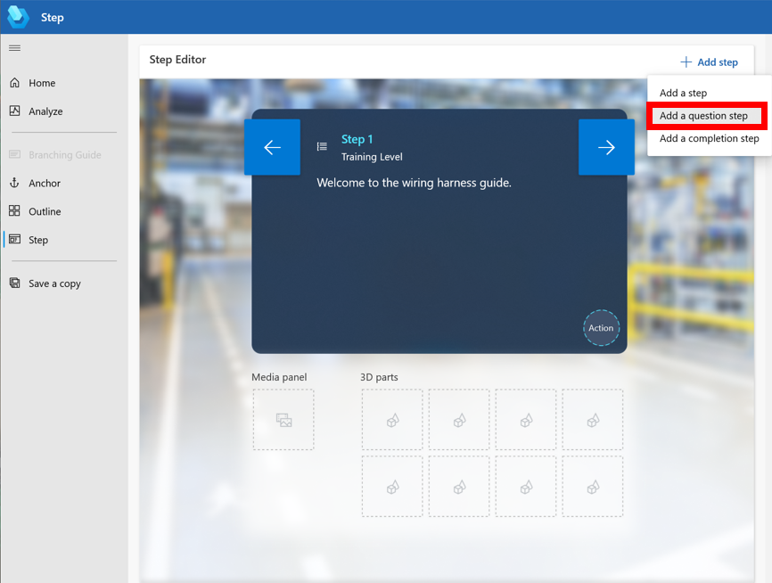
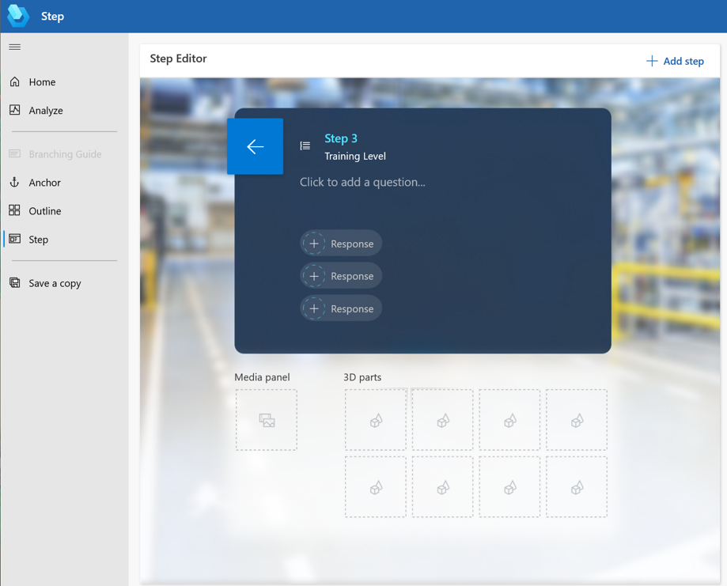
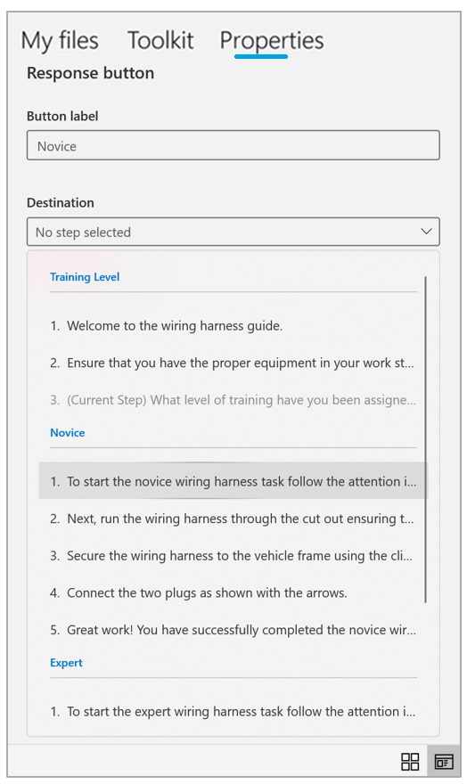
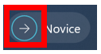
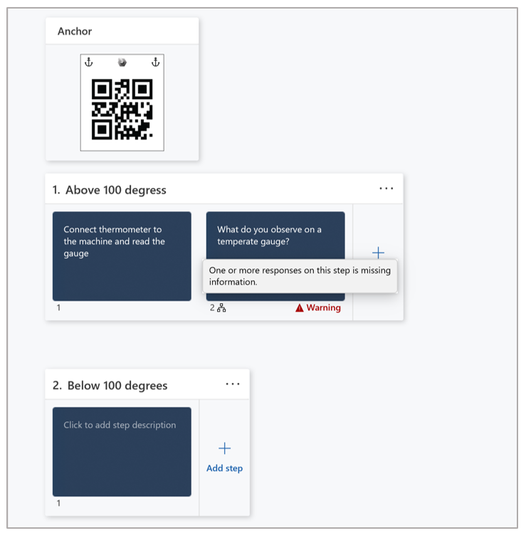
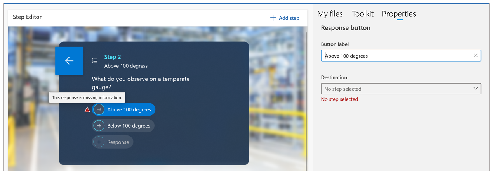
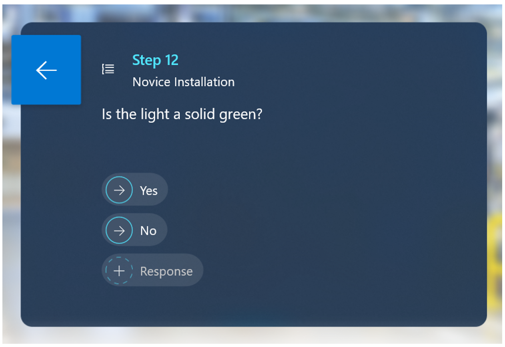

# Add a branch in to a guide in Dynamics 365 Guides to create a non-linear workflow 

You can add a branch to a guide in Microsoft Dynamics 365 Guides if your use case requires a non-linear workflow. By inserting branching points into the flow of the guide that allow the operator to make selections, you can create workflows based on what the operator observes, the operator’s skill level, or different machinery models. 

For example, you can create a guide that includes:

- One branch that an operator can follow if they observe temperatures over 100 degrees, and a different branch if they observe temperatures less than 100 degrees. 

- Beginner, intermediate, and advanced branches. Consolidating data in a single guide reduces the maintenance required to keep three separate guides up-to-date.

- An assessment to ensure that the instructed work was completed or was completed correctly.

## Branching terminology

To get started with branching in Dynamics 365 Guides, you’ll need to know the following terms:

- **Branching** is the blanket term given to the collection of features that enable you to create non-linear guides.

- **Responses** are the choices that authors provide for operators.

- **Completion** is the “end state” of a guide. When an operator reaches the completion step, a guide-complete telemetry event is triggered.

- **Navigation** is the act of moving forward or backward in a guide by using the **Next** and **Back** buttons or response buttons.

## Create a branch point in a guide

To create a branch point in a guide, you add a question step that includes responses. Each response can lead to any other step within the same guide. Operators select 
one of the responses, which determines their next step in the guide.

### Add a question step

1. Open an existing guide or create a new guide.

2. In the **Outline** page, select **Add step**, and then in the context menu, select **Add a question step**.

    
    
    You'll see a small icon below the step that shows that it's a question step.
    
    

    > [!NOTE]
    > You can also add a question step by selecting **Add step** in the top-right corner of the **Step Editor**.
    
    
 
3. Place your cursor (you can use the Tab key if you're using the keyboard) where it says **Click to add a question**, and then enter a question for the operator.

    
 
    > [!NOTE]
    > You can add up to three lines of text per question. If you exceed this limit, you’ll see a warning. 

4. Select a response, and then in the **Properties** tab on the right side of the screen, do the following:

    a. In the **Button label** field, enter the text for the response button. 
    
    b. In the **Destination** list, select the step that the operator will go to when they select the response button. Steps are organized by task.
    
      
      
5. Create the rest of your responses for that step. You can have up to three responses per step. Keep in mind that you can link one question step to another question step, and you can link to any step in the same guide.

    > [!TIP]
    > To clear a response, right-click the response, and then select **Remove**. If you're using the keyboard, tab to the response, select the **Menu** button on the keyboard, and then select **Remove**. 

### Add a completion step

In a branching guide, all paths may not lead to the same place, so you may want to create a completion step to let the operator know when they’re done. When an operator 
finishes a completion step, it triggers a guide-complete event used for business intelligence dashboards and for overall time-tracking telemetry.

> [!NOTE]
> You may want to create a completion step for each path in a guide. For example, if you’re creating a guide with different skill levels, add a completion step at the end 
of the Novice task and at the end of the Expert task.

To add a completion step:

- Do one of the following:

- In the **Outline** page, select **Add step**, and then in the context menu, selection **Completion**. The completion step is added at the end of the task.

- In the **Step Editor**, select **Add**, and then in the context menu, selection **Completion**. The completion step is added to the next step.

    > [!NOTE]
    > The completion step does not have a **Next** button because it’s intended to be the final step in a guide. The operator can restart the guide from the completion step, 
    choose to open a new guide, or go back by choosing the **Back** button.
    
### Try out your flow

You can try out your branching flow and verify that all responses are configured without leaving the PC app. 

1.	In the **Outline** page, open the first step of the first task. By default, operators will start a guide from Step 1 in the first task.

2.	Use the **Next** button to move forward until you reach a question step.

3.	On a question step, select the circular button for a configured response. If you're using a keyboard, tab to a response, tab to the circular button, and then press Enter to go to that response destination. 

    
 
    > [!NOTE]
    > Selecting the **Back** button will return you to the last step you were on, similar to how history works in a web browser. This is also true for the HoloLens app. 
    If a step or task that was part of the user’s path is deleted, the **Back** button goes to the next available item in the history. If all the previous steps are 
    deleted, an error message appears and the user stays on the current step.
    
4. To verify that all responses are fully configured and you didn't forget to specify a destination or name the response, go to the **Outline** page. If one of the responses is missing information for that step, you'll see a warning message.

    
    
    If you see a warning message, open the question step in the **Step Editor**. The property with missing information will be highlighted to make it easy to find.
    
    

## Tips and tricks for branching flows

- Before inserting question steps, author all the steps in the guide so you have the appropriate steps to link to. 

- The completion step is the final step in a guide. If you want to create a scenario where a user can either complete the guide or move to a different task, create a 
question step before the completion step and link the responses to the completion step and the next step in the process. 

    For example, in the following guide, if the operator selects **Yes**, the guide will take the operator to the completion step. If the operator selects **No**, the guide will take the operator to an additional task for further troubleshooting.
    
    
 
## See also

[Use triggers for question step responses](pc-app-trigger.md)
    

