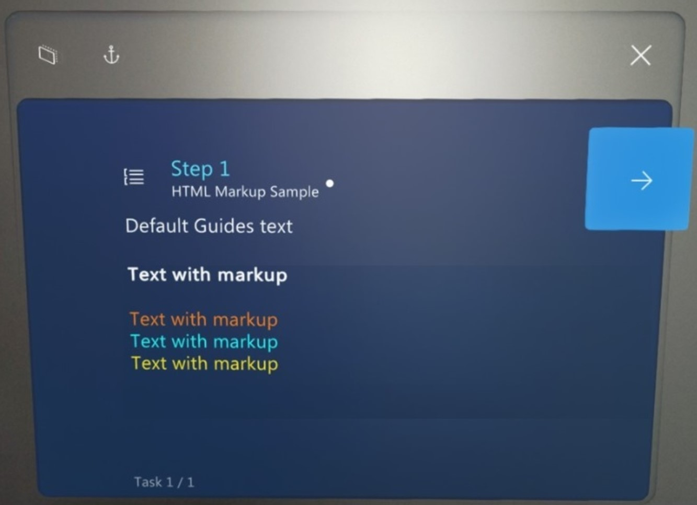

# Use rich text formatting in instruction card text in Dynamics 365 Guides

> [!NOTE]
> This is an unsupported feature and is subject to change.

If you want to use colors or rich-text formatting (bold, color, italic, or underline) in your Dynamics 365 Guides instruction card text, you can add a small subset of HTML tags directly to an instruction card in the PC app.

## Supported tags

Dynamics 365 Guides supports the following subset of tags.

|Tag|Description|
|--------------|---------------------------------------------------------------------------------------|
|``<b>``|Bold.|
|<color=*argument*>|Text color. The argument can be a hexadecimal code beginning with # or a named color. Hexadecimal colors can be RGB (six characters). Recognized color names are black, blue, green, orange, purple, red, white, and yellow. **NOTE:** Make sure to use lowercase for colors ("yellow", for example). Otherwise, the colors won't be applied. For cyan, use the hexadecimal code #00FFFF.|
|``<i>``|Italic.|
|``<u>``|Underline.|

### HTML tags in the PC app

### Results in the HoloLens app

