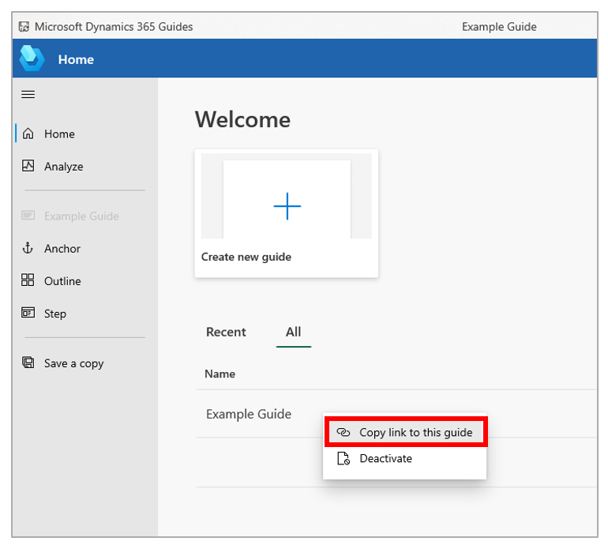
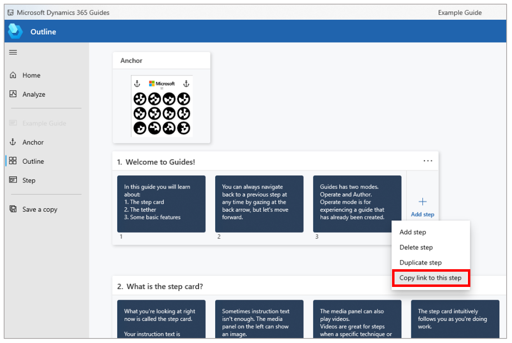

# Create and copy a link to a guide or step in Dynamics 365 Guides

You might want to create and copy a link to a guide or a step in [!include[cc-microsoft](../includes/cc-microsoft.md)] [!include[pn-dyn-365-guides](../includes/pn-dyn-365-guides.md)] for one or both of these reasons:

- You want to share the link with another author through email or chat.

- You want to embed the link in a QR code. In this case, when you or the operator scans the QR code from the HoloLens shell, the guide or step is automatically opened.

## Create and copy a link to a guide

1. On to the **Home** page, right-click the appropriate guide.

2. Select **Copy link to this guide**.

    

## Create and copy a link to a step

1. On the **Outline** page, right-click the appropriate step.

2. Select **Copy link to this step**.

    

## What's next?

[Overview of authoring a guide with the PC app](pc-app-overview.md) 
[Install and sign in to the PC app](install-sign-in-pc-app.md) 
[Create a guide](create-guide.md) 
[Anchor your guide to the real world](anchor.md) 
[Structure your guide on the Outline page](structure-guide.md) 
[Create steps and add 3D content or 2D media](create-steps-assign-media.md) 
[Add a website or Power Apps link to a step](pc-app-website-powerapps-link.md) 
[Learn about keyboard shortcuts](keyboard-shortcuts-pc-app.md) 
[Deactivate a guide](pc-app-deactivate-guide.md) 
[Learn what makes a great mixed reality guide](great-guide.md)

