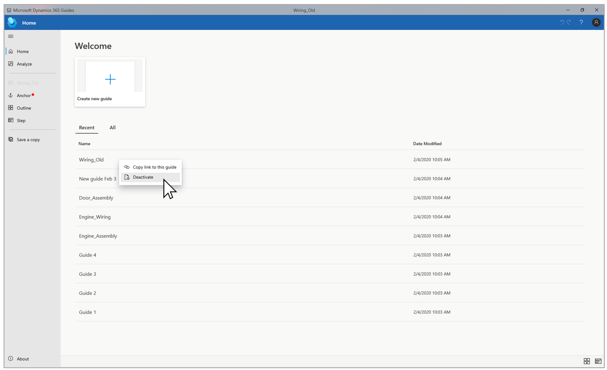
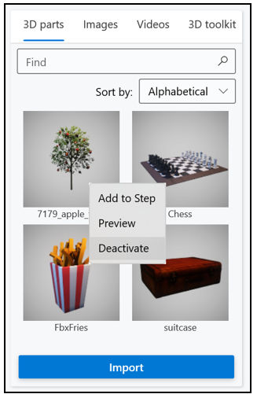

# Deactivate a guide or specific guide content (image, video, or 3D part) if you're a Dynamics 365 Guides author

If you're an author for Microsoft [!include[pn-dyn-365-guides](../includes/pn-dyn-365-guides.md)], you can deactivate a guide if it's out of date or you want to prevent operators from accessing it.

1. On the **Home** page, right-click the guide that you want to deactivate.

2. Select **Deactivate**.

    

    > [!IMPORTANT]
    > After a guide is deactivated, it will continue to appear in the **Recent** list, because this list always shows the 12 most recently opened guides. However, neither you nor your operators will be able to open the guide.
    >
    > To reactivate a guide, or to delete it permanently, contact your admin or another user who has admin access to the Guides Hub. For information about how to deactivate a guide if you're an admin, see [Deactivate a guide (admins)](admin-deactivate-guide.md).
    
## Deactivate specific content (image, video, or 3D part)

You can deactivate an image, video, or 3D part in the PC app. This hides the content in the library without affecting existing guides that use that content. The content is not physically deleted and can be [reactivated through the Guides Hub by an administrator](admin-deactivate-guide.md).
 
1.  Right-click the image, video, or 3D part that you want to deactivate.

2. Select **Deactivate**.

    

## See also

[Deactivate a guide (admins)](admin-deactivate-guide.md)
