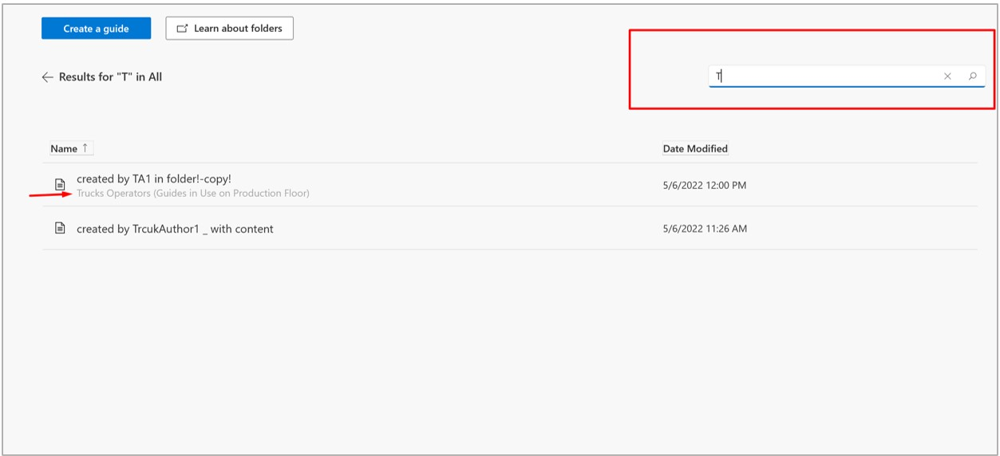
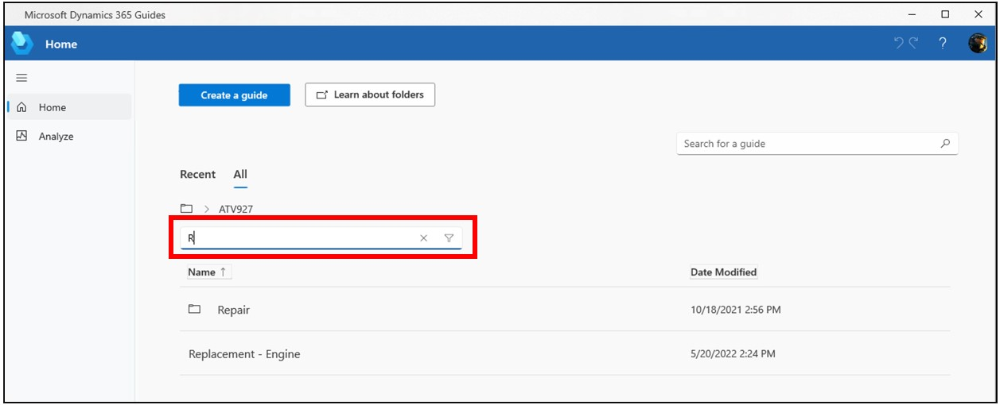
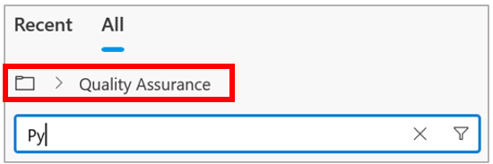

# Find a guide in the Dynamics 365 Guides PC app

To find a guide in the Microsoft Dynamics 365 Guides PC app, you can: 

- Use the search box

- Use the filter box 

- Navigate the folder structure

- Use the **All** or **Recent** tabs, and then sort the resulting lists

## Use the search box

When you search for a guide using the search box, Dynamics 365 Guides searches all folders in the instance. 

> [!NOTE]
> At this time, you can't use the search box to search for a folder. 

1. [Open the PC app](install-sign-in-pc-app.md).

2. Open the **Home** page, and then start entering characters in the search box. 

    

   Search returns all results that match the characters you enter and shows the folder hierarchy, if applicable. 

## Use the filter box

When you use the filter box, you can filter just the current view (the list you see on your screen). To filter inside a folder, you need to open the folder first.

1. [Open the PC app](install-sign-in-pc-app.md).

2. Open the **Home** page, enter a name in the filter box, and then select the **Filter** button.

        
    
## Navigate the folder structure

You can navigate the folder structure by using the **All** tab or the folder breadcrumbs above the filter box. 

Note that folders do not appear on the **Recent** tab. [Learn how to create folders with the Guides model-driven app](admin-create-folders.md).
    
## Use the All or Recent tab, and then sort the resulting lists   

1. Select the **All** or **Recent** tab.

2. Sort the resulting list by selecting the **Name** and **Date Modified** column headers (**All** tab), or the **Name** and **Date Accessed** column headers (**Recent** tab).

## See also

- [Create a guide](create-guide.md)
- [Create a folder (admins and authors)](admin-create-folders.md)
