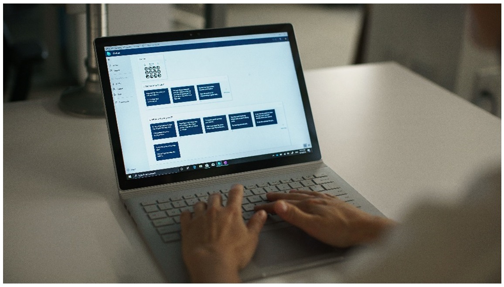

# Overview of authoring a guide with the Dynamics 365 Guides PC app

 [Watch a video about PC authoring](https://aka.ms/pcauthor)

You use the PC authoring app in [!include[cc-microsoft](../includes/cc-microsoft.md)] [!include[pn-dyn-365-guides](../includes/pn-dyn-365-guides.md)] as the first step in the authoring process.

Use the PC app to complete these tasks:

- Create a guide.

- Select an anchoring method.

- Add tasks and steps.

- Write the instructions for your steps.

- Assign different types of content to support the steps. Here are some examples of supporting content:

    - 3D parts

    - 3D objects, such as objects from the 3D toolkit (for example, arrows and numbers)

    - 2D media (images and videos)

## What's next?

[Install and sign in to the PC app](install-sign-in-pc-app.md) 
[Create a guide](create-guide.md) 
[Anchor your guide to the real world](anchor.md) 
[Structure your guide on the Outline page](structure-guide.md) 
[Create steps and add 3D content or 2D media](create-steps-assign-media.md) 
[Add a website or Power Apps link to a step](pc-app-website-powerapps-link.md) 
[Create and copy a link to a guide or step](pc-app-copy-link-guide-step.md) 
[Learn about keyboard shortcuts](keyboard-shortcuts-pc-app.md) 
[Deactivate a guide](pc-app-deactivate-guide.md) 
[Learn what makes a great mixed reality guide](great-guide.md)

[!INCLUDE[footer-include](../includes/footer-banner.md)]
