# Tips for pointing at small or closely spaced objects in Dynamics 365 Guides

If you're working with small or closely spaced objects in Microsoft Dynamics 365 Guides, you might experience problems when using holograms to point at those objects due to HoloLens accuracy thresholds. For example, the following graphic shows a machine that has buttons that are placed closer together than the HoloLens minimum accuracy thresholds. 

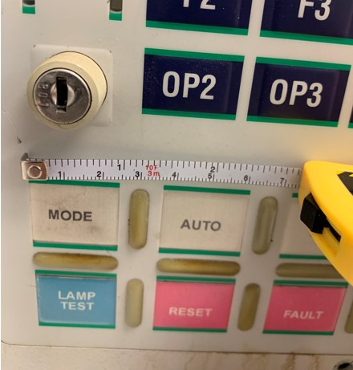

In this case, there might be small variations in the exact placement of the holograms between devices or sessions. When such accuracy is required in small spaces, a small variation can mean pointing to the wrong button. 

If you add holograms to point at the buttons in this case, it may be difficult for the operator to see small but important parts of the equipment as the holograms might obstruct them, as shown in the following graphic.

This article shows how you can use and place a 3D image together with a real-world object to point at small or closely spaced objects accurately and consistently. 

## Use a 3D image together with a real-world object

You can create a 3D image that replicates an object (a machine, for example) or part of an object and place the image in space to keep it in the context of the real-world object. Using a 3D image this way offers the following advantages over attaching holograms directly to a real-world object:

- When you attach 3D pointers to an image, the pointers always stay in the exact same position relative to the image.     

- You can place the image very close to the original object (close to where the operator needs to do the work). This saves the operator from having to continually refer back to the instruction card. 

    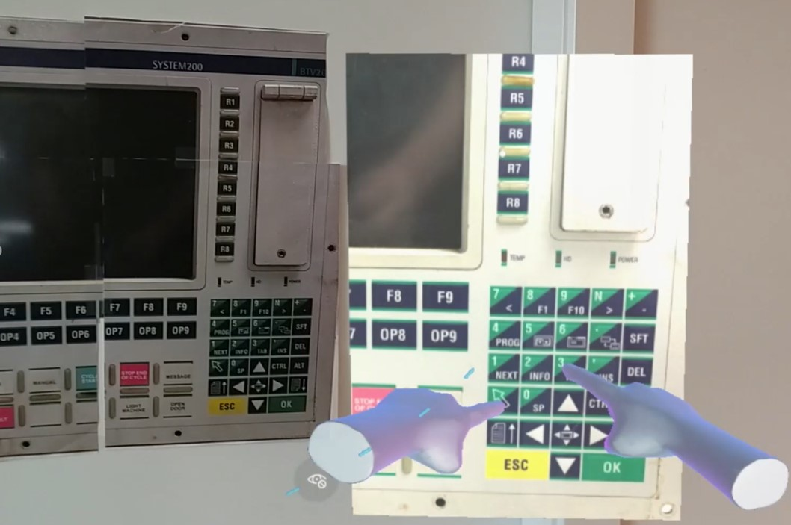

- You can focus on just the part of the machine where the operator needs to focus. For example, in the following graphic, the number pad has been isolated from the larger machine to help the operator focus.

    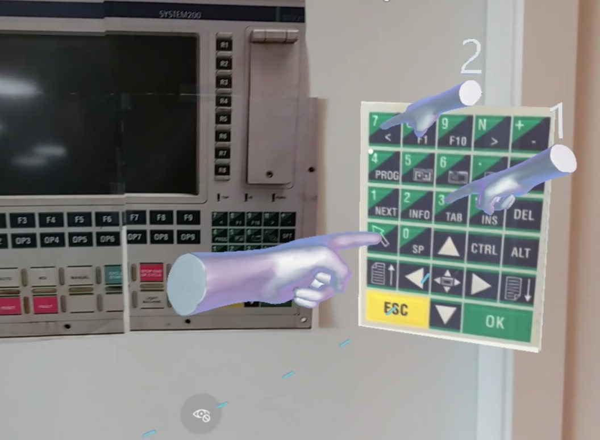

- You can make the image larger (using the scaling feature in Dynamics 365 Guides) to provide the effect of zooming in on the focus area. This makes it easier for the operator to see and understand.
    
    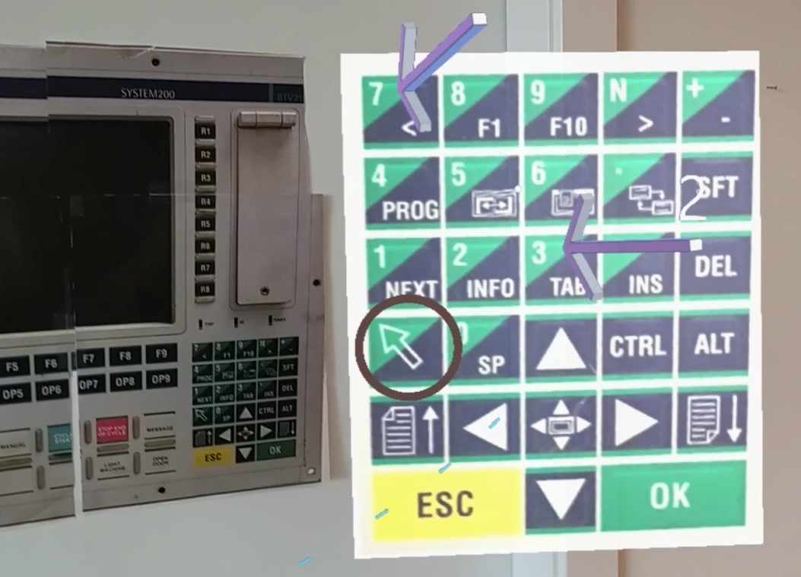

- An image can convey what the operator needs to do faster than the written words in an instruction card. 

    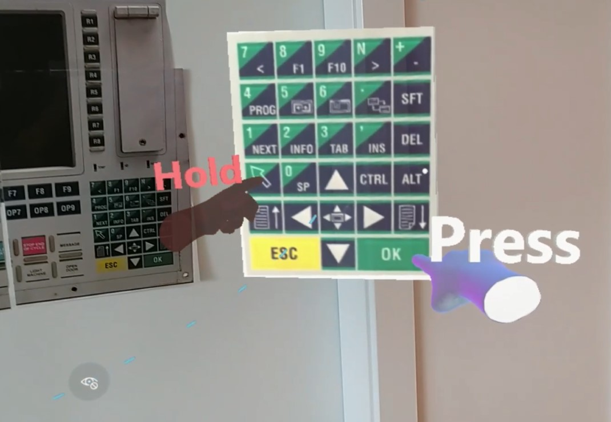

Using a 3D image this way is very efficient. You can create the 3D image very quickly (in Paint 3D, for example) and then reuse the image for different steps in your guide, adding different 3D objects from the 3D toolkit, depending on what's required for the step.  

## Create a 3D panel for an image using Paint 3D 

You can use Paint 3D, which comes with Windows, to create a 3D panel that you can attach an image to. Before starting this procedure, save an image to use to attach to the 3D panel. For example, in this procedure, we'll use a number pad image. 

1. In Paint 3D, select **3D shapes**.

     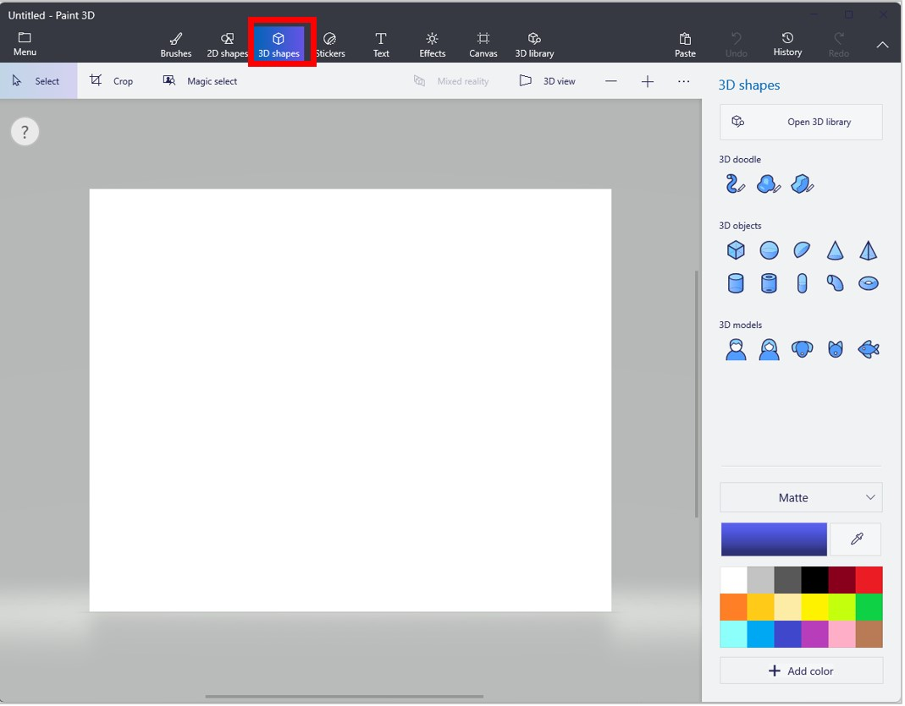
    
2. On the right side of the screen, under **3D objects**, select the cube.

    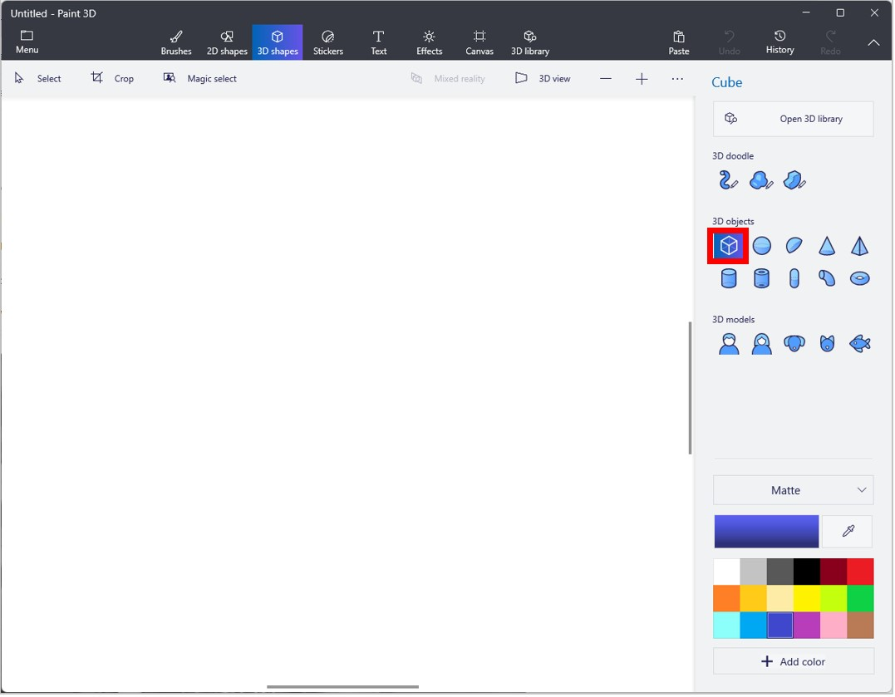
    
3. Rotate the cube to show its 3D profile.

   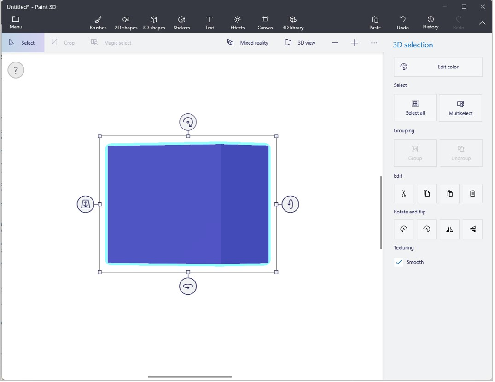
    
4. Slim the cube down to create a 3D panel.

    
    
5. On the right side of the screen, select **Edit color** to change the color of the cube to a background that works for your image.

    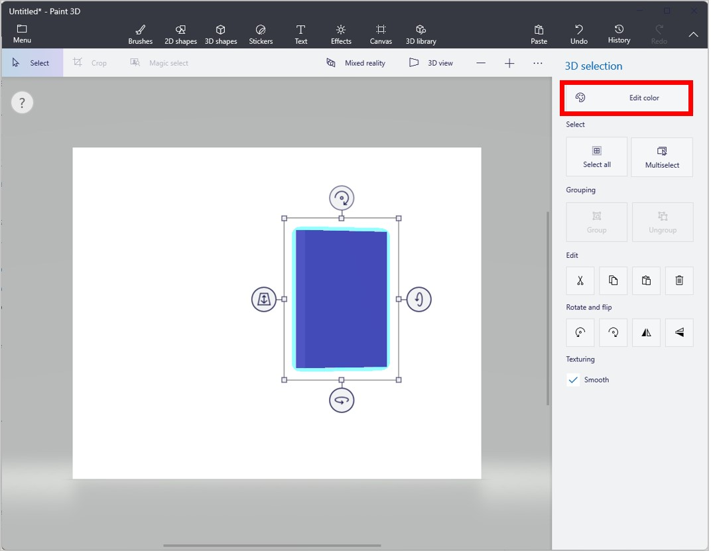
    
6. Select **Stickers** at the top of the screen, and then choose a sticker (image) for your 3D panel.

    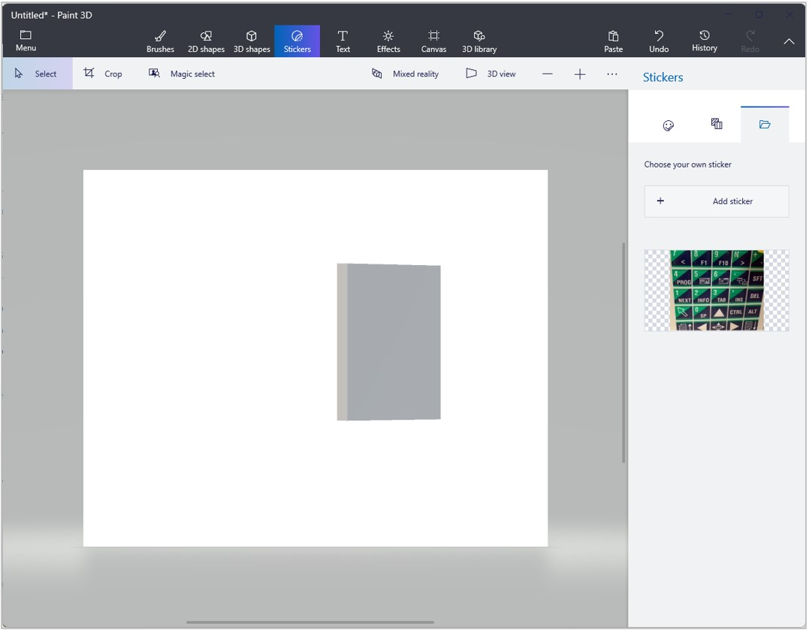
    
7. Resize the sticker to fit your panel. 

    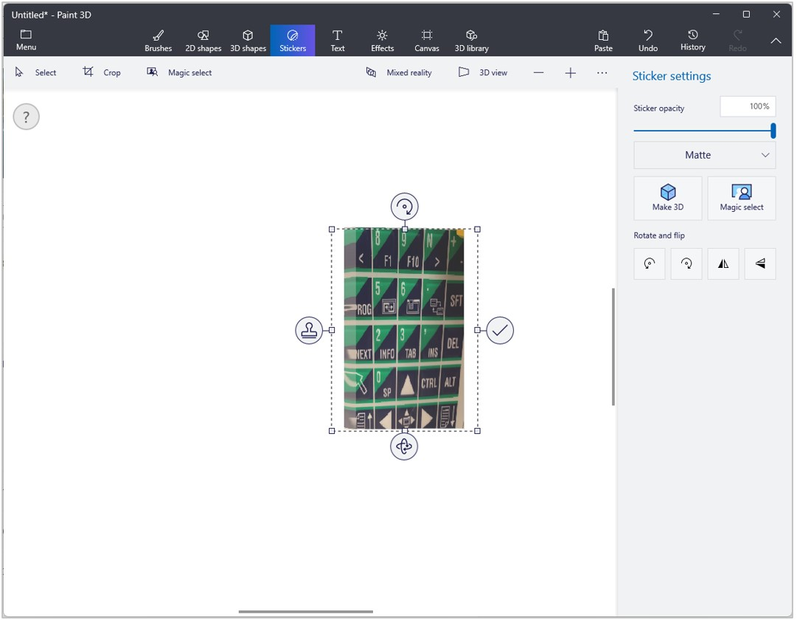

8. Select **Menu** in the upper-left corner of the screen, select **3D model**, and then save the file in .GLB format so you can import it easily into Dynamics 365 Guides.

    > [!NOTE]
    > As an alternative, you can import an image into Paint 3D by selecting **Menu** > **Insert**. While the image is still selected, on the **2D selection** panel to the right, select **Make 3D**.  Then export it as described above. 

9. [Import the file into the Dynamics 365 Guides PC app](pc-app-add-3D-part.md). 

