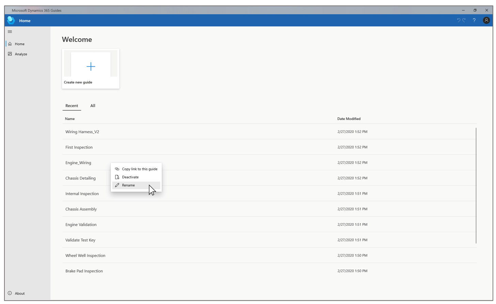

# Rename a guide in Dynamics 365 Guides

From the **Home** page in the PC app, you can rename a guide that was created in Microsoft Dynamics 365 Guides.

1. Sign in to the PC app by using your author credentials.

2. On the **Home** page, find the guide that you want to rename, right-click it, and then select **Rename**.

    > [!NOTE]
    > If you recently opened the guide, it should appear on the **Recent** tab. Otherwise, select the **All** tab to view the complete list of guides.

   

3. In the **Rename guide** dialog box, enter the new name, and then select **OK**. The names of Dynamics 365 Guides files have a limit of 58 characters.

    The name is immediately updated for all users.

    > [!NOTE]
    > Because the position of guides on the **Recent** tab is based on how recently you last opened a file, the position of the renamed guide on that tab won't change until you open the file. On the **All** tab, guides are arranged alphabetically. Therefore, the position of the renamed guide might change on that tab.

## See also

[Create a guide in the PC app](create-guide.md)
